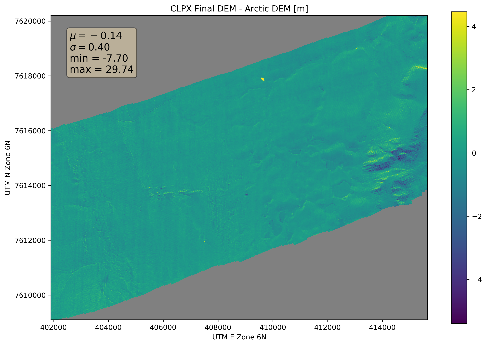

# The CLPX Digital Elevation Model (DEM)

A snow depth map is only as a good as the summer and winter surfaces used to produce it. For a really good snow map, we need a really good DEM. For CLPX, there are several sources of elevation data that cover all or some of the study area:

1.  A lidar DEM from 2012 (1 m)
2.  A SfM DEM from 2017 (1 m)
3.  The Arctic DEM Mosiac (5 m)
4.  The pipeline corridor lidar digital terrain model (DTM) (1 m)

Note: Items 3 and 4 are available from the State of Alaska elevation data portal: <https://elevation.alaska.gov/#68.61378:-149.14902:10>

Each of these elevation datasets has limits: The 2012 lidar DEM has chunks of missing data. The 2017 SfM DEM is not truly snow-free as there are large remnant drifts still visible in the conincident orthmosaic. The Arctic DEM is coarser than the others (5 m vs 1 m pixel size) and may have an aspect driven bias (as we show later) in steep terrain. The pipeline corridor DTM only overlaps the study area by a small amount. How can we combine and leverage all of these sources of elevation data to produce the best DEM possible for the CLPX study area?

##### Step 1: Establish common extents & metadata

The first step is to identify the study area domain by establishing a common set of UTM Zone 6 N (EPSG: 32606) boundary coordinates.

-   Upper Left: (401900.000, 7620200.000) (149d25' 4.36"W, 68d40'34.76"N)
-   Lower Left: (401900.000, 7609100.000) (149d24'25.84"W, 68d34'36.69"N)
-   Upper Right: (415650.000, 7620200.000) (149d 4'45.41"W, 68d40'50.99"N)
-   Lower Right: (415650.000, 7609100.000) (149d 4'12.28"W, 68d34'52.84"N)
-   Center: (408775.000, 7614650.000) (149d14'36.99"W, 68d37'44.13"N)

These coordinates are used in GDAL for target extents, i.e. `-te 401900 7609100 415650 7620200` and in PDAL pipelines `([401900,415650], [7609100, 7620200])`. We will converge on elevation products with 32-bit floating point data types and -9999 no data values.

##### Step 2: 2012 DEM Convergence

The next step is to produce a 'master' DEM for 2012.
There are actually two lidar acquisitions (DOY 157 and 159) for 2012. We can merge these two .LAS files, but first the DOY 159 .LAS file must be reprojected into UTM. The DOY 157 .LAS file needs a UTM coordinate system assigned as well. Outlier points in the point clouds ('floaters' and 'sinkers') also need to be filtered before creating gridded surfaces. We filter and merge the lidar acquisitions using three PDAL pipelines:

1.  Filter outliers and fix metadata for DOY 157 2012 and write new .LAS
2.  Filter outliers and fix metadata for DOY 159 2012 and write new .LAS
3.  Merge the outputs from 1 and 2 above and create GeoTIFF DEM output.

You can see the actual pipelines (.json files) [here.](../../../raw/pdal_pipelines/)
After executing these PDAL pipelines we have a GeoTIFF that represents the 2012 DEM. However, we need to transform the DEM to obtain the desired extents and convert it from a float64 to float32 data type.

`gdalwarp -te 401900 7609100 415650 7620200 -tr 1 1 -ot float32 clpx_2012_157_and_159_dem.tif clpx_dem_2012_warped.tif`

The result of the above GDAL command is a DEM with no data holes caused by inadequate overlap in the flight pattern and the absorbtion of the lidar signal by lakes and streams (Figure 1).

###### Figure 1.

 

##### Step 3: Combine the 2012 and 2017 DEMs

The SfM orthomosaic image produced along with the SfM 2017 DEM reveals remnant drifts still exist on the landscape (Figure 2)

###### Figure 2. The 2017 CLPX DOY 156 Orthomosaic

The remnant drifts pose a problem because the snow surface is now conflated with the bare ground surface. Subtracting the 2012 DEM from the 2017 DEM to find out how much winter drifts are impacting surface heights reveals a couple issues. First, the 2012 DEM has far more no data values than the 2017 DEM. Also, as expected, the remant drifts are inflating the 2017 DEM surface by 10 cm (at drift edges) to several meters (at drift depth maxima) in the remnant drift locations. To address these issues and to further an optimal CLPX DEM we can compute mean (2012, 2017) surface heights in locations where there is good agreement (within about 10 cm) between the two DEMs. In locations of poor agreement (i.e. remnant drifts) a zero value is returned. The extent of the resulting DEM (Figure 3) is limited to that of the 2012 DEM.

`gdal_calc.py -A clpx_dem_2012_warped.tif -B clpx_dem_2017_156.tif --outfile=clpx_mean_dem_ext2012_drift0.tif --calc="((A+B)/2)*isclose(A,B,atol=0.1)" --NoDataValue=-9999`

###### Figure 3. 2012/2017 CLPX Mean DEM Values, Otherwise DEM = 0

Next we create a similar raster, except the zero values from Figure 3 (dark purple) that indicate poor agreement between the 2012 and 2017 DEMs are assigned the value from the 2012 DEM, and everything else has 0 value (Figure 4). Extent is again limited to that of the 2012 DEM.

`gdal_calc.py -A clpx_dem_2012_warped.tif -B clpx_mean_dem_ext2012_drift0.tif --outfile=clpx_dem_ext_and_drift2012.tif --calc="A*(B==0)" --NoDataValue=-9999`

###### Figure 4. DEM Poor Agreement Locations (delta > 10 cm) assigned CLPX 2012 DEM Values, Otherwise 0

The pixel-wise maximum of the last two rasters we created (Figure 3 and Figure 4) yields a DEM with mean (2017 and 2012) elevation values except where there was poor agreement between the two years' DEMs, in which case the 2012 DEM values are used. (Figure 5).

`gdal_calc.py -A clpx_dem_ext_and_drift2012.tif -B clpx_mean_dem_ext2012_drift0.tif --outfile=clpx_dem_meanvals_and2012driftvals.tif --calc="maximum(A,B)" --NoDataValue=-9999`

###### Figure 5. Maximum of CLPX Mean DEM Values and 2012 DEM Values.

Finally, we fill the no data holes in the combined CLPX DEM (Figure 5) and increase the non-null area by using the values from 2017 DEM to extend and fill the map. In the GDAL build virtual raster command below, the file listed first ends up "on top", so the first file here is the 2017 DEM followed by the processed DEM (Figure 5) that contains mean values where agreement is good and 2012 values where agreement is poor. Users should note that even in this 'final' DEM (Figure 6), the areas where there is 2017 data but not 2012 data still have artificially high surface heights where there are remnant drifts. Consider drift location and the 2012 .LAS file extents when selecting subsets of the elevation data for later analysis. An alternative is to reduce the extent to better reflect the 2012 data.

`gdalbuildvrt clpx_dem_final.vrt clpx_dem_2017_156.tif clpx_dem_meanvals_and2012driftvals.tif`

`gdal_translate -of GTiff clpx_dem_final.vrt clpx_dem_final.tif`

###### Figure 6. The 'final' CLPX DEM

##### Step 4: DEM Validation

The Arctic DEM and the infrastructure corrdidor DTM can be used as independent checks of the DEM produced here (Figure 6). The Arctic DEM needs to be upsampled to 1 m, cropped to the CLPX extent, and converted from EPSG:3413 (WGS 84 / NSIDC Sea Ice Polar Stereographic North) to EPSG: 32606 (UTM Zone 6 N).

`gdalwarp -s_srs EPSG:3413 -t_srs EPSG:32606 -te 401900 7609100 415650 7620200 -tr 1 1 -ot float32 arctic_dem/46_18_1_2_5m_v2.0_reg_dem.tif arctic_dem/arctic_dem_1m.tif`

The result of the above GDAL command (Figure 7) is an Arctic DEM product ready for comparison with the CLPX DEM (Figure 6).

###### Figure 7. The Arctic DEM

The infrasture corridor lidar DTM requires some similar preprocessing, but also the two tiles that overlap the study area need to be merged. The resulting DEM from the GDAL commands below (Figure 8) only overlaps a small part of the CLPX study area.

`gdalbuildvrt infrastructure_corridor/clpx_corridor_dtm.vrt infrastructure_corridor/be_psmc4.tif infrastructure_corridor/be_psmc5.tif -te 401900 7609100 415650 7620200 -tr 1 1`

`gdalwarp -s_srs EPSG:26906 -t_srs EPSG:32606 -te 401900 7609100 415650 7620200 -tr 1 1 -ot float32 -dstnodata -9999 infrastructure_corridor/clpx_corridor_dtm.vrt infrastructure_corridor/clpx_corridor_dtm.tif`

###### Figure 8. The Corridor DTM

Now we can subtract the 'final' CLPX DEM (Figure 6) from both the Arctic DEM (Figure 7) and the infrastructure corridor DTM (Figure 8) and examine the residuals (Figures 9 and 10) by executing the following GDAL commnands.

`gdal_calc.py -A clpx_dem_final.tif -B arctic_dem/arctic_dem_1m.tif --outfile=clpx_final_dem_minus_arctic_dem.tif --calc="B-A" --NoDataValue=-9999`

`gdal_calc.py -A clpx_dem_final.tif -B infrastructure_corridor/clpx_corridor_dtm.tif --outfile=clpx_final_dem_minus_corridor_dem.tif --calc="B-A" --NoDataValue=-9999`

###### Figure 9. CLPX 'Final' DEM Minus the Arctic DEM

###### Figure 10. CLPX 'Final' DEM Minus the Infrastructure Corridor DTM

We can see from Figure 10 that the CLPX DEM vs. infrastructure corridor DTM comparison is not very useful because the DTM underestimates the lidar/SfM DEM by 5 meters globally. Although this discrepancy is far beyond a reasonable amount of adjustment, the consistency of the difference (standard deviation of 0.18 m) lets us know that the lidar/SfM DEM is at least relatively correct.
In Figure 10 we generally see good agreement (the Arctic DEM is only 0.14 m too low on average) although there appears to be some aspect driven bias. In the more rugged eastern terrain the North aspects are overestimating the lidar/SfM surface heights and the South aspects are undestimating the lidar/SfM surface heights. The magnitude of the bias is several meters in each case. This seemingly aspect-dependent bias may be a function of satellite look angles or the positive relationship between vertical error and steep terrain produced by geolocation errors. In any case, we can accept that the local airborne (lidar/SfM) measurements of surface height are better than the spaceborne eleation products in steep terrain. However, we may consider adjusting the lidar/SfM DEM (downward) by the mean difference of 0.14 m, effectively thickening all snow depths by 0.14 m. Stripe-like artifacts are visible in many of these DEMs, so there smoothing the DEM is appropriate and it will produce better terrain derivatives (like slope maps) later on.

##### Step 5: Creating Smoothed and/or Adjusted DEMs

`gdal_calc.py -A clpx_dem_final.tif --outfile=clpx_dem_final_minus_014m.tif --calc="A-0.14" --NoDataValue=-9999`

###### Figure 11. The CLPX DEM Adjusted by the Mean Difference with the Arctic DEM (0.14 m)

###### Figure 12. The CLPX DEM Smoothed by a 5x5 Gaussian Filter

###### Figure 13. The CLPX DEM Adjusted by the Mean Difference and Smoothed

We now have four candidate CLPX DEMs from which we can build snow depth maps: the 'final' CLPX DEM (Figure 6), the DEM adjusted to meet the Arctic DEM mean offset (Figure 11), the smoothed version of the 'final' DEM (Figure 12), and the smoothed and adjusted version (Figure 13).

