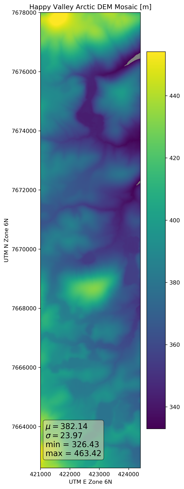
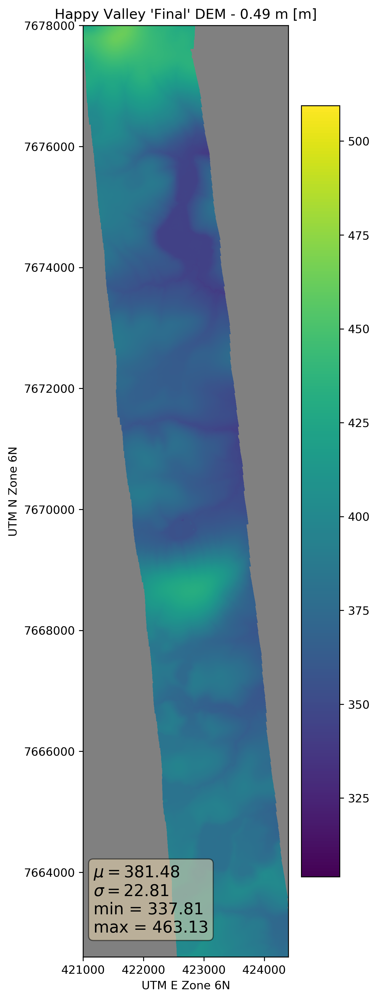

# The Happy Valley DEM

Just like at CLPX, thes snow depth maps at Happy Valley will only be as good as the summer and winter surfaces from which they are generated. At Happy Valley we have three sources of elevation data that cover the study area:

1.  A lidar DEM from 2012 (1 m)
2.  A SfM DEM from 2017 (1 m)
3.  The Arctic DEM Mosiac (5 m)

Note: The Arctic DEM Mosaics are available from the State of Alaska elevation data portal: <https://elevation.alaska.gov/#68.61378:-149.14902:10>
Note: use center coordinates for HV

Each of these elevation datasets has limits: The 2012 lidar DEM has chunks of missing data. The 2017 SfM DEM has a larger extent, but it is not truly snow-free as there are large remnant drifts still visible in the conincident orthmosaic image. The Arctic DEM is coarser than the others (5 m vs 1 m pixel size) and may have an aspect driven bias (as we show later) in steep terrain. How can we combine and leverage all of these sources of elevation data to produce the best DEM possible for Happy Valley?

##### Step 1: Establish common extents & metadata

The first step is to identify the study area domain by establishing a common set of UTM Zone 6 N (EPSG: 32606) boundary coordinates.

-   Upper Left: (421000.000, 7678000.000) (148d59'37.51"W, 69d12'1.67"N)
-   Lower Left: (421000.000, 7662600.000) (148d58'52.32"W, 69d3'44.77"N)
-   Upper Right: (424400.000, 7678000.000) (148d54'28.82"W, 69d12'5.16"N)
-   Lower Right: (424400.000, 7662600.000) (148d53'45.57"W, 69d3'48.24"N)
-   Center: (422700.000, 7670300.000) (148d56'40.98"W, 69d7'54.98"N)

These coordiantes are used in GDAL for target extents, i.e. `-te 421000 7662600 424400 7678000` and in PDAL pipelines `([421000,424400], [7662600, 7678000])`. We will converge on elevation products with 32-bit floating point data types and -9999 no data values.

##### Step 2: Combine the 2012 and 2017 DEMs

The June 4, 2017 Happy Valley DEM downloaded from the FTP covers a larger area than the 2012 DEM. The resolution higher (0.25 m vs. 1 m pixels). We will crop the 2017 DEM to the above extent and downsample to a 1 m spatial resolution. These GDAL commands will downsample, crop change the NoData value from -32767 to -9999 in the 2017 DEM:

`gdalbuildvrt June4_2017_HappyValley.vrt June4_2017_HappyValley.tif -resolution user -tr 1 1 -te 421000 7662600 424400 7678000 -srcnodata -32767 -vrtnodata -9999`

`gdal_translate -of GTiff June4_2017_HappyValley.vrt hv_dem_06_04_2017_1m_cropped.tif`

The 2012 DEM created from the lidar point cloud via the PDAL pipeline also needs attention before it can be compared directly to the 2017 DEM. The data is one row and one column larger than the 2017 DEM and as a result has a slightly different set of boundaries (a 0.5 m difference in the x and y) and the data type is float64 instead of float32. The following GDAL command will force the 2012 DEM to match our target extents and perform the data type conversion:

`gdalwarp -te 421000 7662600 424400 7678000 -tr 1 1 -ot float32 hv_158_2012_dem.tif hv_158_2012_dem_warped.tif`

The remnant drifts pose a problem because the snow surface is now conflated with the bare ground surface. Subtracting the 2012 DEM from the 2017 DEM to find out how much winter drifts are impacting surface heights reveals a couple issues. First, the 2012 DEM has far more no data values than the 2017 DEM. Also, as expected, the remant drifts are inflating the 2017 DEM surface by 10 cm (at drift edges) to several meters (at drift depth maxima) in the remnant drift locations. To address these issues and to further an optimal Happy Valley DEM we can compute mean (2012, 2017) surface heights in locations where there is good agreement (within about 10 cm) between the two DEMs. In locations of poor agreement (i.e. remnant drifts) a zero value is returned. The extent of the resulting DEM (Figure 3) is limited to that of the 2012 DEM.

`gdal_calc.py -A hv_dem_06_04_2017_1m_cropped.tif -B hv_158_2012_dem_warped.tif --outfile=hv_2017_2012_dem_delta.tif --calc="A-B" --NoDataValue=-9999`

`gdal_calc.py -A hv_158_2012_dem_warped.tif -B hv_dem_06_04_2017_1m_cropped.tif --outfile=hv_mean_dem_ext2012_drift0.tif --calc="((A+B)/2)*isclose(A,B,atol=0.1)" --NoDataValue=-9999`

Next we create a similar raster, except the zero values from Figure 3 (dark purple) that indicate poor agreement between the 2012 and 2017 DEMs are assigned the value from the 2012 DEM, and everything else has 0 value (Figure 4). Extent is again limited to that of the 2012 DEM.

`gdal_calc.py -A hv_158_2012_dem_warped.tif -B hv_mean_dem_ext2012_drift0.tif --outfile=hv_dem_ext_and_drift2012.tif --calc="A*(B==0)" --NoDataValue=-9999`

The pixel-wise maximum of the last two rasters we created (Figure 3 and Figure 4) yields a DEM with mean (2017 and 2012) elevation values except where there was poor agreement between the two years' DEMs, in which case the 2012 DEM values are used. (Figure 5).

`gdal_calc.py -A hv_dem_ext_and_drift2012.tif -B hv_mean_dem_ext2012_drift0.tif --outfile=hv_dem_meanvals_and2012driftvals.tif --calc="maximum(A,B)" --NoDataValue=-9999`

Finally, we fill the no data holes in the combined Happy Valley DEM (Figure 5) and increase the non-null area by using the values from 2017 DEM to extend and fill the map. In the GDAL build virtual raster command below, the file listed first ends up "on top", so the first file here is the 2017 DEM followed by the processed DEM (Figure 5) that contains mean values where agreement is good and 2012 values where agreement is poor. Users should note that even in this 'final' DEM (Figure 6), the areas where there is 2017 data but not 2012 data still have artificially high surface heights where there are remnant drifts. Consider drift location and the 2012 .LAS file extents when selecting subsets of the elevation data for later analysis. An alternative is to reduce the extent to better reflect the 2012 data.

`gdalbuildvrt hv_dem_final.vrt hv_dem_06_04_2017_1m_cropped.tif hv_dem_meanvals_and2012driftvals.tif`

`gdal_translate -of GTiff hv_dem_final.vrt hv_dem_final.tif`

##### Step 4: DEM Validation

The Arctic DEM can be used as an independent check of the 'final' DEM produced by combining the 2012 and 2017 Happy Valley DEMs. After combining two mosaic tiles, the Arctic DEM needs to be upsampled to 1 m, cropped, and converted from EPSG:3413 (WGS 84 / NSIDC Sea Ice Polar Stereographic North) to EPSG: 32606 (UTM Zone 6 N).

`gdalbuildvrt arctic_dem/hv_arctic_dem_1m.vrt arctic_dem/46_18_2_1_5m_v2.0/46_18_2_1_5m_v2.0_reg_dem.tif arctic_dem/46_18_2_2_5m_v2.0/46_18_2_2_5m_v2.0_reg_dem.tif -resolution user -tr 1 1 -srcnodata -32767 -vrtnodata -9999`

`gdalwarp -s_srs EPSG:3413 -t_srs EPSG:32606 -te 421000 7662600 424400 7678000 -tr 1 1 -ot float32 arctic_dem/hv_arctic_dem_1m.vrt arctic_dem/arctic_dem_1m_utm.tif`

The result of the above GDAL commands (Figure 7) is an Arctic DEM product ready for comparison.

###### Figure 7. The Happy Valley Arctic DEM

Now we can subtract the 'final' Happy Valley DEM (Figure 6) from the Arctic DEM (Figure 7) and examine the residuals (Figures 9 and 10) by executing the following GDAL commnand:

`gdal_calc.py -A hv_dem_final.tif -B arctic_dem/arctic_dem_1m_utm.tif --outfile=hv_final_dem_minus_arctic_dem.tif --calc="B-A" --NoDataValue=-9999`

###### Figure 9. Happy Valley 'Final' DEM Minus the Arctic DEM

In Figure XX we see that the Arctic DEM is on average 0.49 m lower than the final DEM. This seemingly aspect-dependent bias may be a function of satellite look angles or the positive relationship between vertical error and steep terrain produced by geolocation errors. In any case, we can accept that the local airborne (lidar/SfM) measurements of surface height are better than the spaceborne elevation products in steep terrain. However, we may consider adjusting the lidar/SfM DEM (downward) by the mean difference of 0.49 m, effectively thickening all snow depths by 0.49 m. Stripe-like artifacts are visible in many of these DEMs, so there smoothing the DEM is appropriate and it will produce better terrain derivatives (like slope maps) later on.

##### Step 5: Creating Smoothed and/or Adjusted DEMs

`gdal_calc.py -A hv_dem_final.tif --outfile=hv_dem_final_minus_049m.tif --calc="A-0.49" --NoDataValue=-9999`

###### Figure xx. The Happy Valley 'Final' DEM Adjusted by the Mean Difference with the Arctic DEM (-0.49 m)

run smooth raster.py here....
###### Figure xx. The Happy Valley 'Final' DEM Smoothed by a 5x5 Gaussian Filter

###### Figure xx. The Happy Valley 'Final' DEM Adjusted by the Mean Difference (-0.49 m) and Smoothed

We now have four candidate CLPX DEMs from which we can build snow depth maps: the 'final' CLPX DEM (Figure 6), the DEM adjusted to meet the Arctic DEM mean offset (Figure 11), the smoothed version of the 'final' DEM (Figure 12), and the smoothed and adjusted version (Figure 13).

