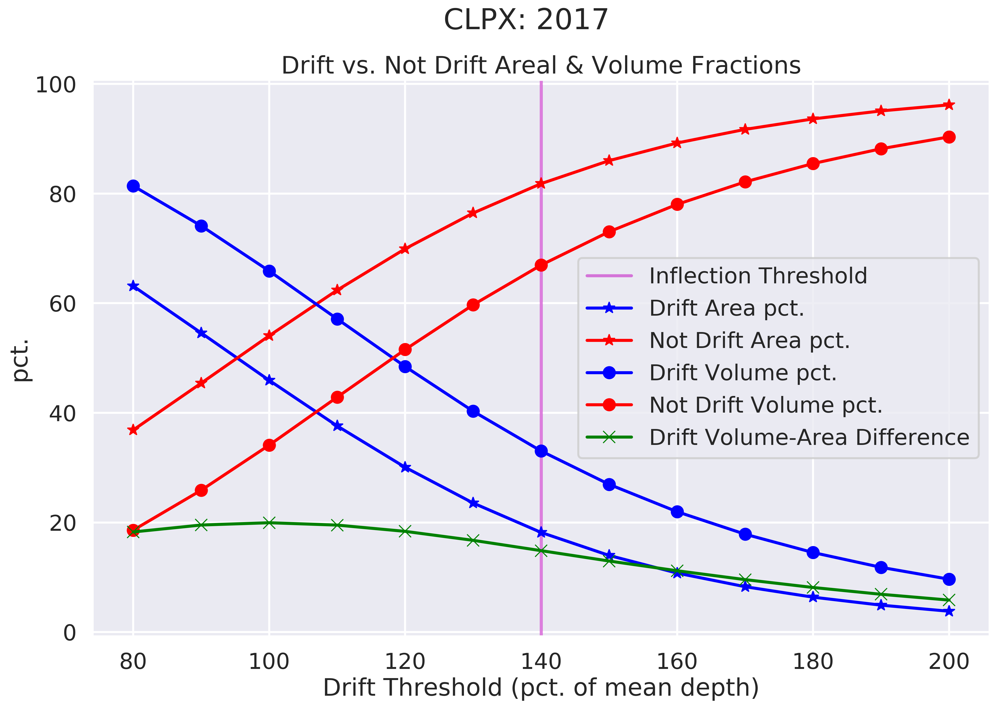

# Background

Snowdrifts massively concentrate the tundra snowcover and its superlative environmental properties (high albedo, thermal buffer, water storage, habitat, etc.) - and so their magnitude (and aesthetics) have drawn interest from many observers over the past 120 years. The relationship between fixed snowdrifts and topography was first explored by Francois Matthes in 1899. While working in Wyoming's Bighorn Mountains, Matthes noticed that even in the July heat, large snowdrifts filled the depressions on the otherwise smooth and grassy slopes of Bald Mountain. He hypothesized that topographic depressions trapped blowing snow in the same way every winter and that this created a positive feedback loop wherein the drifting → snowbank → enhanced erosion → deepening of the depression → more drifting →. His work led to a rich literature on fixed drifts and nivation hollows (McCabe, 1939; St. Onge, 1969; Rapp, 1984; others) that continues today (Lopez-Martinez et al., 2012) though these studies mainly focus on erosion beneath the drifts or the land forms produced by their continued presence. Cornish (1902) appears to be the first to have focused on the nature and formation process of the drifts themselves. He understood that it was the eddy created by an upwind feature that allowed the accumulation of snow, and he introduced the first drift classification: whether the drift was complete or incomplete. He understood that incomplete drifts, indicated by the presence of a cornice on their downwind edge (Figure 1), were those that could not fill the entire streamline of the wind because they lacked a sufficient flux of windblown snow. Ekblaw (1918), who worked in Northern Greenland (dome, piedmont, and wedge drifts) and Lewis (1939), who worked in Iceland (transverse, longitudinal, and circular drifts) developed classification systems based on catchment shape we find of less use, but we note that all three authors understood that there was a relationships between the snowdrift patterns and the topography, and that this pattern of snow deposition repeated over time, making the drift a geomorphic agent that could (over long periods of time) shape the landscape.

###### Figure 1. A Large Snowdrift Downwind of a Lake Cutbank (CLPX, 2018). Depth Estimated at 5 m.

A more practical interest in snowdrifts arose because a poor railway or road cut can produce a drift that buries the roadway. From a combination of wind tunnel experiments and observations of fixed snowdrifts, Finney (1939) concluded that a slope of at least 14° was required to produce a wind eddy and therefore a fixed drift. Rikhter (1954) and Kuz'min (1963) explored this topic further, and the work culminated in in 1975 when Tabler, on the basis of 17 snowdrifts in Wyoming and Colorado, developed an empirical regression model for snowdrift profiles based on upwind and downwind slope factors. Tabler also introduced the term 'equilibrium profile' to describe the surface profile of a fixed snowdrift which cannot grow any further because the deposited snow has filled and smoothed the catchment such that the flow separation and resulting eddy space required to form a fixed snowdrift are no longer present. Tabler’s equilibrium and non-equilibrium drifts are analogous to Cornish's complete vs. incomplete classification. Sturm and Benson (1993) echo these classifications, calling drifts either filling or non-filling. Recognizing (as did Cornish and Tabler) that if a drift was not filled (incomplete) it contained all of the snow flux from a specific direction, Benson (1981) used drift measurements to estimate that flux. \[Add recent Spanish work\]

The last type of fixed drift studies are those that have attempted to use the number and size of drifts as a climate indicator (Klapa, 1980; Lauriol et al., 1986; Watson et al., 1994). These studies have generally been based on aerial photography and while they have produced estimates of the areal coverage of drifts (Lauriol et el., 1986; Table 1), they have not been able to estimate the snow volume or mass contained in the drifts. Despite the fundamental value of the above observations, these studies have been inherently limited by the mapping methods available at the time they were done. The investigators were either constrained to the study a few fixed drifts due to the work effort of manually measuring dense and deep snow, or they had to use remote sensing data that lacked a depth dimension. Consequently, we still lack a volume (or mass) inventory of such drifts even for a single region. What is more, there are a number of snow models that incorporate blowing snow processes \[e.g., Pomeroy et al., 1993; Purves et al., 1999; Liston and Sturm, 2002; Winstral et al., 2002; Liston more recent; CROCUS, SnowPAck)\] and produce fixed drifts in numerical simulations, but in some cases the shapes of those drifts are based on the 17 drifts measured 42 years ago by Tabler. Despite this enthusiasm, snowdrifts remain a domain in which organizing knowledge is difficult for several reasons: they are changeful and  ephemeral, manually measuring them is difficult, and they occupy a wide variety of scales and locations. However, modern methods of measurement and analysis (like those employed here) offer the ability to find new knowledge within the world of snowdrifts.

# Defining and Finding Snowdrifts

To begin finding new snowdrift knowledge, we need to decide what exactly is and is not a snowdrift. Many snow scientists colloquially understand a drift to be an accumulation of snow deposited by wind, often found in the lee of a break in slope or obstacle like a tree or fence. In the field, the 'eyeball' threshold test of "I know a drift when I see it" will suffice. However, that eyeball test is informed by a full set of 3-D information including geometry, texture, shadowing, and even color. In a planar, map-view world of snow depth like that presented here, how should we formally distinguish drift snow from 'not-drift' snow across an entire snow-covered landscape with a variety of snow classes and hetergenous depth? The eyeball test will not suffice because in remote sensing we often lack the field perspective and because the spatial distribution of snow depth is complex with nebulous transitions between snow classes. To clarify our thinking (and it will be useful for our analysis) about drifts, we need to find a threshold of snowdepth beyond which we can be confident that the snow has indeed been deepened by the deposition of wind-blown snow. However, this threshold is unlikely to be stable across, or even within, a domain because snowdrift depth is dependent on many factors such as snowdrift trap size, shape, and spacing and the amount of flux of windblown snow. To surmount this instability we will demonstrate a method of identifying a snowdrift depth threshold within each domain based on how the relationship between drift-covered area (DCA) and drift volume (DV) respond to a changing threshold. For each annual and annual mean snow depth map (N = 14) we compute the DCA and DV, the the mean depths of drift and not drift snow, the not-drift-covered area (NDCA) and not-drift volume (NDV) over a range of snow depth thresholds that delineate drift and not-drift snow. The test depth thresholds are calibrated by the mean snow depth of the entire domain and range between 80% and 200% of the mean depth (10% intervals).

Imagine a world where snow depth is entirely and exactly uniform. There are no drifts, so you could lower the depth threshold of what you called a drift until you reached the mean (uniform constant) snow depth without changing the DCA or DV - both are zero. However, after the threshold is lowered below the mean snow depth, everything is considered a drift and the DCA and DV fractions jump to 100%. In this imaginary case the fractional DCA and DV values plotted against the threshold values are a single step function. Now as our imaginary snow world becomes more complex and realistic, we can expect to smooth out and change the shape of that step function. We would expect that when the threshold is low (relatively more snow is considered to be a drift), that increasing the threshold decreases the fractional DCA and DV by **about the same amount.** In other words, increasing the threshold does not exclude any 'true' drift snow. We would also expect that at some threshold value above the mean snow depth that this symmetry breaks - and now the the fractional DV decreases more rapidly than the fractional DCA because we are leaving out 'true' snowdrifts because they have a lot of snow with respect to their area. Finally, we would expect that as the threshold approaches the maximum snow depth, the fractional DCA and DV curves converge and approach zero. In the real world (Figure 2) we observe this expected behavior, and also see that an inflection point in the trajectory of the difference between fractional DV and DCA marks the tipping point where the symmetry breaks. It is this tipping point that is the snow depth threshold that distinguishes drift from not-drift snow (Figure 2).

###### Figure 3. An Example of a Drift Threshold Test: Fractional DV, DCA, NDCA, and NDV (CLPX, 2017)

In the above example we see that 140% of the mean (0.70 m) is the threshold depth for this particular study area and year. We can confidently classify all snow of greater or equal depth to be a drift. At this threshold depth and beyond including a little more area in the snowdrift category includes a large amount of snow. The average drift threshold is 140% of the mean depth for CLPX and around 130% for Happy Valley (Figure 3, vertical lines). The results for each study area are really quite similar, although we do see that the CLPX data occupies a slightly higher region on the y-axis than Happy Valley (Figure 4). The nature of the snowcover at each study area determines the snowdrift threshold - so there should be a relationship between some function of the snowcover and the threshold. The coeffcient of variance (CV) of the snow depth does indeed have a positive correlation with the threshold (Figure 5). Years in which the of the snowcover is greater have greater thresholds. In a tundra snow environment the CV is reflection of the degree and intensity of organization of the snowcover by the wind. In high-CV winters we perhaps might expect deeper and/or larger snowdrifts (and a more intense scour) than in years. In low-CV winters drift and scour might be more mild.

###### Figure 3. Drift Thresholds by Study Area. Shaded Region is 95% Confidence Interval

###### Figure 4. Drift Thresholds by Study Area and Year

###### Figure 5. Drift Thresholds and CV. Shaded Region is 95% Confidence Interval

The volume-area method is useful for producing a catalog of snowdrifts across our set of snow depth maps. Each snow depth mask can be masked out using the computed threshold snow depth, creating a census of (hundreds?) of snowdrifts. From this catalog we can then ask questions about the drift themselves and the terrain that they overlay. Note that the threshold depends on the global mean snow depth so it is dependent on area selected. However, by determining threshold for the entire domain we minimize the risk of false positives, although it is possible some true snowdrifts are excluded. The snowdrift depth threshold determination can easily be re-computed for any subset of the domain if necessary. We now have means to label pixels in the depth map as either drift or not.

***

In a previous version of this analysis I included seven snow depth maps (lidar collected by the Aerial Snow Observatory in April 2014) from Tuolumne Meadows in California. The snow depth maps there reprsent a much snowier and far more rugged alpine environment. Although the Happy Valley and CLPX curves are outdated in the below figures, it is interesting that despite the differences in both snow and landscape across each study area, the mean threshold depths (vertical lines) are basically between 120% to 140% of the mean. I will update this figure.

###### Figure X. Drift Thresholds Test with Tuolumne

## References

1.  Benson, C. S. Reassessment of Winter Precipitation on Alaska’s Arctic Slope and Measurements on the Flux of Wind Blown Snow. (1981).
2. Benson, C. S. & Sturm, M. Structure and wind transport of seasonal snow on the Arctic slope of Alaska. Ann. Glaciol. 18, 261–267 (1993).
3. Cornish, V. On Snow-Waves and Snow-Drifts in Canada, with Notes on the ‘Snow-Mushrooms’ of the Selkirk Mountains. Geogr. J. 20, 137–173 (1902).
4. Ekblaw, W. E. The importance of nivation as an erosive factor, and of soil flow as a transporting agency, in northern Greenland. in The Importance of Nivation as an Erosive Factor, and of Soil Flow as a Transporting Agency, in Northern Greenland 4, 288–293 (Proceedings of the National Academy of Sciences of the United States of America, 1918).
5. Finney, E. A. Snow Drift Control by Highway Design. 58 (1939).
6. Klapa, M. The problems of the perennial snow patches in the Polish Tatra Mountains. in World Glacier Inventory Proceedings of the Riederalp Workshop 173–180 (1980).
7. Kuz’min, P. P. Snow Cover and Snow Reserves. (Israel Program for Scientific Translation, Office of Technical Services, U. S. Dept. of Commerce, 1963).
8. Lauriol, B., Carrier, Y., Beaudet, H. & Binda, G. The Residual Snow Cover in the Canadian Arctic in July : A Means to Evaluate the Regional Maximum Snow Depth in Winter. Arctic 39, 309–315 (1986).
9. Lewis, W. V. Snow-Patch Erosion in Iceland. Geographical 94, 153–161 (1939).
10. Liston, G. E. & Sturm, M. Winter Precipitation Patterns in Arctic Alaska Determined from a Blowing-Snow Model and Snow-Depth Observations. J. Hydrometeorol. 3, 646–659 (2002).
11. Lopez-Martinez, J., Serrano, E., Schmid, T., Mink, S. & Lines, C. Periglacial processes and landforms in the South Shetland Islands (northern Antarctic Peninsula region). Geomorphology 155–156, 62–79 (2012).
12. Matthes, F. E. Glacial Sculpture of the Bighorn Mountains Wyoming. Twenty-First Annual Report of the United States Geological Survey to the Secretary of the Interior 1899–1900, (1900).
13. McCabe, L. H. Nivation and Corrie Erosion in West Spitsbergen. Geogr. J. 94, 447–465 (1939).
14. Pomeroy, J. W., Gray, D. M. & Landine, P. G. The Prairie Blowing Snow Model: characteristics, validation, operation. J. Hydrol. 144, 165–192 (1993).
15. Purves, R. S., Mackaness, W. A. & Sugden, D. E. An approach to modelling the impact of snow drift on glaciation in the Cairngorm Mountains, Scotland. J. Quat. Sci. 14, 313–321 (1999).
16. Rapp, A. Nivation Hollows and Glacial Cirques in Söderåsen, Scania, South Sweden. Geogr. Ann. Ser. A, Phys. Geogr. 66, 11–28 (1984).
17. Rikhter, G. D. Snow cover, its formation and properties. Translated from Russian. (1954).
18. St Onge, D. A. Nivation landforms. (Department of Energy, Mines and Resources, 1969).
19. Sturm, M., Liston, G. E., Benson, C. S. & Holmgren, J. Characteristics and Growth of a Snowdrift in Arctic Alaska, U.S.A. Arctic, Antarct. Alp. Res. 33, 319–329 (2001).
20. Sturm, M. & Wagner, A. M. Using repeated patterns in snow distribution modeling: An Arctic example. Water Resour. Res. (2010). doi:10.1029/2010WR009434
21. Tabler, R. D. Predicting Profiles of Snowdrifts in Topographic Catchments. in Proceedings of the 43rd Annual Western Snow Conference 87–97 (1975).
22. Watson, A., Davison, R. W. & French, D. D. Summer Snow Patches and Climate in Northeast Scotland, U.K. Arct. Alp. Res. 26, 141–151 (1994).
23. Winstral, A., Elder, K. & Davis, R. E. Spatial Snow Modeling of Wind-Redistributed Snow Using Terrain-Based Parameters. Journal of Hydrometeorology (2002). doi:10.1175/1525-7541(2002)003<0524:SSMOWR>2.0.CO;2
