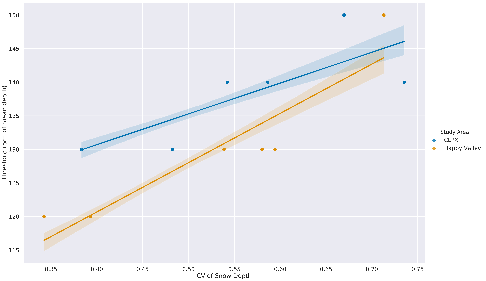

# Background

One thing that is clear from our snow depth maps (Figure 1.) is that the snowcover is highly dissected into areas of deep and shallow snow. In a windy tundra snow environment these are snowdrifts and scour. Most snow scientists colloquially understand a drift to be an accumulation of snow deposited by wind, often found in the lee of a break in slope or obstacle like a tree or fence. In the field, the 'eyeball' threshold test of "I know a drift when I see it" will suffice. However, that eyeball test is informed by a full set of 3-D information including geometry, texture, shadowing, and even color. In a planar, map-view world of snow depth like that presented here, how should we formally distinguish drift snow from 'not-drift' snow across an entire snow-covered landscape with a variety of snow classes and hetergenous depth? The eyeball test will not suffice because in remote sensing we often lack the field perspective and because the spatial distribution of snow depth is complex with nebulous transitions between snow classes. To clarify our thinking (and it will be useful for our analysis) about drifts, we need to find a threshold of snowdepth beyond which we can be confident that the snow has indeed been deepened by the deposition of wind-blown snow. However, this threshold is unlikely to be stable across, or even within, a domain because snowdrift depth is dependent on many factors such as snowdrift trap size, shape, and spacing and the amount of flux of windblown snow. To surmount this instability we will demonstrate a method of identifying a snowdrift depth threshold within each domain based on how the relationship between drift-covered area (DCA) and drift volume (DV) respond to a changing threshold. For each annual and annual mean snow depth map (N = 14) we compute the DCA and DV, the the mean depths of drift and not drift snow, the not-drift-covered area (NDCA) and not-drift volume (NDV) over a range of snow depth thresholds that delineate drift and not-drift snow. The test depth thresholds are calibrated by the mean snow depth of the entire domain and range between 80% and 200% of the mean depth (10% intervals).

##### Maybe We also compute hyspometric curves of drift and not drift snow.

Imagine a world where snow depth is entirely and exactly uniform. There are no drifts, so you could lower the depth threshold of what you called a drift until you reached the mean (uniform constant) snow depth without changing the DCA or DV - both are zero. However, after the threshold is lowered below the mean snow depth, everything is considered a drift and the DCA and DV fractions jump to 100%. In this imaginary case the fractional DCA and DV values plotted against the threshold values are a single step function. Now as our imaginary snow world becomes more complex and realistic, we can expect to smooth out and change the shape of that step function. We would expect that when the threshold is low (relatively more snow is considered to be a drift), that increasing the threshold decreases the fractional DCA and DV by **about the same amount.** In other words, increasing the threshold does not exclude any 'true' drift snow. We would also expect that at some threshold value above the mean snow depth that this symmetry breaks - and now the the fractional DV decreases more rapidly than the fractional DCA because we are leaving out 'true' snowdrifts because they have a lot of snow with respect to their area. Finally, we would expect that as the threshold approaches the maximum snow depth, the fractional DCA and DV curves converge and approach zero. In the real world (Figure 1) we observe this expected behavior, and also see that an inflection point in the trajectory of the difference between fractional DV and DCA marks the tipping point where the symmetry breaks. It is this tipping point that is the snow depth threshold that distinguishes drift from not-drift snow (Figure 1).

###### Figure 1. An Example of a Drift Threshold Test: Fractional DV, DCA, NDCA, and NDV (CLPX, 2017)

In the above example we see that 140% of the mean (0.70 m) is the threshold depth for this particular study area and year. We can confidently classify all snow of greater or equal depth to be a drift. At this threshold depth and beyond including a little more area in the snowdrift category includes a large amount of snow. The average drift threshold is 140% of the mean depth for CLPX and around 130% for Happy Valley (Figure 2, vertical lines). The results for each study area are really quite similar, although we do see that the CLPX data occupies a slightly higher region on the y-axis than Happy Valley (Figure 3). The nature of the snowcover at each study area determines the snowdrift threshold - so there should be a relationship between some function of the snowcover and the threshold. The coeffcient of variance (CV) of the snow depth does indeed have a positive correlation with the threshold (Figure 4). Years in which the of the snowcover is greater have greater thresholds. In a tundra snow environment the CV is reflection of the degree and intensity of organization of the snowcover by the wind. In high-CV winters we perhaps might expect deeper and/or larger snowdrifts (and a more intense scour) than in years. In low-CV winters drift and scour might be more mild.

###### Figure 2. Drift Thresholds by Study Area. Shaded Region is 95% Confidence Interval

###### Figure 3. Drift Thresholds by Study Area and Year

###### Figure 4. Drift Thresholds and CV. Shaded Region is 95% Confidence Interval

### other points

hypsometeric curves (context already existing)
volume filling curves
hyspometric curves for drift and not drift
is the inflection point of the snow depth hypsometric curve a good drift threshold?

does the mean inflection change by study area?

130% of mean.f

This threshold is handy for producing a drift inventory - from which we have census of thousands of snowdrifts. Note that the threshold is dependent on area selected. But running it for the full domain should be fine, although there is a chance we leave out some small drifts.

Note: the threshold is global! To make this analysis more global, we have included seven snow depth dDEMs from the Tuolumne Meadows area. This data, collected by ASO in April 2014, represents a much snowier world and a far more rugged environment. The drift volume-area delta curves for each snow dDEM (Figure 3) indicate a range of curves exist across time and study areas, but the inflection threshold is well constrained between 120 and 160 percent of the mean snow depth. Despite the differences in both snow and landscape across each study area, the mean inflection thresholds (vertical lines, Figure 3) are tightly clustered. Rather, it is the drift fractional volume-area delta that indicate signficant distinction (95% confidence).

###### Figure 3. Summary of the Inflection Drift Thresholds Tests (N = 19) 

Seeing tuolumne data from ASO.. threshold is constant just delta pct. changes:
At Tuolumne we have used subsets rather than annual repeats.

### More explanation of the threshold

The intersecting areal curves (Figure 1) indicate a space where we might find a suitable depth boundary between drift and not drift snow. When the threshold is low, the drift area and volume are greater than the not-drift area and volume. This makes sense because we are including relatively shallow snow (e.g. 80% of the mean) in the drift category. As the threshold increases, the not-drift areal and volume fractions overtake the drift areal and volume fractions. A threshold somewhere to the right of this intersection (located around 115% in Figure 1) will ensure that there are more areas of not-drift snow than drift-snow, which is consistent with our knowledge and experience with drifts: they are not the most prevalent snow class by area are instead scattered about the landscape. A third curve in Figure 1 indicates the difference between the volume percentage of drift snow and the areal percentage. We see that drifts account for more volume than area, and that there is actuall an inflection point in this curve. At some threshold, the slope of the green line begins to increase and approach zero. The inflection point indicates that a threshold has been reached where enough depth is captured such that increasing the threshold does not 'leave' out significant snow deposits, i.e. by leaving more area out of the drift category, the volume-area relationship stops changing. A good drift threshold, we would expect changes the volume area relationship at each step. By including a little more area, we can include a lot more snow, and conversely by decreasing the area..we decrease the volume by a similar amount until we exclude all the not-drift snow.
