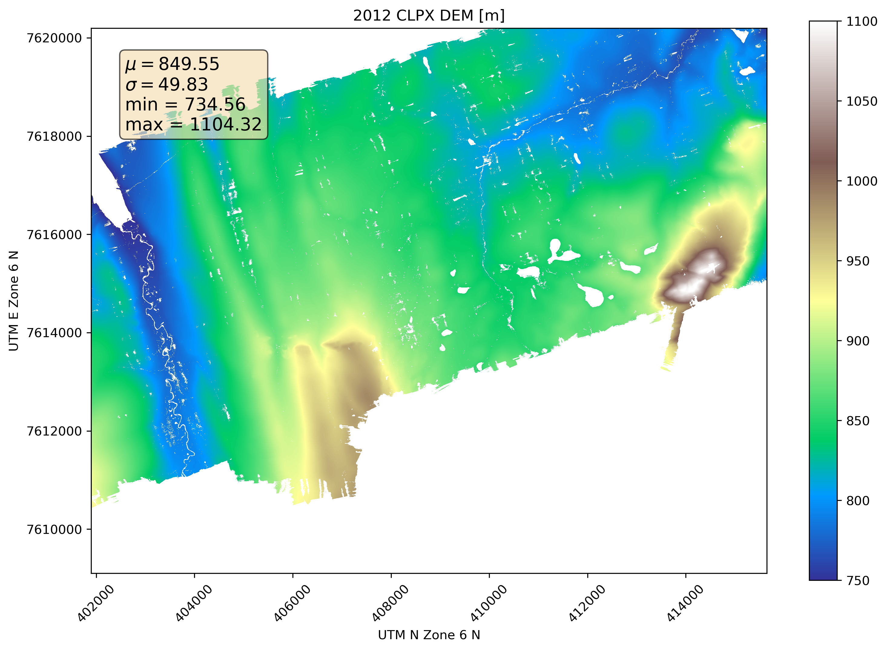
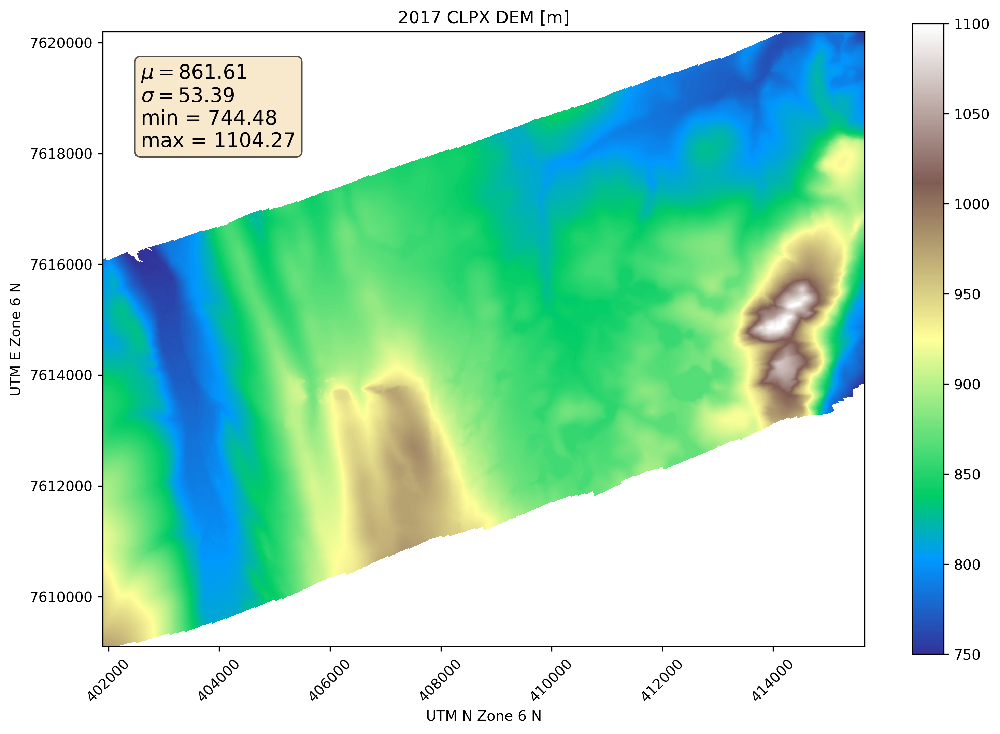
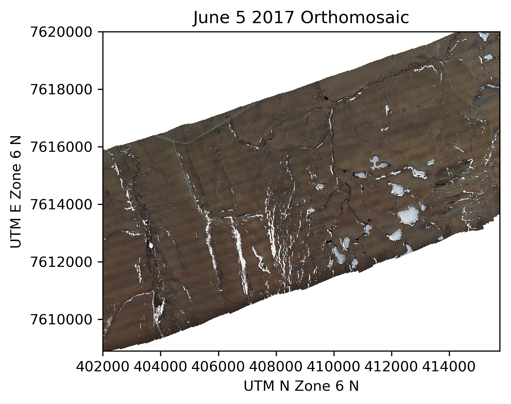
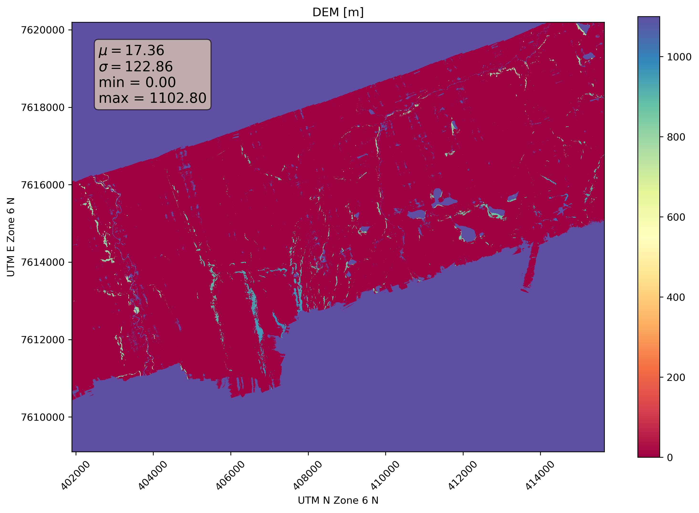
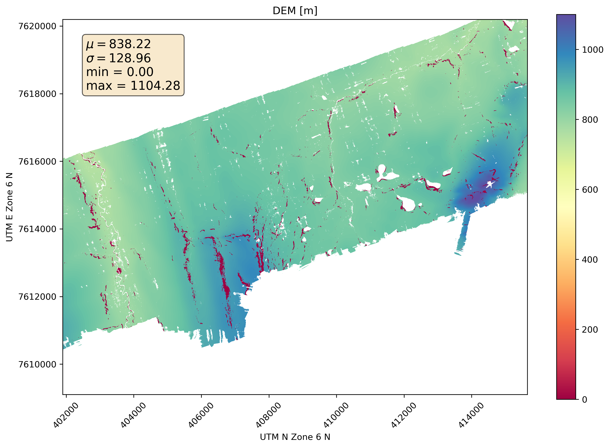
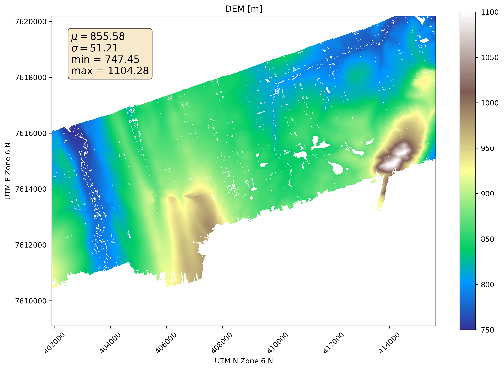

# CLPX DEM Processing Appendix
## Current environment: OS: Fedora 28, GDAL 2.2.4, python 3.6.6, rasterio 1.09, PDAL 1.6
Scripts run in a directory that should look something like this when finished:

<pre><code>
bare_earth
├── clpx_2012_157_and_159_dem.tif
├── clpx_2017_2012_dem_difference_outside_of_drifts.tif
├── clpx_2017_2012_dem_difference.tif
├── clpx_dem_2012_157.tif
├── clpx_dem_2017_156_adjusted_by_mean_DEM_delta.tif
├── clpx_dem_2017_156.tif
├── clpx_dem_master.tif
├── clpx_dem_master.vrt
├── clpx_DemVals2012_where_drifts_in2017Dem_else0.tif
├── clpx_Mean_2012_2017_DemVals_where_notdrifts_in2017Dem_and_2012DemVals_where_drifts_in2017Dem.tif
├── clpx_Mean_2012_2017_DemVals_where_notdrifts_in2017Dem_else0.tif
├── ftp_source_data
│   └── las_file_list.txt
├── generate_clpx_DEM_figs.sh
├── generate_clpx_master_dem.sh
├── orthos
│   ├── clpx_ortho_06_05_2017_sum.tif
│   └── clpx_ortho_06_05_2017.tif
└── pdal_pipelines
    ├── clpx_2012_157_dem_fix_crs_crop_filter.json
    ├── clpx_2012_159_dem_fix_crs_crop_filter.json
    └── clpx_2012_full_dem_pipeline.json
</code></pre>

<div style="page-break-after: always;"></div>

### Scripts to Derive the CLPX DEM

-   Generate the desired 2012 and 2017 DEMs:
  - 2012: There are actually two lidar acquisitions (DOY 157 and 159) from 2012. We will merge the two LAS files together - but first the DOY 159 LAS file must be reprojected into the proper coordinate reference system, and the DOY 157 LAS file must have the coordinate system explicitly defined. Outlier points in the point clouds ('floaters' and 'sinkers') also need to be filtered out before creating gridded surfaces. We process the 2012 lidar acquisitions using three PDAL pipelines, and then transform the DEM output of the last pipeline to obtain the correct extents and parameters:
      - `pdal pipeline pdal_pipelines/clpx_2012_159_dem_fix_crs_crop_filter.json`
      - `pdal pipeline pdal_pipelines/clpx_2012_157_dem_fix_crs_crop_filter.json`
      - `pdal pipeline pdal_pipelines/clpx_full_dem_pipeline.json`
      - `gdalwarp -te 401900 7609100 415650 7620200 -tr 1 1 -ot float32 clpx_2012_157_and_159_dem.tif clpx_dem_2012_157.tif`
  - 2017:
     - `gdalbuildvrt clpx_dem_2017_156.vrt ftp_source_data/June5_2017_CLPX* -tr 1 1 -te 401900 7609100 415650 7620200 -srcnodata -32767 -vrtnodata -9999`
     - `gdal_translate -of GTiff clpx_dem_2017_156.vrt clpx_dem_2017_156.tif`
-   Subtract the 2012 DEM from 2017 DEM:
  - `gdal_calc.py -A clpx_dem_2017_156.tif -B clpx_dem_2012_157.tif --outfile=clpx_2017_2012_dem_difference.tif --calc="A-B" --NoDataValue=-9999`
- Compute snowdrift DEM mask by DEM difference threshold and pixel intensity:
  - Compute the sum of the pixel intensities with this Python snippet:
    ```python
    import rasterio
    import numpy as np
    src = rasterio.open('clpx_ortho_06_05_2017.tif')
    ortho = src.read()
    ortho = ortho[0:3, :, :]
    ortho_sum = np.nansum(ortho, axis=0)
    ortho_sum[ortho_sum == 765] = 0
    ortho_sum[ortho_sum == 0] = -9999
    profile = src.profile
    profile['count'] = 1
    profile['nodata'] = -9999
    profile['dtype'] = 'float32'
    with rasterio.open('clpx_ortho_06_05_2017_sum.tif', 'w', **profile) as dst:
        dst.write(ortho_sum.astype('float32'), 1)
    ```
  - Compute the mask:
    - `gdal_calc.py -A clpx_dem_2012_157.tif -B orthos/clpx_ortho_06_04_2017_sum.tif -C clpx_2017_2012_dem_difference.tif --outfile=clpx_DemVals2012_where_drifts_in2017Dem_else0.tif --calc="A*(B>420)*(C>0)"`
- Compute mean DEM values where there are no 2017 snowdrifts:
  -   `gdal_calc.py -A clpx_dem_2012_157.tif -B clpx_dem_2017_156.tif -C clpx_DemVals2012_where_drifts_in2017Dem_else0.tif --outfile=clpx_Mean_2012_2017_DemVals_where_notdrifts_in2017Dem_else0.tif --calc="((A+B)/2)*(C==0)" --NoDataValue=-9999`
- Merge the outputs from the last two commands so that there is no longer any masked data:
  - `gdal_calc.py -A clpx_Mean_2012_2017_DemVals_where_notdrifts_in2017Dem_else0.tif -B clpx_DemVals2012_where_drifts_in2017Dem_else0.tif --outfile=clpx_Mean_2012_2017_DemVals_where_notdrifts_in2017Dem_and_2012DemVals_where_drifts_in2017Dem.tif --calc="maximum(A,B)" --NoDataValue=-9999`
- Adjust the 2017 DEM by the mean of the DEM difference map (with snowdrifts masked out) to minimize border artifacts:
    - `gdal_calc.py -A clpx_2017_2012_dem_difference.tif -B clpx_Mean_2012_2017_DemVals_where_notdrifts_in2017Dem_else0.tif --calc="A*(B>0)" --outfile=clpx_2017_2012_dem_difference_outside_of_drifts.tif --NoDataValue=-9999`
    -  `gdal_calc.py -A clpx_dem_2017_156.tif --outfile=clpx_dem_2017_156_adjusted_by_mean_DEM_delta.tif --calc="A-0.04" --NoDataValue=-9999`
- Pad the merged product with the 2017 DEM and write to a final master DEM:
  - `gdalbuildvrt clpx_dem_master.vrt clpx_dem_2017_156_adjusted_by_mean_DEM_delta.tif clpx_Mean_2012_2017_DemVals_where_notdrifts_in2017Dem_and_2012DemVals_where_drifts_in2017Dem.tif -vrtnodata -9999`
  - `gdalwarp -of Gtiff -dstnodata -9999 clpx_dem_master.vrt clpx_dem_master.tif`

***
<div style="page-break-after: always;"></div>

## CLPX 2012 DEM PDAL lidar processing pipelines
###### Filter outliers and fix metadata for DOY 157 2012 and write new LAS file.
```json
{
    "pipeline": [
        {
            "filename":"2012_157_CLPX.las",
            "type":"readers.las",
            "spatialreference":"epsg: 32606"
        },
        {
            "type":"filters.crop",
            "bounds":"([401900,415650],[7609100,7620200])"
        },
        {
            "type":"filters.outlier",
            "method":"statistical",
            "mean_k":12,
            "multiplier":2.0
        },
        {
            "type":"filters.range",
            "limits":"Classification![7:7]"
        },
        {
          "filename":"clpx_2012_157_utm.las",
          "type": "writers.las",
          "a_srs":"epsg: 32606"
        }
      ]
}
```
###### Filter outliers and fix metadata for DOY 159 2012 and write new LAS file.
```json
{
    "pipeline": [
        {
            "filename":"2012_159_CLPX.las",
            "type":"readers.las",
            "spatialreference":"epsg: 32606"
        },
        {
            "type":"filters.crop",
            "bounds":"([401900,415650],[7609100,7620200])"
        },
        {
            "type":"filters.outlier",
            "method":"statistical",
            "mean_k":12,
            "multiplier":2.0
        },
        {
            "type":"filters.range",
            "limits":"Classification![7:7]"
        },
        {
          "filename":"clpx_2012_159_utm.las",
          "type": "writers.las",
          "a_srs":"epsg: 32606"
        }
      ]
}
```
###### Merge the two processed LAS files and export to a gridded GeoTIFF DEM raster.
```json
{
  "pipeline": [
    "clpx_2012_159_utm.las",
    "clpx_2012_157_utm.las",
    {
      "type": "filters.merge"
    },
    {
      "type":"filters.crop",
      "bounds":"([401900,415650],[7609100,7620200])"
    },
    {
      "type":"filters.outlier",
      "method":"statistical",
      "mean_k":12,
      "multiplier":2.0
    },
    {
      "type":"filters.range",
      "limits":"Classification![7:7]"
    },
    {
      "filename":"clpx_2012_157_and_159_dem.tif",
      "resolution":1.0,
      "output_type":"mean",
      "radius":2.0,
      "bounds":"([401900,415650],[7609100,7620200])",
      "type": "writers.gdal"
    }
]
}
```
***
<div style="page-break-after: always;"></div>

### CLPX DEM Figures and Annotations

###### Figure 1. CLPX 2012 DEM (lidar source)



The 2012 DEM is derived from a sparser point cloud compared to the 2017 SfM point cloud. The swath is also narrower.

<div style="page-break-after: always;"></div>

###### Figure 2. CLPX 2017 DEM (SfM source)



The 2017 DEM has better continuity and coverage - but there are snowdrifts Figure 3).

<div style="page-break-after: always;"></div>

###### Figure 3. CLPX with Snowdrifts



Many remnant snowdrifts are visible in the orthomosaic.

<div style="page-break-after: always;"></div>

###### Figure 4. CLPX 2017 DEM - 2012 DEM Difference


We compute the difference between the 2017 and 2012 DEMs to determine how to mask snowdrift and not-snowdrift areas. In this case 0.0 m is selected based on comparative visual inspections of the orthomosaic (Figure 3) overlain with the DEM difference map (Figure 4). However, the threshold method alone produces snow depth maps with strong border artifacts at the edges of the 2012 DEM. Snowdrifts are also indentifiable in the orthomosaic by masking out pixels where the sum of red, green, and blue band intensities is less than 420. The intersection of the DEM difference mask and the pixel intensity mask is used as the final snowdrift mask. The masked snowdrift locations are then filled by values from the 2012 DEM (Figure 5).

<div style="page-break-after: always;"></div>

###### Figure 5. 2017 Snowdrift Mask Filled by 2012 DEM Values



<div style="page-break-after: always;"></div>

###### Figure 6. Mean 2012 & 2017 DEM Values



<div style="page-break-after: always;"></div>

###### Figure 7. Maximum of Mean DEM Values and 2012 DEM Values



The pixel-wise maximum of the previous two rasters (Figures 5 and 6) yields a DEM with mean values except where snowdrifts existed in the 2017 DEM - in which case values are from the 2012 DEM (Figure 1).

<div style="page-break-after: always;"></div>

###### Figure 8. The Final CLPX Bare Earth DEM


Users should note that even in the 'final' DEM (Figure 8), areas padded by 2017 data (i.e. no 2012 data) will still have artificially high surface heights where there were remnant snowdrifts. Snowdrift location and the coverage extent of the 2012 data should be considered when selecting subsets for later analysis. One alternative is to reduce the extent to better reflect the 2012 data.

***

<div style="page-break-after: always;"></div>

Potential to do:

###### Compare to an ArcticDEM strip e.g.

`gdalbuildvrt arctic_dem/clpx_arctic_dem_1m.vrt arctic_dem/46_18_2_1_5m_v2.0/46_18_2_1_5m_v2.0_reg_dem.tif arctic_dem/46_18_2_2_5m_v2.0/46_18_2_2_5m_v2.0_reg_dem.tif -resolution user -tr 1 1 -srcnodata -32767 -vrtnodata -9999`

`gdalwarp -s_srs EPSG:3413 -t_srs EPSG:32606 -te 401900 7609100 415650  7620200 -tr 1 1 -ot float32 arctic_dem/clpx_arctic_dem_1m.vrt arctic_dem/arctic_dem_1m_utm.tif`

`gdal_calc.py -A clpx_dem_final.tif -B arctic_dem/arctic_dem_1m_utm.tif --outfile=clpx_final_dem_minus_arctic_dem.tif --calc="B-A" --NoDataValue=-9999`

###### Edit Paths to LAS files within pipelines

END
