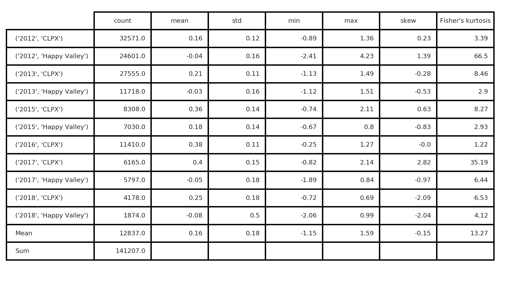
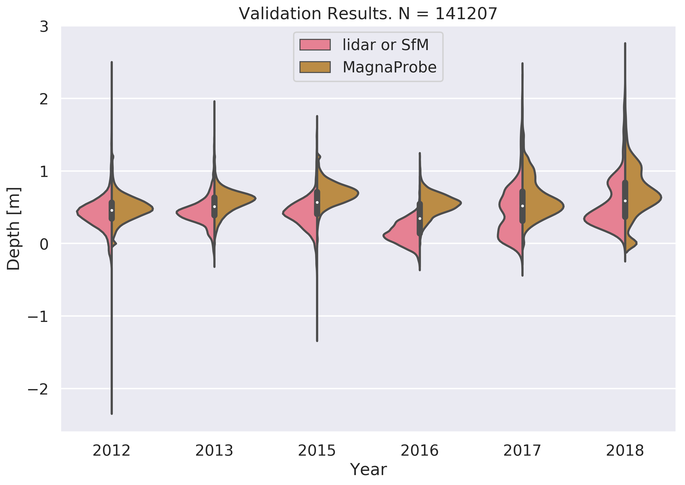
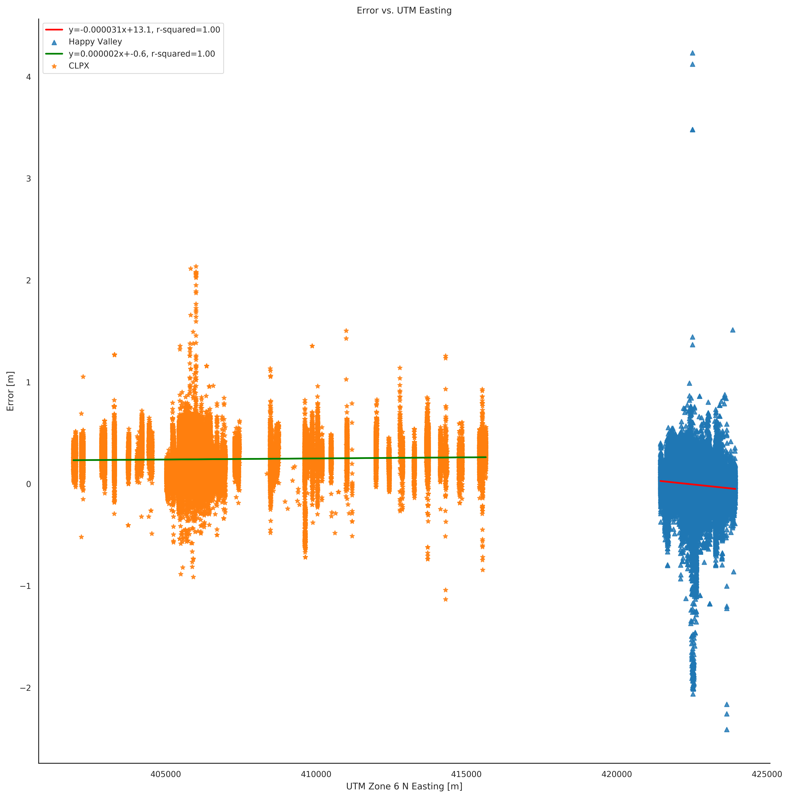
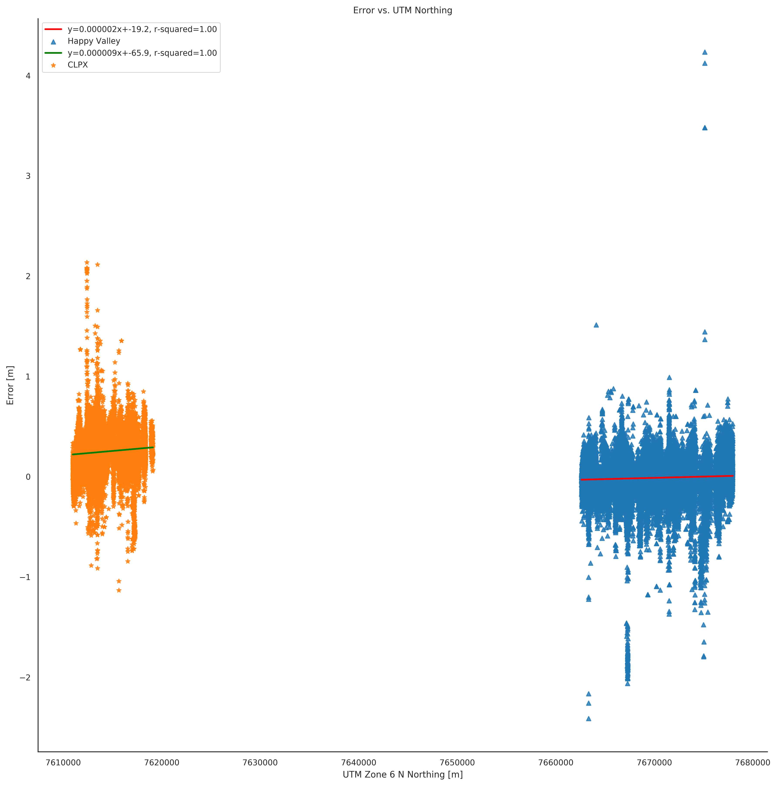
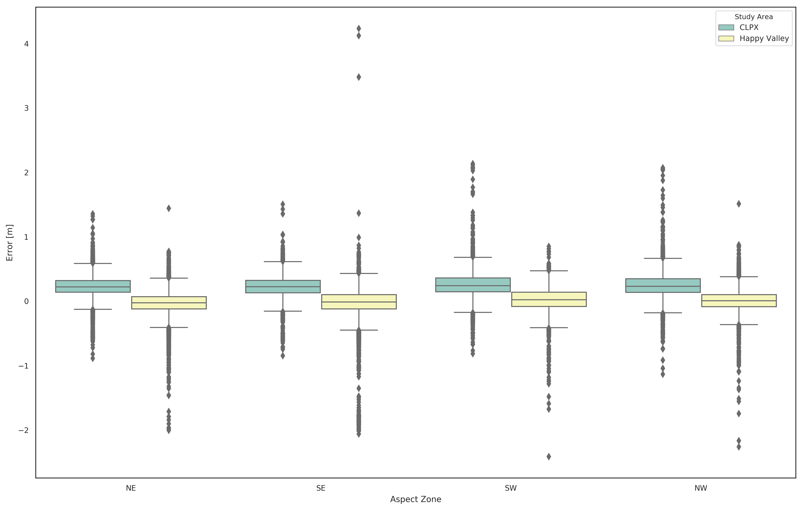

# Data

## Introduction

Three types of observations were made at Happy Valley and CLPX study areas: airborne surveys of bare-earth surface heights (i.e. digital eleveation models (DEMs)), airborne surveys of snow-covered (near peak seasonal accumulation) surface heights (i.e. digital surface models (DSMs)), and manual field measurements of snow depth. Among the airborne data are DEMs and DSMs derived from both lidar and structure-from-motion (SfM) digital photogrammetry - and orthosmosaic images accompany the latter as well. The aerial photographs constituting the basis of the SfM data come from a digital SLR coupled to an OxTS GPS-IMU and intervalometer onboard a Cessna-180 aircraft operated by UAF researcher and pilot Chris Larsen and were processed using Agisoft Photoscan Pro software. No ground control is used. All data are directly tagged with geospatial data using the aircraft positions from the GPS and precise timestamps from the moment the camera shutter opened. Lidar data comes from a Riegl LMS-Q240i scanner (also onboard C. Larsen's Cessna-180) and is processed using Riegl's RiProcess software.

These data are used to generate high resolution (1 m) maps of snow depth at landscape scales (e.g. Figure 1). Snow depth maps are computed by subtracting the snow-free DEM from the snow-covered DSM. The resulting snow depth maps are then validated using the field data that was collected concurrently with the airborne snow-covered DSMs. Between the two study areas there are twelve snow depth maps collected over a span of seven years (2012 - 2018, except in 2014) which together are comprised of over 600 million snow depth records and are validated by 141,207 field measurements of snow depth. All gridded surface data (DEMs and DSMs) in this study converge on a consistent set of geospatial data parameters (Table 1). The preparation of the DEMs and DSMs, computation of the snow depth maps, and the validation of the snow depth maps using the in situ snow depth measurements is outlined and discussed. Actual data processing guidlines are available in the attached appendices.

###### Table 1: DEM and DSM Metadata
| Metadata Property | Happy Valley | CLPX |
|----------------|----------------|----------------|
| File Format | GeoTIFF raster (.tif) | GeoTIFF raster (.tif) |
| Data Type | 32-bit floating point | 32-bit floating point |
| Coordinate Reference System | UTM Zone 6 N (EPSG: 32606) | UTM Zone 6 N (EPSG: 32606) |
| 'No Data' Value | -9999 | -9999 |
| Spatial Resolution | 1 m | 1 m |
| Dimensions (x, y) | (3400, 15400) | (13750, 11100) |
| Upper Left Coordinate (x, y) | (421000, 7678000) | (401900, 7620200) |
| Lower Left Coordinate (x, y) | (421000, 7663600) | (401900, 7609100) |
| Upper Right Coordinate (x, y) | (424400, 7678000) | (415650, 7620200) |
| Lower Right Coordinate (x, y) | (424400, 7663600) | (415650, 7609100) |
| Center (x,y) | (422700, 7670300) | (408775, 7614650) |
| Size on Disk | 200 MB | 583 MB |

## The Bare-Earth DEMs
A high resolution DEM of the bare landscape, free from snow or leafy vegetation, is the foundation of surface differential aerial snow depth mapping. At each study area individual DEMs were acquired twice: once with lidar in 2012, and once with SfM in 2017. All DEMs were acquired in early June to capture the surface elevation after the melt but prior to the leafing out of vegetation. However, each set of DEMs has relative strengths and weaknesses: the 2012 lidar DEMs are derived from sparser point clouds and cover smaller swaths than the 2017 SfM data, but remnant snowdrfits cover some areas of the 2017 SfM data and thus hide the true surface heights. These remant snowdrifts raise the 2017 DEM surface by amounts ranging from 10 cm (at snowdrift edges) up to several meters (at snowdrift depth maxima). The lidar and SfM DEMs of each study area are fused together to leverage their respective strengths and to mitigate their weaknesses. Combining two DEMs separated by five years also will minimize the influence of dynamic landscape surface height factors such as frost heave and vegetation growth upon the snow depth maps. A 'master' DEM for each study area is generated by prescribing different surface heights based on the data condition at a given location (Table 2).

###### Table 2: 'Master' DEM Matrix
| DEM Conditions          | Source of Elevation Value       |
|------------------------ |------------------------------|
| Confidence in 2012 and 2017 DEMs | Mean of 2012 and 2017 DEM |
| No Data in 2012 DEM | 2017 DEM* (SfM) |
| Snowdrift coverage in 2017 DEM | 2012 DEM (lidar)             |

*The 2017 DEM surface is shifted downward (0.04 m at CLPX; 0.12 m at Happy Valley) to minimize border artifacts in the snow depth maps where the two DEMs intersect.

The general steps* to compute the master DEMs based on the logic in Table 2 are as follows:
1. Generate 2012 and 2017 gridded DEMs with the desired parameters (Table 1).
2. Subtract the 2012 DEM from the 2017 DEM.
3. Create a 2017 snowdrift location mask.
4. Compute the mean of the 2012 and 2017 DEMs outside the snowdrift mask.
5. Retreive the 2012 DEM values within the snowdrift mask.
6. Create a new DEM joining the mean values from outside the snowdrifts and the 2012 values inside the snowdrifts.
7. Overlay this new DEM on the (adjusted) 2017 DEM - effectively padding the new DEM with the larger swath of the 2017 DEM.
8. Write the data to a 'master' DEM.

*See the following appendices for detailed documentation of these processing steps: CLPX DEM Preparation; Happy Valley DEM Preparation.

The above processing chain produces DEMs suitable for the computation of seasonal snow depth maps. We are confident in these products because the repeated acquisitions bookend most of the DSM acquisitions and because the surface height differences between the two DEMs are relatively small. Maps of topographic surface roughness are also derived directly from these DEMs.

## The Snow-Covered DSMs

Near the end of each of the six winters (2012 through 2018, except in 2014), mid-April airborne surveys acquired the surface heights of the mature, near-peak winter snowcover at each study area. The 2012 and 2013 snow-covered DSMs are generated from lidar, while all others are derived from SfM*. The DSMs are used to compute snow depth maps by subtracting the bare earth DEM. All DSMs in this study conform to the same data parameters prescribed earlier (Table 1).

*See the following appendices for detailed documentation of these processing steps: CLPX DSM Preparation; Happy Valley DSM Preparation.

## Snow Depth Maps

The snow depth maps are the element-wise difference of the summer, bare-earth DEM from the winter, snow-covered DSM: The computation the snow depth maps is a straightforward subtraction.* Each snow depth map has the same extents and metadata as the parent surfaces (Table 1). All snow depth maps measure depth in meters. The high resolution (1 m) maps capture both landscape and local patterns of snow depth distribution and reveal a striking heterogeneity within the tundra snowcover (Figure 1). The seasonal depths maps of each study area are then stacked into a three-dimensional array and mean and standard deviation depth maps are computed over the time-axis. Each seaonal depth map is then compared to a set of manual snow depth measurements made in the field conincident with the acquisition of the snow-covered DSM in order to validate the accuracy of the snow depth map.

*See the following appendices for detailed documentation of these processing steps: CLPX Snow Depth Maps; Happy Valley Snow Depth Maps.

###### Figure 1: Happy Valley 2018 Snow Depth Map

## Snow Depth Map Validation

Over a hundred thousand snow depth measurements made with a GPS-enabled automatic snow depth probe (a MagnaProbe \[Sturm and Holmgren, 2018\]) validate the twelve snow depth maps in this study (Figure 2). A custom Python script* computes the difference between the probe measurement and the value of the snow depth map pixel for that location. The resulting difference between the probe value and the map value is the error in meters. A similar script then compares these error values to geographic position, topographic slope, and aspect to determine if there is a spatial bias. Results of the error analysis are used to adjust each snow depth depth map to fit the 'true' probe measurements of snow depth as best is possible.

*See the following appendix for scripts and documentation: Snow Depth Map Validation.

###### Figure 2: An example of a field validation campaign: CLPX 2013; 27,555 MagnaProbe validation points indicated by black dots.

The primary sources of uncertainty in the snow depth maps are geolocation errors in the parent DEMs and DSMs. Geolocation errors contribute uncertainity to the snow depth maps in two ways: 1) Inaccurate measurements of surface height within each parent DEM/DSM are passed down to the snow depth map, and 2) poor geographic coregistration between the DEM and DSM. The former will produce especially severe errors where the change in true surface height is large compared to the ground sample distance (i.e. steep or rough terrain). The geolocation uncertainty within the parent DEMs/DSMs arises from the limits of the GPS onboard the aircraft and from how the GPS data is processed while building the point clouds derived from the raw laser returns (lidar) or aerial photographs (SfM). Based on previous experience we understand the geolocation error within the parent DEM / DSMs to be on the order of plus or minus 0.30 and the upper limit of the accuracy of the snow depth maps (unadjusted by probe measurements) is expected to be plus or minus 0.10 m \[Nolan et al., 2015\]. Natural dynamic landscape factors such as frost heave, shrub bending, shrub leaf-out, and the nature of the snowcover itself may also influence results. The measurements of snow depth used to validate the snow depth maps also have substantial geolocation errors (on the order of plus or minus 2.5 m) caused by the non-differential GPS onboard the instrument. Additionally, a quasi-random vertical error in depth exists that is almost always too high (as much as 0.05 m) amd is caused by the tendency to 'over-probe' down into the substrate below the snow. However, the probe is considered the true snow depth measurement in our study and we leverage the large number of measurements to validate the snow depth maps as best as possible.

We believe that over the course of a measurement campaign the combination of all of the above airborne and probe uncertainty sources cause the surface heights and resulting snow depth maps to 'float' some amount away from their actual values - and the amount of this float (as we will show) must in someway be close to a fixed offset for the survey. Given the above sources of uncertainty and lack of high fidelity ground control points, we expect corrected snow depth maps accuracies to range between 0.10 and 0.40 m. A total of 141,207 MagnaProbe points between both study areas were used in this validation process.

###### Table 3: Snow Depth Map Validation Results

The mean error (probe minus snow depth map) for all years and study areas is 0.16 m (Table 3). The probability distributions of snow depth measurements and their corresponding snow depth map values are similar in shape, albeit shifted on the depth axis. The interannual variabilty of distribution shape is largely driven by different field measurement survey strategies. (Figure 3). In each year the median error at CLPX is greater than at Happy Valley (Figure 4). This may be due to field campaign survey differences - but the terrain, wind regime, and resulting snowcover at CLPX are also much different than at Happy Valley. The katabatic-intensified patterns of drift and scour over the eastern portion of the CLPX domain are likely more difficult targets for airborne snow depth mapping because of the thin snowcover of the scoured zones and because snow depth changes quickly in the rougher terrain.

###### Figure 3. Violin plot of annual airborne and field snow depth distributions.

###### Figure 4: Box Plots of Errors (MagnaProbe minus Snow Depth Map) by Year and Study Area

Errors are examined by position (i.e. easting and northing) to determine if there is any geographic trend (Figure 5). At each study area there is a slight increase (although the Happy Valley easting case is negligble) in the absolute error value as easting and northing values increase. Similar sample points at opposite ends (N-S or E-W) of the domain are more likely to have different error values. The anisotropy is expected because swath edges are areas of lower point cloud density due to reduced photograph sidelap/overlap (SfM) or increased scan angles (lidar). Slope and aspect are also used to analyze the influence of terrain and topography upon the errors (Figure 6). The absolute error increases with slope at each study area. The geolocation errors discussed earlier likely explain some of this behavior - but these steeper slope areas are also under-sampled by field measurements with respect to the rest of the domains. Aspect has virtually no influence upon the errors within each study area.

###### Figure 5: Error Trends by Geographic Position

###### Figure 6: Errors by Slope and Aspect

A few salient features emerge from the error analysis: the median Happy Valley error is always less than that of CLPX, error distributions are more similar over time than over space (Figure 4), and the MagnaProbe snow depth measurements and snow depth maps similar distributions (Figure 3). The magnitude of the snow depth map mean errors ranges from -0.08 m to 0.40 m, but error variance is well constrained between 0.11 and 0.19 m, with the exception of the 2018 Happy Valley outlier (Table 3). The interannual variation in the error distributions is likely a function of the indiviudal character of each winter's field campaign. As expected, the snow depth maps perform slightly better where slopes are gentle and there is greater uncertainty at the swath edges. Given that there is no serious geographic or topographic influence on the errors, we apply a global correction to each snow depth map that is equal to the mean error for that study area and year (Table 3). This amounts to adding a constant value to each pixel in the snow depth map. For example, the entire 2012 Happy Valley snow depth map is 0.04 m shallower after the correction is applied. The 'corrected' snow depth maps are then the basis for all further analyses. Arithmetic global adjustments of the snow depth maps are favorable because they are simply explained, based on thousands of ground truth measurements, and easily repeated. Other more specific or complex correction schemes may be effective - but currently there is no clear justification to pursue them for our data here. Note that field validation data was not acquired at Happy Valley in 2016 due to logistical constraints. However, the mean of the Happy Valley errors from all other years is zero, thus we do not adjust the depth map in this case.

The snow depth maps described here are adjusted by some amount using the field measurments of snow depth. Errors are largely attributable to geolocation uncertainty and are biased toward swath edges. The large number field measurements (141,207) of makes us confident in the fidelity of the snow depth maps and able to move forward with an analysis of the snowcover within each study area. The decimetric level accuracy of the snow depth maps is comparable to that of other airborne (e.g. Deems et al., 2008; Deems et al., 2013; Jagt et al., 2015; Nolan et al., 2015; Bühler et al., 2016; Harder et al., 2016; Painter et al., 2016) and spaceborne \[Marti et al., 2016\] efforts. However, the snow depth maps in this study are distinguished by their landscape-scale coverage, large number of ground truth measurements, and repetition over six winters.

## References

1.  Buhler, Y., Adams, M. S., Bosch, R. & Stoffel, A. Mapping snow depth in alpine terrain with unmanned aerial systems (UASs): Potential and limitations. Cryosphere 10, 1075–1088 (2016).
2.  Deems, J. S., Painter, T. H. & Finnegan, D. C. Lidar measurement of snow depth: a review. J. Glaciol. 59, 467–479 (2013).
3.  Harder, P., Schirmer, M., Pomeroy, J. & Helgason, W. Accuracy of snow depth estimation in mountain and prairie environments by an unmanned aerial vehicle. Cryosphere 10, 2559–2571 (2016).
4.  Jagt, B., Lucieer, A., Wallace, L., Turner, D. & Durand, M. Snow Depth Retrieval with UAS Using Photogrammetric Techniques. Geosciences 5, 264–285 (2015).
5.  Marti, R. et al. Mapping snow depth in open alpine terrain from stereo satellite imagery. Cryosphere 10, 1361–1380 (2016).
6.  Nolan, M., Larsen, C. & Sturm, M. Mapping snow depth from manned aircraft on landscape scales at centimeter resolution using structure-from-motion photogrammetry. Cryosphere 9, 1445–1463 (2015).
7.  Painter, T. H. et al. The Airborne Snow Observatory: Fusion of scanning lidar, imaging spectrometer, and physically-based modeling for mapping snow water equivalent and snow albedo. Remote Sens. Environ. 184, 139–152 (2016).
8.  Sturm, M. & Holmgren, J. An Automatic Snow Depth Probe for Field Validation Campaigns. Water Resour. Res. (2018). doi:10.1029/2018WR023559
