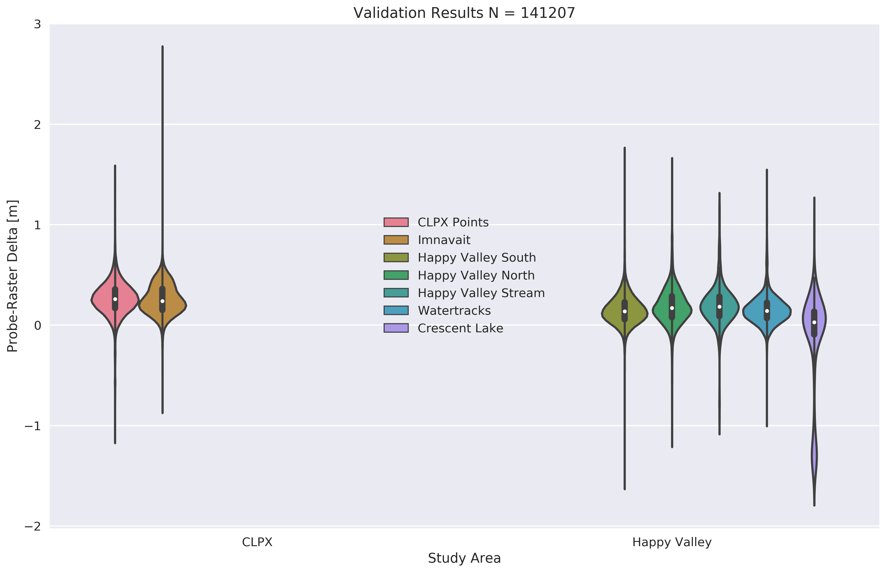
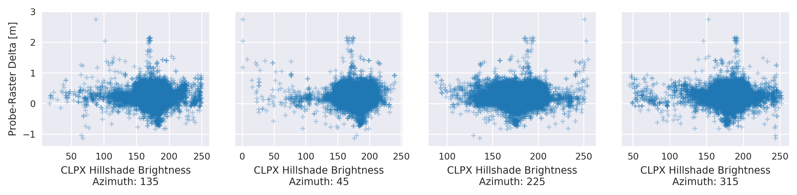

# Data

## Introduction

Three types of observations were made at Happy Valley and at CLPX: airborne surveys of snow-free surface heights (DEMs), airborne surveys of snow-covered (near peak seasonal accumulation) surface heights (DSMs), and field measurements of snow depth. Among the airborne data is both lidar and structure-from-motion (SfM) photogrammetry, with orthosmosaic images available from the latter. These data are used to generate high resolution (1 m) maps of snow depth at landscape scales. Snow depth maps are computed by subtracting the snow-free DEM from the snow-covered DSM and are then validated using the field data that was collected concurrently with the airborne snow-covered surface height surveys. Between the two study areas there are twelve snow depth maps collected over seven years (2012 - 2018) which are comprised of over 600 million snow depth records and validated by 141,207 field measurements of snow depth. Care was taken to achieve consistent and convergent geospatial data paramters within and across study areas during the processing phase (Table 1). This report and the attached appendicies detail the preparation of the DEMs and DSMs, computation of the snow depth maps, and the validation of the snow depth maps using the in situ snow depth measurements.

###### Table 1: DEM and DSM Metadata
| Metadata Property | Happy Valley | CLPX |
|-------------------------------|----------------------------|----------------------------|
| File Format | GeoTIFF raster (.tif) | GeoTIFF raster (.tif) |
| Data Type | 32-bit floating point | 32-bit floating point |
| Coordinate Reference System | UTM Zone 6 N (EPSG: 32606) | UTM Zone 6 N (EPSG: 32606) |
| 'No Data' Value | -9999 | -9999 |
| Spatial Resolution | 1 m | 1 m |
| Dimensions (x, y) | (3400, 15400) | (13750, 11100) |
| Upper Left Coordinate (x, y) | (421000, 7678000) | (401900, 7620200) |
| Lower Left Coordinate (x, y) | (421000, 7663600) | (401900, 7609100) |
| Upper Right Coordinate (x, y) | (424400, 7678000) | (415650, 7620200) |
| Lower Right Coordinate (x, y) | (424400, 7663600) | (415650, 7609100) |
| Center (x,y) | (422700, 7670300) | (408775, 7614650) |
| Size on Disk | 200 MB | 583 MB |

## Bare-Earth DEMs
The high resolution DEM of the bare landscape (no snow or leafy vegetation) surface is literally the foundation of airborne surface differential snow depth mapping. For each study area, individual DEMs were acquired in early June of two separate years (2012 and 2017) using two different techniques (lidar and SfM). Each of set of DEMs has relative strengths and weaknesses: the 2012 lidar DEMs are derived from sparser point clouds and cover smaller swaths than the 2017 data, but remnant snowdrfits cover portions of the 2017 SfM DEMs and thus hide the true surface heights. The remant snowdrifts raise the 2017 DEM surface by amounts ranging from 10 cm (at snowdrift edges) up to several meters (at snowdrift depth maxima). The lidar and SfM DEMs of each study area are fused together to mitigate the indiviudal weaknesses and to minimize the influence of dynamic landscape surface height factors such as frost heave and vegetation growth. A 'master' DEM for each study area is generated by prescribing different surface heights based on the status of the data (Table 2).
###### Table 2: 'Master' DEM matrix
| DEM Conditions          | Source of Elevation Value       |
|------------------------ |------------------------------|
| Confidence in 2012 and 2017 DEMs | Mean of 2012 and 2017 DEM |
| No Data in 2012 DEM | 2017 DEM* (SfM) |
| Snowdrift coverage in 2017 DEM | 2012 DEM (lidar)             |

*The 2017 DEM surface is shifted downward by 0.12 m (the mean of the 2017-2012 DEM difference (with snowdrifts masked out) map minus one standard deviation) to minimize border artifacts where the two DEMs meet.

The general steps to compute the master DEMs are as follows:
1. Generate 2012 and 2017 gridded DEMs with the desired parameters (Table 1).
2. Subtract the 2012 DEM from the 2017 DEM
3. Create a 2017 snowdrift location mask
4. Compute the mean of the 2012 and 2017 DEMs outside the snowdrift mask.
5. Retreive the 2012 DEM values within the snowdrift mask.
6. Create a new DEM joining the mean values and the 2012 values.
7. Overlay this new DEM on the (adjusted) 2017 DEM - effectively padding the new DEM with the larger swath of the 2017 DEM.
8. Write the data to a 'master' DEM.

These steps are documented and detailed in the DEM preparation appendix of each study area. The end result is a high confidence DEM suitable for the computation of seasonal snow depth maps.

## Snow-Covered DSMs

Near the end of each winter (2012 - 2018, except in 2014) mid-April airborne surveys acquired the surface heights of the mature, near-peak winter snowcover at each study area.

### Pick It Up Here

The rasters derived from these campaigns are the basis, along with the summer snow-free DEM, for the snow depth dDEMS. Similar to the snow free data, these data require processing to achieve constant metadata and boundaries before constructing the snow depth difference dDEMs. The 2012 and 2013 snow surfaces are generated from lidar point clouds via PDAL pipelines (see Appendix 1). All other snow surface heights (2015 - 2018) are derived from SfM.

### Data 2.1 2012 and 2013 Winter Surfaces (from lidar via PDAL)

After executing the PDAL pipelines to produce gridded GeoTIFF rasters from the 2012 and 2013 point clouds, each raster output requires an adjustment to force the correct extent and dimensions and to convert from a 64-bit to a 32-bit floating point data type.

### Data 2.2 2015-2018 Winter Surfaces

The 2015-2018 surfaces are from SfM and need minor preprocessing to achieve the correct extents, resolutions, and other metadata. At this time the CLPX 2015 winter surface is not hosted on the ftp, although several versions exist on my personal backups. I am uncertain if the data was acquired on DOY 097 or 098. The CLPX 2016 winter surface (DOY 096) is also not on the ftp, but my version consists of 22 GeoTIFF tiles (11.4 G). The tiles need to be merged and downsampled from 0.20 m pixels to 1.0 m pixels. The CLPX 2017 winter surface is on the ftp (14 tiles, 7.4 G) and also needs to be merged and downsampled. The CLPX 2018 data (20 tiles, 11.3 G) must also be merged and downsampled. The 2015 Happy Valley winter surface is hosted on the ftp (9 tiles) and needs to be mosaiced, downsampled (0.20 m to 1.0 m), and provided with correct references and metadata.
The 2016 Happy Valley snow surface is not currently on the ftp, but exists in my backups (9 tiles, 3.2 G) and needs similar processing to the 2015 data. The 2017 Happy Valley winter surface is available on the ftp and needs similar processing and downsampling (0.25 m to 1.0 m).

#### CLPX
##### 2015
`gdalwarp -te 401900 7609100 415650 7620200 -tr 1 1 -ot float32 -srcnodata -32767 -dstnodata -9999 clpx_snow_on_2015_098.tif clpx_snow_on_098_2015_warped.tif`
##### 2016
`gdalbuildvrt clpx_snow_on_096_2016.vrt clpx_2016_096* -resolution user -tr 1 1 -te 401900 7609100 415650 7620200 -srcnodata -32767 -vrtnodata -9999`

`gdal_translate -of GTiff clpx_snow_on_096_2016.vrt clpx_snow_on_096_2016.tif`
##### 2017
`gdalbuildvrt clpx_snow_on_101_2017.vrt Apr11_2017* -resolution user -tr 1 1 -te 401900 7609100 415650 7620200 -srcnodata -32767 -vrtnodata -9999`

`gdal_translate -of GTiff clpx_snow_on_101_2017.vrt clpx_snow_on_101_2017.tif`
##### 2018
`gdalbuildvrt clpx_snow_on_105_2018.vrt April15_2018* -resolution user -tr 1 1 -te 401900 7609100 415650 7620200 -srcnodata -32767 -vrtnodata -9999`

`gdal_translate -of GTiff clpx_snow_on_105_2018.vrt clpx_snow_on_105_2018.tif`

#### Happy Valley
##### 2015
`gdalbuildvrt hv_snow_on_apr82015.vrt Apr8* -resolution user -tr 1 1 -te 421000 7662600 424400 7678000 -srcnodata -32767 -vrtnodata -9999`

`gdal_translate -of GTiff hv_snow_on_apr82015.vrt hv_snow_on_098_2015.tif`
##### 2016
`gdalbuildvrt hv_snow_on_096_2016.vrt hv_2016_096_snow_on* -resolution user -tr 1 1 -te 421000 7662600 424400 7678000 -srcnodata -32767 -vrtnodata -9999`

`gdal_translate -of GTiff hv_snow_on_096_2016.vrt hv_snow_on_096_2016.tif`
##### 2017
`gdalbuildvrt hv_snow_on_apr12_2017.vrt Apr12_2017_HV.tif -resolution user -tr 1 1 -te 421000 7662600 424400 7678000 -srcnodata -32767 -vrtnodata -9999`

`gdal_translate -of GTiff hv_snow_on_apr12_2017.vrt hv_snow_on_102_2017.tif`
##### 2018
`gdalbuildvrt hv_snow_on_103_2018.vrt Apr13_2018* -resolution user -tr 1 1 -te 421000 7662600 424400 7678000 -srcnodata -32767 -vrtnodata -9999`

`gdal_translate -of GTiff hv_snow_on_103_2018.vrt hv_snow_on_103_2018.tif`

The 2015-2017 winter surfaces are now ready to be used in constructing the snow depth dDEMs. 2018 is still in progress. We can now generate snow depth [m] dDEMs for six winters for each study area by subtracting the summer bare earth DEM from the winter snow covered DEM.

* * *

## Data 3.0 Computing Snow Depth dDEMs

The GDAL commands to compute the snow depth dDEMs are available in Appendix 3: Snow Depth dDEM Computation. Each snow depth dDEM has the same extents and metadata as the parent DEMs. The snow depth [m] dDEMs are computed as the element-wise difference of the summer DEM from the winter DEM:

$$H{snow}_{ij} = Hwinter_{ij} - Hsummer_{ij}$$

###### Figure 10: A snow depth ${[m]}$ dDEM (CLPX 2017)

We compare each winter and study area's snow depth dDEM against a set of manual MagnaProbe snow depth measurements acquired at the same time as the winter surface.

* * *

## Data 4.0 Validation of the Snow Depth dDEMs

Each year the snow depth map produced by the seasonal surface differencing has been validated by thousands of MagnaProbe measurements (Figure 11). A Python script compares the value of the snow depth raster against the value of the MagnaProbe depth measurement at the same location. The difference between the MagnaProbe measurement and the raster value is the error in meters. For those familiar with ArcGIS, this is similar to the 'Extract Values to Points' geoprocessing tool, or the 'Point Sampler Plugin' for QGIS. A similar script then compares these error values to several terrain derivatives (e.g. slope, hillshade). Errors are analyzed by year, study area, location within each study area, and topography. Finally, a correction value is prescribed to adjust each snow depth map. Particular consideration is given to the case of Happy Valley in 2016 where no validation points were acquired because of logistical field work limits. All validation scripts and results are reproducible (see Appendix 4: Snow Depth dDEM Validation).

###### Figure 11: An example of a field validation campaign: CLPX 2012 Uncorrected Snow Depth dDEM $[m]$ and MagnaProbe validation points $(N=32571)$

### Data 4.1: Known Error Sources

The primary sources of uncertainty in the snow depth dDEMs are geolocation errors in the parent summer and winter DEMs. A geolocation error can contribute uncertainity to a snow depth dDEM in two ways: 1) Inaccurate measurements of surface height within each parent DEM, and 2) misregistration between the two parent DEMs. An inaccurate surface height measurement caused by geolocation uncertainty will produce especially severe errors where the change in true surface height is high with respect to the ground sample distance (i.e. steep or rough terrain). The geolocation uncertainty in the parent DEMs arises from the limits of the GPS onboard the aircraft and from how the GPS data is processed when building the lidar or SfM point clouds from the raw laser returns or aerial photographs. Based on previous experience [Nolan et al., 2015] we understand the geolocation error within the parent DEMs to be on the order of plus or minus 0.30 m. The upper limit of the accuracy of the snow depth dDEMs is expected to be plus or minus 0.10 m, although natural factors such as frost heave, shrub bending, and shrub leaf-out will influence results.

The MagnaProbe measurements of snow depth used to truh the snow depth dDEMs have errors as well. The geolocation error caused by the non-differential MagnaProbe GPS is substantial (on the order of 5.0 m) and there is a quasi-random vertical error in depth that is almost always too high (over-probe) can be as high as 0.05 m [Sturm and Holmgren, in press]. We consider the MagnaProbe measurement to be the true snow depth in our study and leverage the high number of measurements to validate the snow depth dDEMs as best as possible. We believe that over the course of a measurement campaign the combination of all of the above errors cause the surface height measurements to float some amount away from the 'true' surface - and the amount of this float (as we will show) must in someway be close to a fixed offset for the survey. Given the above sources of uncertainty and lack of ground control points, we expect corrected snow depth dDEM accuracies to range between 0.10 and 0.40 m.

### 4.2 Validation Results

A total of 141207 MagnaProbe points between both study areas were used in this validation process. The distributions of these snow depth measurements and their corresponding snow depth raster values are found in Figure 12. The mean error (snow depth dDEM minus MagnaProbe) for the entire set of data (all years and study areas) is 0.25 m (Table 1).

###### Figure 12: MagnaProbe histograms vs. snow depth dDEM histrograms, all data all years. Between each histogram pair is the boxplot for the combined measurement population.

###### Table 1: Validation Results for MagnaProbe to snow depth dDEM pixel comparisons

Table 1 indicates that the airborne retreivals of snow depth underestimate the snow depth measured by the MagnaProbe. The snow depth dDEMs are too shallow. The positive error values explain the misaligned histogram pairs in Figure 12 where the snow depth dDEM distribution is always negatively shifted with respect to its partner MagnaProbe distribution. The variability of the errors with respect to time (year) and space (study area) is examined with another violin plot (Figure 13) and by a more familiar boxplot (Figure 14). Errors are consistent between the two study areas except in 2017 (Figure 13), although in each year the median error at CLPX is greater than at Happey Valley. Errors are more variable over time than study area, but the first and third quantiles of each boxplot overlap with at least one other year (Figure 14). Note that validation data is missing for Happy Valley in 2016.

###### Figure 13: Violin Plots of Errors (MagnaProbe minus Snow Depth dDEM) by Year and Study Area

###### Figure 14: Box Plots of Errors (i.e. MagnaProbe - MagnaProbe minus Snow Depth dDEM) by Year and Study Area

To determine the presence of any geographic trend in the errors geographic zone labels are prescribed to different sets of MagnaProbe points for each study area. The CLPX points are divided into 4 zones: CLPX East, Imnavait, Imnavait North, and CLPX West. These four zones  capture different MagnaProbe sampling regimes and the general trend of wind and snow characteristics known to exist in this domain: deeper snow and milder winds in the West and shallower snow scoured by strong katabatic winds in the East [Sturm and Stuefer, 2013]. Happy Valley is split into five zones: Happy Valley North, Happy Valley South, Watertracks, Crescent Lake, and Happy Valley Stream. Total (Figures 15 and 16) and annual (Figure 17) errors are compared across these geographic zones to illuminate any potential geographic or sampling regime bias in the errors.

###### Figure 15: Violin Plots of Errors by Geographic Zone

###### Figure 16: Box Plots of Errors by Geographic Zone

###### Figure 17: Box Plots of Errors by Geographic Zone and Year

The relationship between topography and error is analyzed by
extracting values from a variety of DEM derivative rasters and comparing them to colocated error values. There are two sets of DEM derivatives: hillshade rasters and surface roughness rasters. Hillshade rasters illuminated from four different azimuths (45, 135, 225, and 315 degrees) have intensity values ranging from 0 (no illumination and black) to 255 (full illumination and white). The surface roughness rasters are slope (degrees), the terrain prominence index (TPI), the terrain ruggedness index (TRI), and roughness. Both sets of rasters are computed by GDAL commands (see Appendix 5: DEM Derivatives). Scatterplots compare error values with hillshade and surface roughness values for each study area (Figure 18).

###### Figure 18: Topographic Error Analysis

### 4.3 Validation Discussion

The overall errors are quite similar across each year and study area and the MagnaProbe snow depth measurements and the airborne snow depth retreivals have very similar distributions. The snow depth dDEM is negatively shifted with respect to the corresponding MangaProbe distribution in the violin plots (Figure 12, Table 1). The same plot indicates there is interannual variation in these distributions, but this variation is likely a function of changing MagnaProbe survey strategies and locations. The annual magnitude of the snow depth dDEM mean error ranges from 0.11 m to 0.43 m, but error variance is well constrained (annual standard deviation values range between 0.11 and 0.19 m, with 2018 Happy Valley being the outlier, Table 1). This consistent amount of variance across years and study areas explains why the error distributions look so similar for each year and study area (Figure 13).

While the errors are generally consistent over time and between the two study areas, we should also know whether or not the errors are consistent within each year and study area. Do the snow depth dDEMs perform better or worse with respect to the MagnaProbe snow depth measurements in certain locations or types of terrain? Or are the errors stationary across the entire domain for a single year? The spatial dependence of the errors, if any, will inform how to use the error analysis to correct the snow depth dDEMs. At Happy Valley, three regions have very similar error distributions: Happy Valley South, Happy Valley North, and Happy Valley Stream (Figure 15). The consistency of these errors may be driven by similar, linear sampling regimes with high N values that parallel the North-South orientation of the swath. The Crescent Lake and Watertracks zones have lower median errors (Figure 16), but have far smaller N values and surveys were intentionally aligned with the prevailing winter wind direction (West to East) to capture snowdrifts. The area of the latter two zones is much smaller as well (Crescent Lake is a single snowdrift overlaying the bank of a small tundra lake.)

At CLPX the error distributions for every geographic zone are tightly clustered (Figure 15), although the CLPX West zone has the greatest median error (Figure 16), perhaps due to a relatively low N value. The boxplots for the CLPX East and Imnavait zones are nearly identical (Figure 16) despite their disparate wind regimes and snowpacks. The low variance of the Imnavait North zone errors can probably be explained by sparse MagnaProbe coverage: these are the few points that lie North of the 1 by 1 km grids but have similar eastings to Imnavait proper. There is no signigicant variance in error across geographic zones when results from all years are considered together. Splitting the results by geographic zone and by year (Figure 17) shows some interannual variation within individual zones (e.g. Imnavait) but strong intra-annual consistency across zones. The relative position on the y-axis of the annual boxplots is consistent for many of the individual zones (Figure 17). The results here do not indicate strong spatial biases in the errors. There is variability, but this variability may be expected because of the variable sampling schemes employed at each year and zone. The topographic error analysis yields similar results: hillshade and surface roughness measures do not have signficant relationships with the error for either study area (Figure 18).

### 4.4 Correcting the Snow Depth Rasters Using the Error Analysis

Given that there is no obvious geographic or topographic influence on the errors, we apply a global correction to each snow depth dDEM that is equal to the mean error for that study area and year (Table 1). Essentially we add a constant value to each pixel in the snow depth dDEM (e.g. the entire 2012 Happy Valley snow depth dDEM is 0.12 m deeper after the correction is applied). The 'corrected' snow depth dDEMS are then the basis for all further analyses. The arithmetic global adjustments of the data seem favorable at this time because they are simple and easily explained, and based on thousands of ground truth measurements. We can remain open to other adjustment schemes, but currently there is no clear justification for a more specific or complex method based on geographic or topographic parameters.

One gap in the error analysis is the nonexistent 2016 validation points for Happy Valley. One option is to use the mean of all Happy Valley annual mean errors (0.17 m) to correct the snow depth dDEM. Another option is to use the mean error from the same year, but from the other study area (CLPX 2016; 0.40 m). An arguement for using 0.17 m is that in every year the median error for CLPX is greater than the median error at Happy Valley (Figure 14). However, as discussed earlier, the errors are consistent through time across different geographic zones. For example, for every geographic zone the 2016 median error is greater than the 2012 and 2013 median errors (Figure 17). With this behavior in mind we can weight the 2016 CLPX median error by the tendency of the Happy Valley errors to be less than the CLPX errors. The Happy Valley mean error (all years) accounts for 59% of the CLPX mean error (all years exlcuding 2016). We adjust the CLPX 2016 mean error of 0.40 m by 59% to 0.24 m and use this value to correct the 2016 Happy Valley snow depth dDEM.

## Conclusion and Moving Forward

- We have adjusted every raster by some amount.
- Errors are attributable.
- Ground truth (BIG N) makes us confident to move forward.

