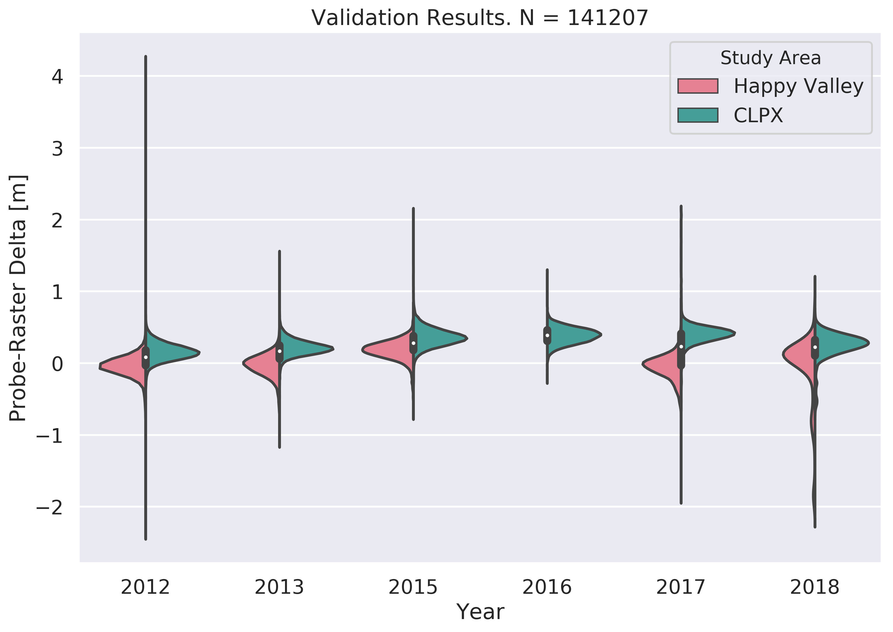

# Data, Validation, and Error Analysis

Note: The 'live' version of this document is available at <https://github.com/charparr/parr-thesis/blob/master/validation/validation_report.md>

## Introduction

The data in this study is comprised of four types: airborne lidar and airborne structure-from-motion photogrammetry (SfM) surface height measurements, SfM orthomosaic aerial images, and manual MagnaProbe geospatial measurements of snow depth. The data comes from multiple airborne and field snow measurement campaigns conducted in two distinct Arctic tundra field areas, CLPX and Happy Valley, over the course of six years. The purpose of these campaigns was to acquire the surface elevations of landscapes under two conditions: blanketed by near-peak winter snowcover, and the bare earth revealed after snowmelt but prior to the leafing out of vegetation. From these surface elevations continuous, landscape-scale maps of snow depth are retreived by subtracting the summer surface from the winter surface. Each campaign was supported by a groud validation effort consisting of thousands of manual snow depth measurements conincident with the acquisiton of the winter surface (Figure 1). The following report details the construction of the snow depth differential DEM maps (dDEMS), the validation methods and results, and discusses the nature of the errors.

## Data 1.0: The Bare Earth DEMs

The snow depth dDEMS created by seasonal surface differencing depend on high quality bare earth DEMs where the influences of dynamic landscape factors like remnant snowcover, vegetation, or even frost heave, are minimal. At Happy Valley and CLPX there are several sources of elevation data that we can use as a basis for computing snow depth:

1.  A 2012 lidar DEM (1 m spatial resolution)
2.  A 2017 SfM DEM (1 m spatial resolution)
3.  The 2016 Arctic DEM Mosiac (5 m spatial resolution)
4.  The 2011 pipeline corridor lidar digital terrain model (DTM) (1 m spatial resolution) (CLPX Only)

Note: Source data for items 1 and 2 are hosted at Chris Larsen's ftp site: <ftp://bering.gps.alaska.edu/pub/chris/snow/>. Items 3 and 4 are available from the State of Alaska elevation data portal: <https://elevation.alaska.gov>.

Each of these elevation data requires some preprocessing and consideration before incorporating using it to compute snow depth. For example, the 2012 lidar DEMs have areas of missing data due to insufficient point density and the absorbtion of laser shots by water bodies. A similar caveat exists for the 2017 DEMs: they are not truly snow-free because large remnant snowdrifts persist (visible in the conincident orthmosaics, Figure 1) and so the surface heights at these drifted locations are not representative of the bare earth. The Arctic DEM is a product of spaceborne high resolution optical stereo imagery and open source photogrammetry software (<https://www.pgc.umn.edu/data/arcticdem/>) and is coarser than the locally aircraft-collected surfaces and may have aspect driven biases (as we show later) in steep terrain. Finally, the pipeline corridor DTM only overlaps CLPX by a small amount and does not overlap Happy Valley at all. We combine and leverage these sources of elevation data to produce the most cohesive DEMs possible to use as the basis for our snow depth computations.

###### Figure 1. The 2017 CLPX DOY 156 Orthomosaic with Snowdrifts

### Data 1.1: Define Study Area Boundaries & Metadata Parameters

All geospatial data in this study will converge on a UTM Zone 6 N (EPSG: 32606) coordinate system. Rasters will have 32-bit floating point data types, 1 m pixel sizes, and no data values of -9999.

#### CLPX UTM Zone 6 N Boundaries
-   Upper Left: (401900.000, 7620200.000)
-   Lower Left: (401900.000, 7609100.000)
-   Upper Right: (415650.000, 7620200.000)
-   Lower Right: (415650.000, 7609100.000)
-   Center: (408775.000, 7614650.000)

#### Happy Valley Zone 6 N UTM Boundaries
-   Upper Left: (421000.000, 7678000.000)
-   Lower Left: (421000.000, 7662600.000)
-   Upper Right: (424400.000, 7678000.000)
-   Lower Right: (424400.000, 7662600.000)
-   Center: (422700.000, 7670300.000)

The above UTM corner coordinates are used as parameters within the Geospatial Data Abtraction (GDAL) (e.g. `-te 401900 7609100 415650 7620200`) and in the Point Data Abstraction Library (PDAL) (e.g. `([401900,415650], [7609100, 7620200])`) to processing rasters to common extents and dimensions.

### Data 1.2 Convert lidar point clouds to gridded surfaces

The next step is to convert the bare earth lidar points clouds (.LAS files) to gridded surfaces (GeoTIFF rasters). However, prior to conversion all the point clouds must have the correct spatial references and be filtered to remove outlying, anomalous points that float far above or below the actual terrain surface. The CLPX process requires an additional step of merging two point clouds because bare earth lidar was acquired on two separate days during the 2012 campaign. The processing and conversion is performed using open source (PDAL) data processing piplelines. Each pipeline is a sequential series of discrete processing steps encoded in a JSON file. The pipelines are useful because they are reproducible and document the choices of processing parameters (see Appendix 1: PDAL Pipelines).

### Data 1.3: Converge 2012 DEMs

The next step is to produce 'master' CLPX and Happy Valley bare earth DEMs from the rasters constructed via the PDAL pipelines. The default PDAL output type is a 64-bit floating point raster, so a conversion to a 32-bit data type is necessary. The PDAL outputs also have boundaries which are shifted 0.5 m from the previsouly defined target boundaries, so the correct UTM boundaries must be forced for each DEM. Executing a GDAL command for each DEM accomplishes both of the above tasks:

#### CLPX

`gdalwarp -te 401900 7609100 415650 7620200 -tr 1 1 -ot float32 clpx_2012_157_and_159_dem.tif clpx_dem_2012_warped.tif`

#### Happy Valley

`gdalwarp -te 421000 7662600 424400 7678000 -tr 1 1 -ot float32 hv_158_2012_dem.tif hv_158_2012_dem_warped.tif`

The outputs of the above GDAL commands are the 'master' 2012 bare earth DEMs for each study area. However, there are still artifacts and missing data (Figure 2) that need to be addressed using the 2017 elevation data.

###### Figure 2. The 2012 CLPX bare earth DEM

 

### Data 1.4 Fusing the 2012 and 2017 bare earth DEMs

The 2017 bare earth DEM values can be used to check and weight colocated 2012 bare earth DEM values and increase the total areal data coverage within each domain. However, the remnant snowdrifts known to exist (Figure 1) pose a problem because the snow surface is conflated with the bare earth surface. Subtracting the 2012 DEMs from the 2017 DEMs reveals how much the snowdrifts are impacting surface heights. We then use this information to fuse the bare earth DEMs from each year using the following processing steps:

1.  Create 2017 DEM with correct boundaries and metadata
2.  Subtract the 2012 DEM from the 2017 DEM
3.  Identify where the two DEMs agree or disagree
4.  Compute mean DEM values where DEMs agree
5.  Extract 2012 DEM values where DEMs disagree (i.e. snowdrifts)
6.  Extract 2017 DEM values where 2012 DEM is missing data
7.  Compute a 'final' fusion DEM from steps 4 through 6

These steps are executed with the following sequences of GDAL commands:

#### CLPX

-   Step 1 (not current for CLPX...)
    -   `gdalbuildvrt CLPX_2017_.vrt CLPX_2017_.tif -resolution user -tr 1 1 -te 401900 7609100 415650 7620200 -srcnodata -32767 -vrtnodata -9999`
    -   `gdal_translate -of GTiff CLPX_2017.vrt clpx_dem_2017_156.tif`
-   Step 2
    -   `gdal_calc.py -A clpx_dem_2017_156.tif -B clpx_dem_2012_warped.tif --outfile=clpx_2017_2012_dem_delta.tif --calc="A-B" --NoDataValue=-9999`
-   Step 3 & 4
    -   `gdal_calc.py -A clpx_dem_2012_warped.tif -B clpx_dem_2017_156.tif --outfile=clpx_mean_dem_ext2012_drift0.tif --calc="((A+B)/2)*isclose(A,B,atol=0.1)" --NoDataValue=-9999`
-   Step 5
    -   `gdal_calc.py -A clpx_dem_2012_warped.tif -B clpx_mean_dem_ext2012_drift0.tif --outfile=clpx_dem_ext_and_drift2012.tif --calc="A*(B==0)" --NoDataValue=-9999`
    -   `gdal_calc.py -A clpx_dem_ext_and_drift2012.tif -B clpx_mean_dem_ext2012_drift0.tif --outfile=clpx_dem_meanvals_and2012driftvals.tif --calc="maximum(A,B)" --NoDataValue=-9999`
-   Step 6
    -   `gdalbuildvrt clpx_dem_final.vrt clpx_dem_2017_156.tif clpx_dem_meanvals_and2012driftvals.tif`
-   Step 7
    -   `gdal_translate -of GTiff clpx_dem_final.vrt clpx_dem_final.tif`

#### Happy Valley

-   Step 1
    -   `gdalbuildvrt June4_2017_HappyValley.vrt June4_2017_HappyValley.tif -resolution user -tr 1 1 -te 421000 7662600 424400 7678000 -srcnodata -32767 -vrtnodata -9999`
    -   `gdal_translate -of GTiff June4_2017_HappyValley.vrt hv_dem_06_04_2017_1m_cropped.tif`
-   Step 2
    -   `gdal_calc.py -A hv_dem_06_04_2017_1m_cropped.tif -B hv_158_2012_dem_warped.tif --outfile=hv_2017_2012_dem_delta.tif --calc="A-B" --NoDataValue=-9999`
-   Step 3 & 4
    -   `gdal_calc.py -A hv_158_2012_dem_warped.tif -B hv_dem_06_04_2017_1m_cropped.tif --outfile=hv_mean_dem_ext2012_drift0.tif --calc="((A+B)/2)*isclose(A,B,atol=0.1)" --NoDataValue=-9999`
-   Step 5
    -   `gdal_calc.py -A hv_158_2012_dem_warped.tif -B hv_mean_dem_ext2012_drift0.tif --outfile=hv_dem_ext_and_drift2012.tif --calc="A*(B==0)" --NoDataValue=-9999`
    -   `gdal_calc.py -A hv_dem_ext_and_drift2012.tif -B hv_mean_dem_ext2012_drift0.tif --outfile=hv_dem_meanvals_and2012driftvals.tif --calc="maximum(A,B)" --NoDataValue=-9999`
-   Step 6
    -   `gdalbuildvrt hv_dem_final.vrt hv_dem_06_04_2017_1m_cropped.tif hv_dem_meanvals_and2012driftvals.tif`
-   Step 7
    -   `gdal_translate -of GTiff hv_dem_final.vrt hv_dem_final.tif`

The above DEM fusion steps are illustrated using the CLPX domain. The threshold for DEM agreement is set at 0.10 m because the remnant snowdrifts increase the 2017 bare earth DEM surfaces by amounts ranging from 0.10 m at drift edges up to several meters at drift depth maxima locations. Outside of the snowdrifts, the two DEMs are in good agreement (Figure 3).

###### Figure 3. CLPX 2012 - 2017 DEM Difference

Mean DEM values are now computed where the DEM difference is less than 0.10 m. A value of 0 is assigned elsewhere where the DEM difference is greater than 0.10 m (Figure 4).

###### Figure 4. 2012/2017 CLPX Mean DEM Values Where DEM Difference < 0.10 m, Otherwise DEM = 0

Next, the zero values that indicate poor agreement between the 2012 and 2017 DEMs (Figure 4) are assigned the value from the 2012 DEM, and all other pixels are prescribed a value of 0 (Figure 5).

###### Figure 5. 2012 DEM Values Where DEM Difference > 0.10 m, Otherwise DEM = 0

The pixel-wise maximum of the previous two rasters (Figures 4 and 5) yields a DEM with mean values except where there was poor agreement between the DEMs, in which case the 2012 DEM values are used (Figure 6).

###### Figure 6. Maximum of CLPX Mean DEM Values and 2012 DEM Values

Finally, the previous DEM (Figure 6) is combined with the 2017 DEM to extend the data coverage and fill any remaining missing data. In the GDAL build virtual raster command (Step 6), the file listed first ends up "on top", so the first file listed is the 2017 DEM followed by the processed DEM (Figure 6) that contains mean values where agreement is good and 2012 values where agreement is poor. Users should note that even in this 'final' DEM (Figure 7), the areas where there is 2017 data but not 2012 data could still have unchecked artificially high surface heights where there are remnant snowdrifts. Consider snowdrift location (e.g. Figure 1) and the 2012 point cloud boundaries when selecting subsets of the elevation data for analysis. 

###### Figure 7. The 'Final' CLPX Fusion Bare Earth DEM

### Data 1.5 Bare Earth DEM Validation

The Arctic DEM and the infrastructure corrdidor DTM (CLPX only) can be used as independent checks of the DEMs produced by the fusion process (Figure 7). The Arctic DEM must be upsampled to 1 m spatial resolution, cropped to the correct extents, and converted from WGS 84 NSIDC Sea Ice Polar Stereographic North (EPSG: 3413) to WGS 84 UTM Zone 6 N (EPSG: 32606). At Happy Valley the additional step of merging two raster tiles is required. The infrastructure corridor DTM requires similar preprocessing. The following GDAL commands produce rasters compatible with the 'final' DEMs produced earlier.

#### CLPX
##### Arctic DEM

`gdalwarp -s_srs EPSG:3413 -t_srs EPSG:32606 -te 401900 7609100 415650 7620200 -tr 1 1 -ot float32 arctic_dem/46_18_1_2_5m_v2.0_reg_dem.tif arctic_dem/arctic_dem_1m.tif`

##### Infrastructure Corridor DTM

`gdalbuildvrt infrastructure_corridor/clpx_corridor_dtm.vrt infrastructure_corridor/be_psmc4.tif infrastructure_corridor/be_psmc5.tif -te 401900 7609100 415650 7620200 -tr 1 1`

`gdalwarp -s_srs EPSG:26906 -t_srs EPSG:32606 -te 401900 7609100 415650 7620200 -tr 1 1 -ot float32 -dstnodata -9999 infrastructure_corridor/clpx_corridor_dtm.vrt infrastructure_corridor/clpx_corridor_dtm.tif`

#### Happy Valley

`gdalbuildvrt arctic_dem/hv_arctic_dem_1m.vrt arctic_dem/46_18_2_1_5m_v2.0/46_18_2_1_5m_v2.0_reg_dem.tif arctic_dem/46_18_2_2_5m_v2.0/46_18_2_2_5m_v2.0_reg_dem.tif -resolution user -tr 1 1 -srcnodata -32767 -vrtnodata -9999`

`gdalwarp -s_srs EPSG:3413 -t_srs EPSG:32606 -te 421000 7662600 424400 7678000 -tr 1 1 -ot float32 arctic_dem/hv_arctic_dem_1m.vrt arctic_dem/arctic_dem_1m_utm.tif`

Next we subtract the 'final' DEMs (e.g. Figure 7) from the Arctic DEM and the infrastructure corridor DTM (CLPX only):

#### CLPX

`gdal_calc.py -A clpx_dem_final.tif -B arctic_dem/arctic_dem_1m.tif --outfile=clpx_final_dem_minus_arctic_dem.tif --calc="B-A" --NoDataValue=-9999`

`gdal_calc.py -A clpx_dem_final.tif -B infrastructure_corridor/clpx_corridor_dtm.tif --outfile=clpx_final_dem_minus_corridor_dem.tif --calc="B-A" --NoDataValue=-9999`

#### Happy Valley

`gdal_calc.py -A hv_dem_final.tif -B arctic_dem/arctic_dem_1m_utm.tif --outfile=hv_final_dem_minus_arctic_dem.tif --calc="B-A" --NoDataValue=-9999`

The infrastructure corridor DTM underestimates the CLPX final fusion DEM by about 5 meters nearly everwhere (Figure 8). The discrepancy is large, but the consistency of the difference (a standard deviation of only 0.18 m) supports the fidelity of the final fusion CLPX DEM. Given the nature of the difference and the small amount of overlap between the two data, no adjustment of the final fusion CLPX DEM needs to be made based on the infrastructure corridor DTM. The differencing with the Arctic DEM (Figure 9) reveals good agreement between the two elevation datasets (0.14 m at CLPX, 0.49 m at Happy Valley) In each study area there appears to an aspect driven bias in the Arctic DEM. At CLPX, North aspects excede and South aspects fall short of the fusion DEM surface heights, and the magnitude of the bias is up to several meters in each case. At Happy Valley the bias is similar, except East-West rather than North-South. The aspect dependency of the bias may be a function of satellite look angles and/or the amplication of vertical errors produced by geolocation errors in steep and rugged terrain.

###### Figure 8. The CLPX 'Final' Fusion DEM Minus the Infrastructure Corridor DTM

###### Figure 9. CLPX 'Final' Fusion DEM Minus the Arctic DEM

Based on the results so far, it is useful to create two more bare earth DEM products. First, a smoothed version of the 'final' fusion DEM. A Gaussian filter is used to minimize the artifacts and sharp breaks created by flight dynamics and the data fusion process. A smoothed DEM will produce better elevation derivative products such as slope maps. Second, an adjusted version of the smoothed fusion DEM. The mean difference between the final fusion DEM and the Arctic DEM (-0.14 m and -0.49 m for CLPX and Happy Valley respectively) is added to the final fusion DEM.

#### CLPX

`gdal_calc.py -A clpx_dem_final.tif --outfile=clpx_dem_final_minus_014m.tif --calc="A-0.14" --NoDataValue=-9999`

#### Happy Valley

`gdal_calc.py -A hv_dem_final.tif --outfile=hv_dem_final_minus_049m.tif --calc="A-0.49" --NoDataValue=-9999`

There are now actually four candidate DEMs for each study area from which depth maps can be computed: the 'final' lidar/SfM fusion DEM, the final DEM adjusted to meet the Arctic DEM mean offset, the smoothed version of the final fusion DEM, and the smoothed and adjusted DEM. After computing and validating the snow depth dDEMs for each DEM type, we find that a smoothed, unadjusted lidar/SfM fusion DEM is the best choice for snow depth computation and analysis (see Appendix 2: Impact of DEM Choice on Snow Depth dDEMS)

* * *

## Data 2.0 The Winter Snow-Covered DEMs

Each winter (2012, 2013, 2015, 2016, 2017, and 2018) a mid-April measurement campaign to acquire surface heights of the mature, near-peak winter snowcover was performed. The rasters derived from these campaigns are the basis, along with the summer snow-free DEM, for the snow depth dDEMS. Similar to the snow free data, these data require processing to achieve constant metadata and boundaries before constructing the snow depth difference dDEMs. The 2012 and 2013 snow surfaces are generated from lidar point clouds via PDAL pipelines (see Appendix 1). All other snow surface heights (2015 - 2018) are derived from SfM.

### Data 2.1 2012 and 2013 Winter Surfaces (from lidar via PDAL)

After executing the PDAL pipelines to produce gridded GeoTIFF rasters from the 2012 and 2013 point clouds, each raster output requires an adjustment to force the correct extent and dimensions and to convert from a 64-bit to a 32-bit floating point data type.

#### CLPX
`gdalwarp -te 401900 7609100 415650 7620200 -tr 1 1 -ot float32 clpx_snow_on_106_2012.tif clpx_snow_on_106_2012_warped.tif`

`gdalwarp -te 401900 7609100 415650 7620200 -tr 1 1 -ot float32 clpx_snow_on_102_2013.tif clpx_snow_on_102_2013_warped.tif`

#### Happy Valley
`gdalwarp -te 421000 7662600 424400 7678000 -tr 1 1 -ot float32 hv_snow_on_107_2012.tif hv_snow_on_107_2012_warped.tif`

`gdalwarp -te 421000 7662600 424400 7678000 -tr 1 1 -ot float32 hv_snow_103_2013.tif hv_snow_103_2013_warped.tif`

The 2012 and 2013 winter surfaces for each study area now match the extents and metadata of the snow-free surfaces.

### Data 2.2 2015-2018 Winter Surfaces

The 2015-2018 surfaces are from SfM and need minor preprocessing to achieve the correct extents, resolutions, and other metadata. At this time the CLPX 2015 winter surface is not hosted on the ftp, although several versions exist on my personal backups. I am uncertain if the data was acquired on DOY 097 or 098. The CLPX 2016 winter surface (DOY 096) is also not on the ftp, but my version consists of 22 GeoTIFF tiles (11.4 G). The tiles need to be merged and downsampled from 0.20 m pixels to 1.0 m pixels. The CLPX 2017 winter surface is on the ftp (14 tiles, 7.4 G) and also needs to be merged and downsampled. The 2015 Happy Valley winter surface is hosted on the ftp (9 tiles) and needs to be mosaiced, downsampled (0.20 m to 1.0 m), and provided with correct references and metadata.
The 2016 Happy Valley snow surface is not currently on the ftp, but exists in my backups (9 tiles, 3.2 G) and needs similar processing to the 2015 data. The 2017 Happy Valley winter surface is available on the ftp and needs similar processing and downsampling (0.25 m to 1.0 m). 2018 data for both study areas in still in progress.

#### CLPX
##### 2015
`gdalwarp -te 401900 7609100 415650 7620200 -tr 1 1 -ot float32 -srcnodata -32767 -dstnodata -9999 clpx_snow_on_2015_098.tif clpx_snow_on_098_2015_warped.tif`
##### 2016
`gdalbuildvrt clpx_snow_on_096_2016.vrt clpx_2016_096* -resolution user -tr 1 1 -te 401900 7609100 415650 7620200 -srcnodata -32767 -vrtnodata -9999`

`gdal_translate -of GTiff clpx_snow_on_096_2016.vrt clpx_snow_on_096_2016.tif`
##### 2017
`gdalbuildvrt clpx_snow_on_101_2017.vrt Apr11_2017* -resolution user -tr 1 1 -te 401900 7609100 415650 7620200 -srcnodata -32767 -vrtnodata -9999`

`gdal_translate -of GTiff clpx_snow_on_101_2017.vrt clpx_snow_on_101_2017.tif`

#### Happy Valley
##### 2015
`gdalbuildvrt hv_snow_on_apr82015.vrt Apr8* -resolution user -tr 1 1 -te 421000 7662600 424400 7678000 -srcnodata -32767 -vrtnodata -9999`

`gdal_translate -of GTiff hv_snow_on_apr82015.vrt hv_snow_on_098_2015.tif`
##### 2016
`gdalbuildvrt hv_snow_on_096_2016.vrt hv_2016_096_snow_on* -resolution user -tr 1 1 -te 421000 7662600 424400 7678000 -srcnodata -32767 -vrtnodata -9999`

`gdal_translate -of GTiff hv_snow_on_096_2016.vrt hv_snow_on_096_2016.tif`
##### 2017
`gdalbuildvrt hv_snow_on_apr12_2017.vrt Apr12_2017_HV.tif -resolution user -tr 1 1 -te 421000 7662600 424400 7678000 -srcnodata -32767 -vrtnodata -9999`

`gdal_translate -of GTiff hv_snow_on_apr12_2017.vrt hv_snow_on_102_2017.tif`

The 2015-2017 winter surfaces are now ready to be used in constructing the snow depth dDEMs. 2018 is still in progress. We can now generate snow depth [m] dDEMs for six winters for each study area by subtracting the summer bare earth DEM from the winter snow covered DEM.

* * *

## Data 3.0 Computing Snow Depth dDEMs

The GDAL commands to compute the snow depth dDEMs are available in Appendix 3: Snow Depth dDEM Computation. Each snow depth dDEM has the same extents and metadata as the parent DEMs. The snow depth [m] dDEMs are computed as the element-wise difference of the summer DEM from the winter DEM:

$$H{snow}_{ij} = Hwinter_{ij} - Hsummer_{ij}$$

###### Figure 10: A snow depth ${[m]}$ dDEM (CLPX 2017)

We compare each winter and study area's snow depth dDEM against a set of manual MagnaProbe snow depth measurements acquired at the same time as the winter surface.

* * *

## Data 4.0 Validation of the Snow Depth dDEMs

Each year the snow depth map produced by the seasonal surface differencing has been validated by thousands of MagnaProbe measurements (Figure 11). A Python script compares the value of the snow depth raster against the value of the MagnaProbe depth measurement at the same location. The difference between the MagnaProbe measurement and the raster value is the error in meters. For those familiar with ArcGIS, this is similar to the 'Extract Values to Points' geoprocessing tool, or the 'Point Sampler Plugin' for QGIS. A similar script then compares these error values to several terrain derivatives (e.g. slope, hillshade). Errors are analyzed by year, study area, location within each study area, and topography. Finally, a correction value is prescribed to adjust each snow depth map. Particular consideration is given to the case of Happy Valley in 2016 where no validation points were acquired because of logistical field work limits. All validation scripts and results are reproducible (see Appendix 4: Snow Depth dDEM Validation).

###### Figure 11: An example of a field validation campaign: CLPX 2012 Uncorrected Snow Depth dDEM $[m]$ and MagnaProbe validation points $(N=32571)$

### Data 4.1: Known Error Sources

The primary sources of uncertainty in the snow depth dDEMs are geolocation errors in the parent summer and winter DEMs. A geolocation error can contribute uncertainity to a snow depth dDEM in two ways: 1) Inaccurate measurements of surface height within each parent DEM, and 2) misregistration between the two parent DEMs. An inaccurate surface height measurement caused by geolocation uncertainty will produce especially severe errors where the change in true surface height is high with respect to the ground sample distance (i.e. steep or rough terrain). The geolocation uncertainty in the parent DEMs arises from the limits of the GPS onboard the aircraft and from how the GPS data is processed when building the lidar or SfM point clouds from the raw laser returns or aerial photographs. Based on previous experience [Nolan et al., 2015] we understand the geolocation error within the parent DEMs to be on the order of plus or minus 0.30 m. The upper limit of the accuracy of the snow depth dDEMs is expected to be plus or minus 0.10 m, although natural factors such as frost heave, shrub bending, and shrub leaf-out will influence results.

The MagnaProbe measurements of snow depth used to truh the snow depth dDEMs have errors as well. The geolocation error caused by the non-differential MagnaProbe GPS is substantial (on the order of 5.0 m) and there is a quasi-random vertical error in depth that is almost always too high (over-probe) can be as high as 0.05 m [Sturm and Holmgren, in press]. We consider the MagnaProbe measurement to be the true snow depth in our study and leverage the high number of measurements to validate the snow depth dDEMs as best as possible. We believe that over the course of a measurement campaign the combination of all of the above errors cause the surface height measurements to float some amount away from the 'true' surface - and the amount of this float (as we will show) must in someway be close to a fixed offset for the survey. Given the above sources of uncertainty and lack of ground control points, we expect corrected snow depth dDEM accuracies to range between 0.10 and 0.40 m.

### 4.2 Validation Results

A total of 135155 MagnaProbe points between both study areas were used in this validation process. The distributions of these snow depth measurements and their corresponding snow depth raster values are found in Figure 12. The mean error (snow depth dDEM minus MagnaProbe) for the entire set of data (all years and study areas) is 0.26 m (Table 1).

###### Figure 12: MagnaProbe histograms vs. snow depth dDEM histrograms, all data all years. Between each histogram pair is the boxplot for the combined measurement population.

###### Table 1: Validation Results for MagnaProbe to snow depth dDEM pixel comparisons

Table 1 indicates that the airborne retreivals of snow depth underestimate the snow depth measured by the MagnaProbe. The snow depth dDEMs are too shallow. The positive error values explain the misaligned histogram pairs in Figure 12 where the snow depth dDEM distribution is always negatively shifted with respect to its partner MagnaProbe distribution. The variability of the errors with respect to time (year) and space (study area) is examined with another violin plot (Figure 13) and by a more familiar boxplot (Figure 14). Errors are consistent between the two study areas except in 2017 (Figure 13), although in each year the median error at CLPX is greater than at Happey Valley. Errors are more variable over time than study area, but the first and third quantiles of each boxplot overlap with at least one other year (Figure 14). Note that validation data is missing for Happy Valley in 2016.

###### Figure 13: Violin Plots of Errors (MagnaProbe minus Snow Depth dDEM) by Year and Study Area

###### Figure 14: Box Plots of Errors (i.e. MagnaProbe - MagnaProbe minus Snow Depth dDEM) by Year and Study Area

To determine the presence of any geographic trend in the errors geographic zone labels are prescribed to different sets of MagnaProbe points for each study area. The CLPX points are divided into 4 zones: CLPX East, Imnavait, Imnavait North, and CLPX West. These four zones  capture different MagnaProbe sampling regimes and the general trend of wind and snow characteristics known to exist in this domain: deeper snow and milder winds in the West and shallower snow scoured by strong katabatic winds in the East [Sturm and Stuefer, 2013]. Happy Valley is split into five zones: Happy Valley North, Happy Valley South, Watertracks, Crescent Lake, and Happy Valley Stream. Total (Figures 15 and 16) and annual (Figure 17) errors are compared across these geographic zones to illuminate any potential geographic or sampling regime bias in the errors.

###### Figure 15: Violin Plots of Errors by Geographic Zone

###### Figure 16: Box Plots of Errors by Geographic Zone

###### Figure 17: Box Plots of Errors by Geographic Zone and Year

The relationship between topography and error is analyzed by
extracting values from a variety of DEM derivative rasters and comparing them to colocated error values. There are two sets of DEM derivatives: hillshade rasters and surface roughness rasters. Hillshade rasters illuminated from four different azimuths (45, 135, 225, and 315 degrees) have intensity values ranging from 0 (no illumination and black) to 255 (full illumination and white). The surface roughness rasters are slope (degrees), the terrain prominence index (TPI), the terrain ruggedness index (TRI), and roughness. Both sets of rasters are computed by GDAL commands (see Appendix 5: DEM Derivatives). Scatterplots compare error values with hillshade and surface roughness values for each study area (Figure 18).

###### Figure 18: Topographic Error Analysis

### 4.3 Validation Discussion

The overall errors are quite similar across each year and study area and the MagnaProbe snow depth measurements and the airborne snow depth retreivals have very similar distributions. The snow depth dDEM is negatively shifted with respect to the corresponding MangaProbe distribution in the violin plots (Figure 12, Table 1). The same plot indicates there is interannual variation in these distributions, but this variation is likely a function of changing MagnaProbe survey strategies and locations. The annual magnitude of the snow depth dDEM mean error ranges from 0.12 m to 0.43 m, but error variance is well constrained (annual standard deviation values range between 0.11 and 0.16 m, Table 1). This consistent amount of variance across years and study areas explains why the error distributions look so similar for each year and study area (Figure 13).

While the errors are generally consistent over time and between the two study areas, we should also know whether or not the errors are consistent within each year and study area. Do the snow depth dDEMs perform better or worse with respect to the MagnaProbe snow depth measurements in certain locations or types of terrain? Or are the errors stationary across the entire domain for a single year? The spatial dependence of the errors, if any, will inform how to use the error analysis to correct the snow depth dDEMs. At Happy Valley, three regions have very similar error distributions: Happy Valley South, Happy Valley North, and Happy Valley Stream (Figure 15). The consistency of these errors may be driven by similar, linear sampling regimes with high N values that parallel the North-South orientation of the swath. The Crescent Lake and Watertracks zones have lower median errors (Figure 16), but have far smaller N values and surveys were intentionally aligned with the prevailing winter wind direction (West to East) to capture snowdrifts. The area of the latter two zones is much smaller as well (Crescent Lake is a single snowdrift overlaying the bank of a small tundra lake.)

At CLPX the error distributions for every geographic zone are tightly clustered (Figure 15), although the CLPX West zone has the greatest median error (Figure 16), perhaps due to a relatively low N value. The boxplots for the CLPX East and Imnavait zones are nearly identical (Figure 16) despite their disparate wind regimes and snowpacks. The low variance of the Imnavait North zone errors can probably be explained by sparse MagnaProbe coverage: these are the few points that lie North of the 1 by 1 km grids but have similar eastings to Imnavait proper. There is no signigicant variance in error across geographic zones when results from all years are considered together. Splitting the results by geographic zone and by year (Figure 17) shows some interannual variation within individual zones (e.g. Imnavait) but strong intra-annual consistency across zones. The relative position on the y-axis of the annual boxplots is consistent for many of the individual zones (Figure 17). The results here do not indicate strong spatial biases in the errors. There is variability, but this variability may be expected because of the variable sampling schemes employed at each year and zone. The topographic error analysis yields similar results: hillshade and surface roughness measures do not have signficant relationships with the error for either study area (Figure 18).

### 4.4 Correcting the Snow Depth Rasters Using the Error Analysis

Given that there is no obvious geographic or topographic influence on the errors, we apply a global correction to each snow depth dDEM that is equal to the mean error for that study area and year (Table 1). Essentially we add a constant value to each pixel in the snow depth dDEM (e.g. the entire 2012 Happy Valley snow depth dDEM is 0.12 m deeper after the correction is applied). The 'corrected' snow depth dDEMS are then the basis for all further analyses. The arithmetic global adjustments of the data seem favorable at this time because they are simple and easily explained, and based on thousands of ground truth measurements. We can remain open to other adjustment schemes, but currently there is no clear justification for a more specific or complex method based on geographic or topographic parameters.

One gap in the error analysis is the nonexistent 2016 validation points for Happy Valley. One option is to use the mean of all Happy Valley annual mean errors (0.19 m) to correct the snow depth dDEM. Another option is to use the mean error from the same year, but from the other study area (CLPX 2016; 0.40 m). An arguement for using 0.19 m is that in every year the median error for CLPX is greater than the median error at Happy Valley (Figure 14). However, as discussed earlier, the errors are consistent through time across different geographic zones. For example, for every geographic zone the 2016 median error is greater than the 2012 and 2013 median errors (Figure 17). With this behavior in mind we can weight the 2016 CLPX median error by the tendency of the Happy Valley errors to be less than the CLPX errors. The Happy Valley mean error (all years) accounts for 63% of the CLPX mean error (all years exlcuding 2016). We adjust the CLPX 2016 mean error of 0.40 m by 63% to 0.25 m and use this value to correct the 2016 Happy Valley snow depth dDEM.

#### Post Correction Check

###### TODO: Compare values of corrected snow depth rasters at known snow-free sites (rocks, roads). Are they about zero?

## Conclusion and Moving Forward

- We have adjusted every raster by some amount.
- Errors are attributable.
- Ground truth (BIG N) makes us confident to move forward.

"IF you set this up in the writing as a strawman, then when you look at the pdfs and so on, you can work backward toward the "why...what causes the error" question. The fact that thepdfs have very similar forms but are offset argue for large fixed errors and random smaller ones, I think.  The lack of a landscape-associated bias argues at least within the slopes we have that we are not seeing that sort of derived error in our domains.""

# TO DO
-   Add missing CLPX gdal commands
-   incoporate MS email comments
-   Regional aspect analysis (e.g. Imnav east aspects)
  - bare spot
-   Appendices
- ask chris about 2018 data, ftp missing files...
