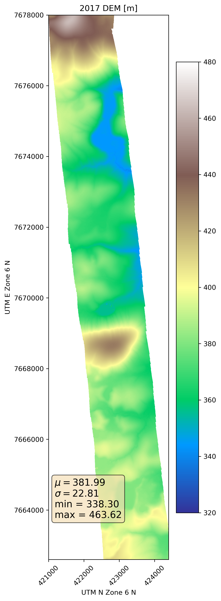
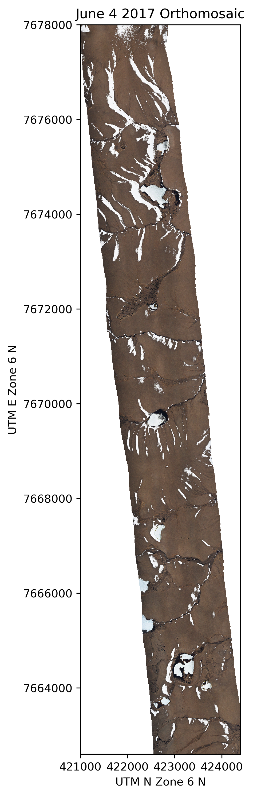
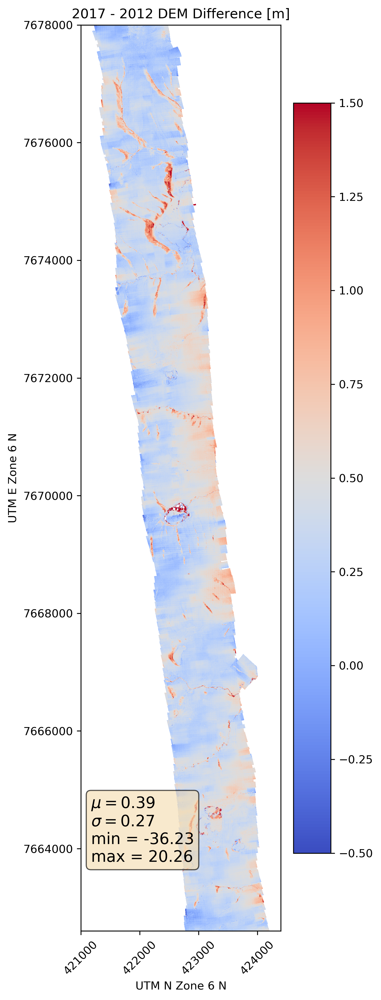
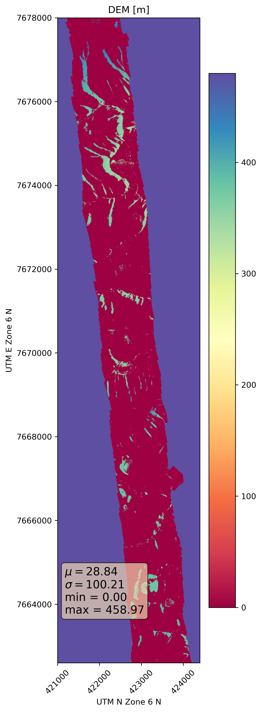
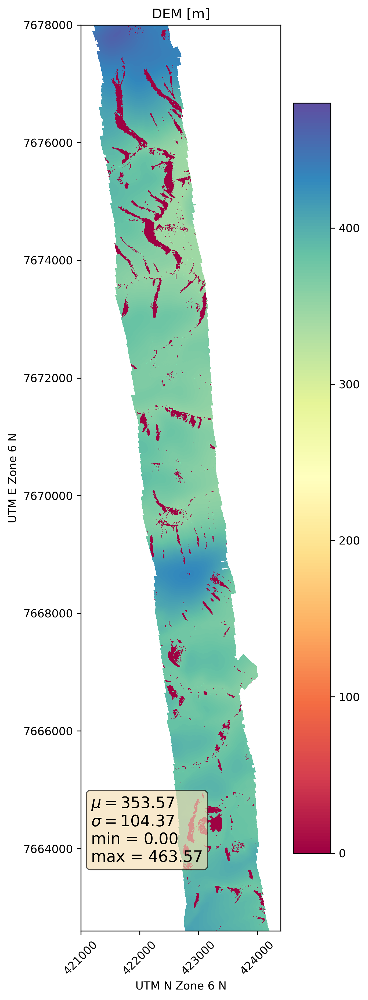
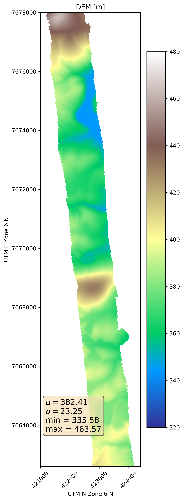

# Happy Valley DEM Processing Appendix
## Current environment: Fedora 28, GDAL 2.2.4, python 3.6.6, rasterio 1.09
Scripts run in a directory that should look something like this when finished:

<pre><code>
bare_earth
├── ftp_source_data
│   ├── HappyValley_7June2012-0-1.tif
│   ├── HappyValley_7June2012-0-2.tif
│   ├── HappyValley_7June2012-0-3.tif
│   ├── HappyValley_7June2012-1-1.tif
│   ├── HappyValley_7June2012-1-2.tif
│   ├── HappyValley_7June2012-1-3.tif
│   ├── HappyValley_7June2012-1-4.tif
│   ├── HappyValley_7June2012-1-5.tif
│   ├── HappyValley_7June2012-1-6.tif
│   ├── HappyValley_7June2012-1-7.tif
│   ├── HappyValley_7June2012-2-6.tif
│   ├── HappyValley_7June2012-2-7.tif
│   ├── June4_2017_HappyValleyOrtho-0-0.tif
│   ├── June4_2017_HappyValleyOrtho-0-1.tif
│   ├── June4_2017_HappyValleyOrtho-0-2.tif
│   ├── June4_2017_HappyValleyOrtho-0-3.tif
│   ├── June4_2017_HappyValleyOrtho-0-4.tif
│   ├── June4_2017_HappyValleyOrtho-1-3.tif
│   ├── June4_2017_HappyValleyOrtho-1-4.tif
│   └── June4_2017_HappyValley.tif
├── hv_2017_2012_dem_difference.tif
├── hv_dem_06_04_2017_adjusted_by_mean_DEM_delta.tif
├── hv_dem_06_04_2017.tif
├── hv_dem_06_07_2012.tif
├── hv_dem_master.tif
├── hv_DemVals2012_where_drifts_in2017Dem_else0.tif
├── hv_Mean_2012_2017_DemVals_where_notdrifts_in2017Dem_and_2012DemVals_where_drifts_in2017Dem.tif
├── hv_Mean_2012_2017_DemVals_where_notdrifts_in2017Dem_else0.tif
└── orthos
    ├── hv_ortho_06_04_2017_sum.tif
    └── hv_ortho_06_04_2017.tif
</code></pre>

<div style="page-break-after: always;"></div>

### Scripts to Derive the Happy Valley DEM

-   Generate the desired 2012 and 2017 DEMs
  - 2012
     - `gdalbuildvrt hv_dem_06_07_2012.vrt ftp_source_data/HappyValley_7June2012*  -tr 1 1 -te 421000 7662600 424400 7678000 -srcnodata -32767 -vrtnodata -9999`
     - `gdal_translate -of GTiff hv_dem_06_07_2012.vrt hv_dem_06_07_2012.vrt.tif`
  - 2017
     - `gdalbuildvrt hv_dem_06_04_2017.vrt ftp_source_data/June4_2017_HappyValley.tif -tr 1 1 -te 421000 7662600 424400 7678000 -srcnodata -32767 -vrtnodata -9999`
     - `gdal_translate -of GTiff hv_dem_06_04_2017.vrt hv_dem_06_04_2017.tif`
-   Subtract the 2012 DEM from 2017 DEM
  - `gdal_calc.py -A hv_dem_06_04_2017.tif -B hv_dem_06_07_2012.tif --outfile=hv_2017_2012_dem_difference.tif --calc="A-B" --NoDataValue=-9999`
- Compute snowdrift DEM mask by DEM difference threshold and pixel intensity.
  - Compute the sum of the pixel intensities with this Python snippet
    ```python
    import rasterio
    import numpy as np
    src = rasterio.open('hv_ortho_06_04_2017.tif')
    ortho = src.read()
    ortho = ortho[0:3, :, :]
    ortho_sum = np.nansum(ortho, axis=0)
    ortho_sum[ortho_sum == 765] = 0
    ortho_sum[ortho_sum == 0] = -9999
    profile = src.profile
    profile['count'] = 1
    profile['nodata'] = -9999
    profile['dtype'] = 'float32'
    with rasterio.open('hv_ortho_06_04_2017_sum.tif', 'w', **profile) as dst:
        dst.write(ortho_sum.astype('float32'), 1)
    ```
  - Compute the mask
    - `gdal_calc.py -A hv_dem_06_07_2012.tif -B orthos/hv_ortho_06_04_2017_sum.tif -C hv_2017_2012_dem_difference.tif --outfile=hv_DemVals2012_where_drifts_in2017Dem_else0.tif --calc="A*(B>420)*(C>0.4)"`
- Compute mean DEM values where there are no 2017 snowdrifts
  -   `gdal_calc.py -A hv_dem_06_07_2012.tif -B hv_dem_06_04_2017.tif -C hv_DemVals2012_where_drifts_in2017Dem_else0.tif --outfile=hv_Mean_2012_2017_DemVals_where_notdrifts_in2017Dem_else0.tif --calc="((A+B)/2)*(C==0)" --NoDataValue=-9999`
- Merge the outputs from the last two commands so that there is no longer any masked data
  - `gdal_calc.py -A hv_Mean_2012_2017_DemVals_where_notdrifts_in2017Dem_else0.tif -B hv_DemVals2012_where_drifts_in2017Dem_else0.tif --outfile=hv_Mean_2012_2017_DemVals_where_notdrifts_in2017Dem_and_2012DemVals_where_drifts_in2017Dem.tif --calc="maximum(A,B)" --NoDataValue=-9999`
- Adjust the 2017 DEM by the mean DEM difference to minimize border artifacts
    -  `gdal_calc.py -A hv_dem_06_04_2017.tif --outfile=hv_dem_06_04_2017_adjusted_by_mean_DEM_delta.tif --calc="A-0.39"`
- Pad the merged product with the 2017 DEM and write to a final master DEM
  - `gdalbuildvrt hv_dem_master.vrt hv_dem_06_04_2017_adjusted_by_mean_DEM_delta.tif hv_Mean_2012_2017_DemVals_where_notdrifts_in2017Dem_and_2012DemVals_where_drifts_in2017Dem.tif -vrtnodata -9999`
  - `gdalwarp -of Gtiff -dstnodata -9999 hv_dem_master.vrt hv_dem_master.tif`

***
<div style="page-break-after: always;"></div>

### Happy Valley DEM Figures and Annotations

###### Figure 1. Happy Valley 2012 DEM (lidar source)


The 2012 DEM is derived from a sparser point cloud compared to the 2017 SfM point cloud. The swath is also narrower.

<div style="page-break-after: always;"></div>

###### Figure 2. Happy Valley 2017 DEM (SfM source)



The 2017 DEM has better continuity and coverage - but there are snowdrifts Figure 3).

<div style="page-break-after: always;"></div>

###### Figure 3. Happy Valley with Snowdrifts



Many remnant snowdrifts are visible in the orthomosaic.

<div style="page-break-after: always;"></div>

###### Figure 4. Happy Valley 2017 DEM - 2012 DEM Difference



We compute the difference between the 2017 and 2012 DEMs to determine how to mask snowdrift and not-snowdrift areas. In this case 0.4 m is selected based on comparative visual inspections of the orthomosaic (Figure 3) overlain with the DEM difference map (Figure 4). The threshold is also appproximately a half standard deviation above the mean of the DEM difference map. However, the threshold method alone produces snow depth maps with strong border artifacts at the edges of the 2012 DEM. Snowdrifts are also indentifiable in the orthomosaic by masking out pixels where the sum of red, green, and blue band intensities is less than 420. The intersection of the DEM difference mask and the pixel intensity mask is used as the final snowdrift mask. The masked snowdrift locations are then filled by values from the 2012 DEM (Figure 5).

###### Figure 5. 2017 Snowdrift Mask Filled by 2012 DEM Values



<div style="page-break-after: always;"></div>

###### Figure 6. Mean 2012 & 2017 DEM Values



<div style="page-break-after: always;"></div>

###### Figure 7. Maximum of Mean DEM Values and 2012 DEM Values



The pixel-wise maximum of the previous two rasters (Figures 5 and 6) yields a DEM with mean values except where snowdirfts existed in the 2017 DEM - in which case values are from the 2012 DEM (Figure 1).

<div style="page-break-after: always;"></div>

###### Figure 8. The Final Happy Valley Bare Earth DEM


***

<div style="page-break-after: always;"></div>

Potential to do:

Redo ArcticDEM Validation e.g.

`gdalbuildvrt arctic_dem/hv_arctic_dem_1m.vrt arctic_dem/46_18_2_1_5m_v2.0/46_18_2_1_5m_v2.0_reg_dem.tif arctic_dem/46_18_2_2_5m_v2.0/46_18_2_2_5m_v2.0_reg_dem.tif -resolution user -tr 1 1 -srcnodata -32767 -vrtnodata -9999`

`gdalwarp -s_srs EPSG:3413 -t_srs EPSG:32606 -te 421000 7662600 424400 7678000 -tr 1 1 -ot float32 arctic_dem/hv_arctic_dem_1m.vrt arctic_dem/arctic_dem_1m_utm.tif`

`gdal_calc.py -A hv_dem_final.tif -B arctic_dem/arctic_dem_1m_utm.tif --outfile=hv_final_dem_minus_arctic_dem.tif --calc="B-A" --NoDataValue=-9999`

END
