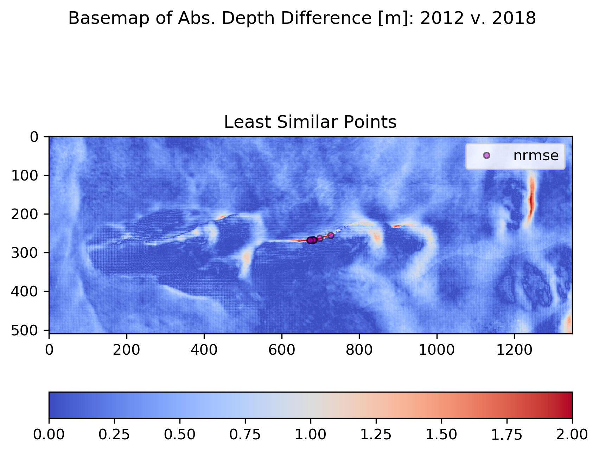
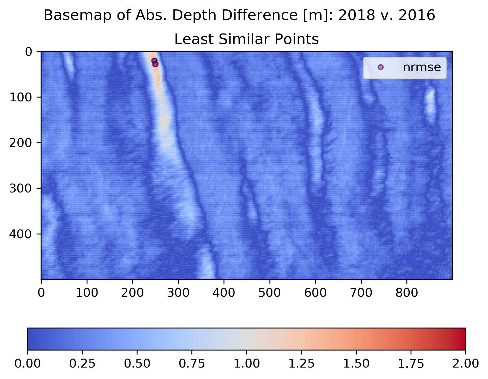
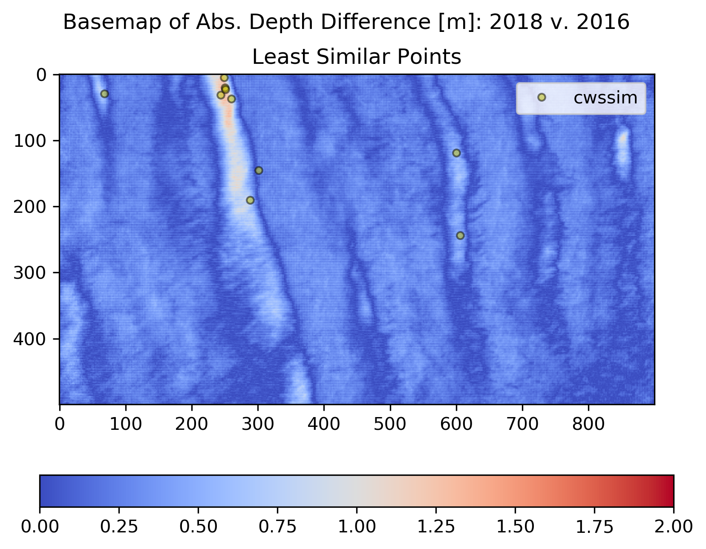
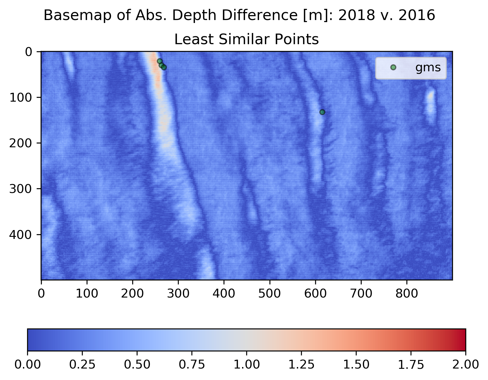

# IQA Metric to Sow Information

What do the different IQA metrics actually tell us about the differences in snow cover between two years? What are the ramifications of the similarity analysis? To determine what these IQA metrics are telling us we will examine two landscape endmembers from our subsets: the CLPX Outcrops and HV Watertrack zones. We will look at IQA results from the least similar pairs of years for each zone.

###### Figure 1. Least Similar Snow Depth Pattern Pair for CLPX Outcrops

###### Figure 2. Least Similar Snow Depth Pattern Pair for HV Watertracks

## Normalized Root Mean Square Error (NRMSE)

NRMSE will ping the maxima of the differences between the two patterns. In more dissected environments, these are usually where the amount of snow in nonfillling drifts are in disagreement. The nonfilling drift traps tend to be steep cutbanks or rocky outcrops where corniced drift ends are typical. When the flux of two different winters are substantially the different, you can get a very deep drift in one year, but in the next year that flux is not adequate and there is very little drift snow. The result is a strong (or in our case, actually a weak) NRMSE signal. We see that NRMSE is biased towards the nonfilling drifts, but does tell us the location and magntiude of the differences within these drifts. NRMSE won't tell us if different structures, or drift/scour units, do exist in each scene.

###### Figure with Profiles
###### 10 least similar (NRMSE) points.

###### 10 least similar (NRMSE) points.

## Structural SIMilarity Index (SSIM)
SSIM was created under the assumption that the human visual system very tuned in to structural information in scenes - and tundra snow patterns of drift and scour are highly structured. Snow depths are locally correlated within the drift and scour units. SSIM is a technique of comparing these structures, rather than a point-wise comparison like NRMSE. Structural information are the attributes that represent the structure of objects in a scene, independent of the local average luminance and contrast. In the world of snow depth patterns, luminance is the mean depth, and contrast is the standard deviation of depth. Snow pattern structures are locally compared after the input substracting the mean local depth and normalizing by the mean local standard deviations.

###### 10 least similar (SSIM) points.

## CW-SSIM

###### 10 least similar (SSIM) points.

## GMS

###### 10 least similar (GMS) points.

