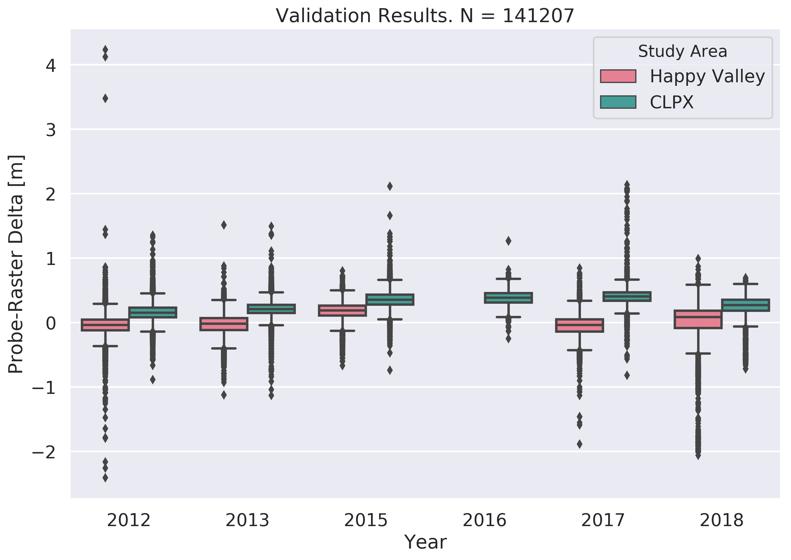
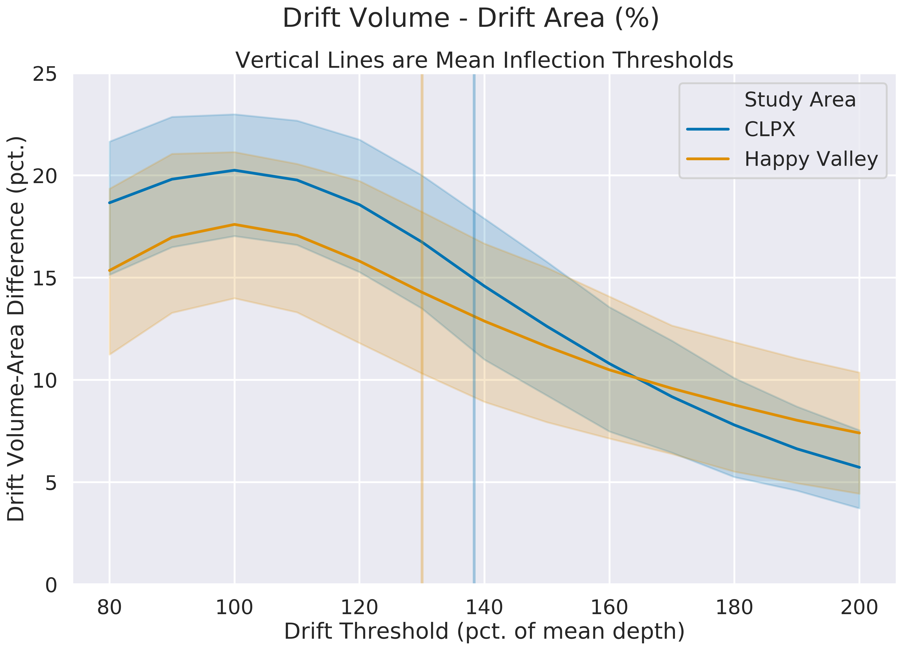
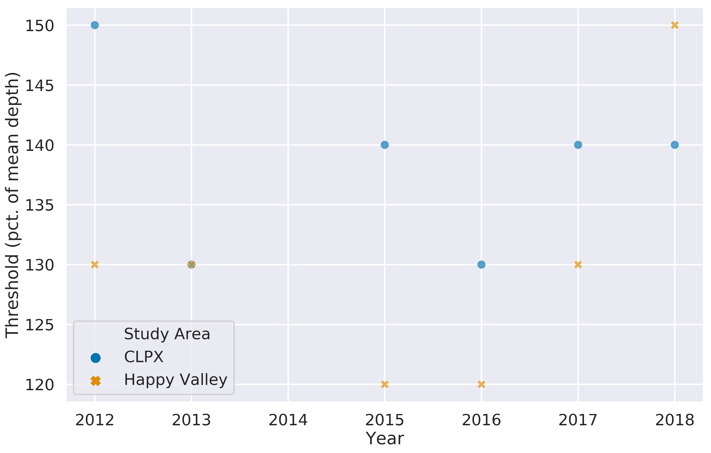
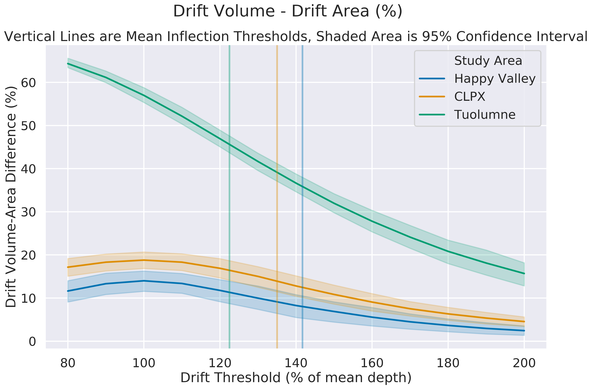
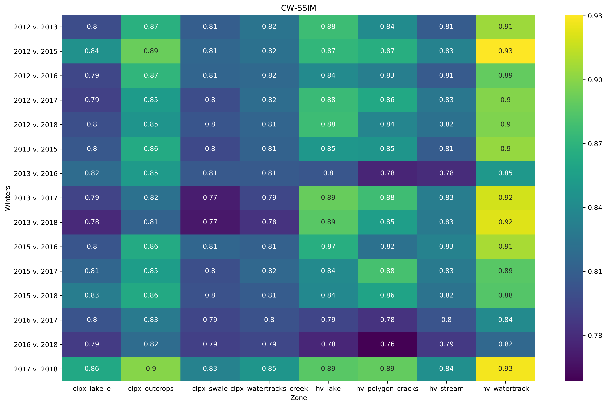
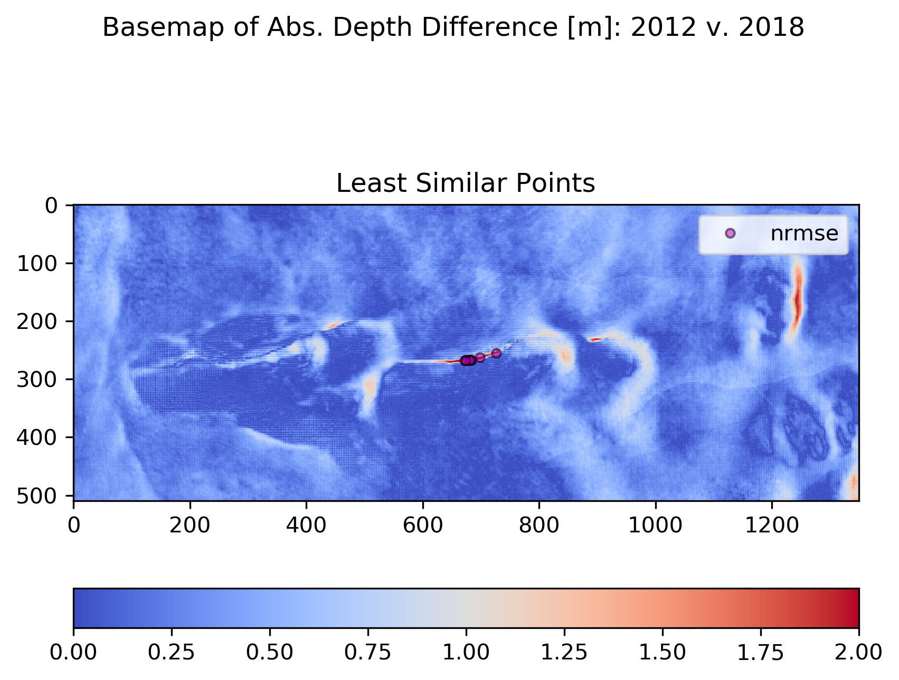
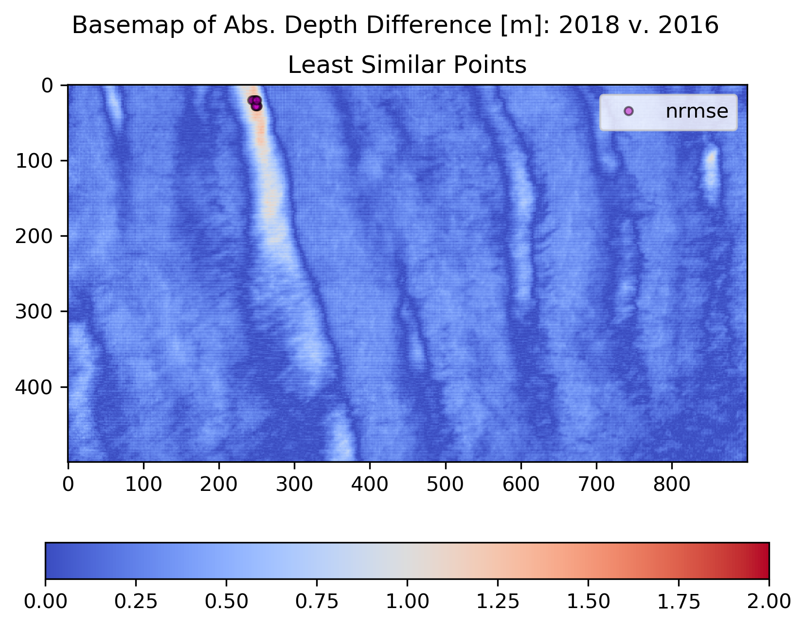
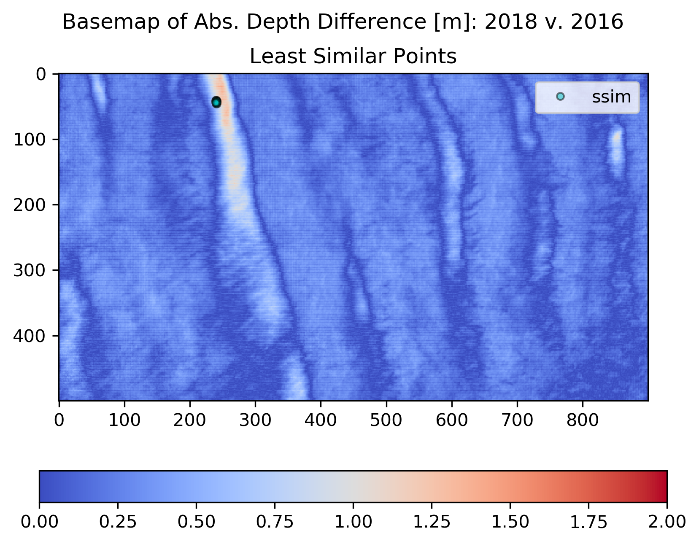

# Outline
## Introduction
## Snowdrift Background

# Introduction

Spatial patterns of snow properties (i.e. depth, density, hardness) are common in nature and occur across spatial scales that range from near-continental (106 m, e.g. glacier facies (Benson, 1962)) to local (e.g. 10 m snow surface bedforms). The processes that produce these patterns can function over years (climate patterns) or seconds, with suprisingly rapid pattern development even in the course of a single storm, where transport rates can exceed decigrams * m-2s-1. The type of snow pattern observed is predicated by the spatial scale and resolution of the observations used, and by the climate class of the snowcover (Sturm et al., 1995). In windy tundra and prairie snow classes, the most distinct spatial patterns in depth, density, and hardness are created by the scour, transport, and deposition of snow by the wind.

###### Figure 1. Spatial snow patterns of a windy prairie landscape.

In these snow classes, snow patterns exhibit two primary elements (i.e. facies). Snowdrifts are "sinks" for windblown snow and possess a relatively thick and dense snowcover.[1](#myfootnote1) Scoured zones are "sources" for the snowdrifts and are exposed to strong winds capable of eroding the snowcover and transporting it downwind where it is then deposited - unless it sublimates. Snow patterns with strong snowdrift and scour elements (Figure 1) are a function of snow precipitation (<i>P</i>) and snow transport (<i>T</i>). The <i>T</i> component is determined by the interaction of wind and topography (and vegetation, which is not a major factor in the cases presented here), and thus when the <i>T</i> signal is large, the spatial pattern of snow depth is very much dependent on the spatial pattern of topography. Tundra snow depth patterns at the landscape scale are tightly coupled with the snow transport process - which itself is coupled tightly to spatial patterns of topography. Completing the loop, local topography in tundra and prairie regions can be changed by long-lying snowdrifts via nivation processes (REFS). Understanding the nature of tundra and prairie snow depth patterns, learning how to compare and contrast them, and observing their behavior over time, can give us insight into how these snow-landscape relationships operate (Figure 1). Of particular interest is how stable over time these patterns are (fidelity, see Figure 2) and the ramifications of that stability.

<a name="myfootnote1">1</a>: Later we introduce a more precise definition of drift based on the relationship of the local depth to the mean, but most snow researchers seem to have no problem in identifying drifts without a formal definition.

Although scientific interest in snow patterns is not new, our ability to repeatedly measure them in high resolution (1 m) at the landscape scale is, largely due to the development of airborne lidar (REFS) and structure-from-motion (SfM) photogrammetry (REFS). Prior work on spatial snow patterns linked patterns to geographic variables and then used these patterns to inform hydrological models (e.g. Kirnbaur, 1991; Konig and Sturm, 1998; Grayson et al., 2002; Winstral et al., 2002l Parajka et al., 2012). A few of these studies analyzed patterns at landscape, watershed, and even regional scales (cf. Lauriol et al., 1986). Some attempted to quantify the inter-annual consistency or fidelity of the patterns (cf. Luce and Tarboton, 2004; Sturm and Wagner, 2010; Qualls and Arogundade, 2013). However, our understanding of these patterns, and the nature of the pattern-landscape connection is still immature and the observational record of snow patterns from nature is limited.

Moreover, defining, let alone comparing patterns, remains a difficult task. As remote sensing and modeling capacities expand and resolutions sharpen, the need for robust and efficicent methods of comparing spatial patterns is growing (Jetten, 2003). Measuring the similarity of one spatial pattern to another is not trivial. While comparing and interpreting two spatial patterns may be intuitive for human observers with domain-specific knowledge, it remains a complex task for computers because they can be sensitive to small changes which obscure larger similarities (Wang and Bovik...MSE Love it ref). For example, minor geometric distortions of a pattern (translation, rotation, warping, etc.), small amplitude changes, or additive noise can all disproportionately reduce statistical pattern fidelity, yet patterns exhibiting these minor differences can be quite similar. The key to improvements in this area has been the development of better computational tools, tools robust enough to ignore insignficant changes yet efficient enough to handle large datasets. The newest of these tools come close to mimicing the power of human observation in comparing pattern similarity. We use such tools to explore the ramifications of multi-year, near-peak snow depth pattern fidelity using data from two Arctic tundra field areas.

# A Snowdrift Primer

Snowdrifts massively concentrate the tundra snowcover and its superlative environmental properties (high albedo, thermal buffer, water storage, habitat, etc.) - and so their magnitude (and aesthetics) have drawn interest from many observers over the past 120 years. The relationship between fixed snowdrifts and topography was first explored by Francois Matthes in 1899. While working in Wyoming's Bighorn Mountains, Matthes noticed that even in the July heat, large snowdrifts filled the depressions on the otherwise smooth and grassy slopes of Bald Mountain. He hypothesized that topographic depressions trapped blowing snow in the same way every winter and that this created a positive feedback loop wherein the drifting → snowbank → enhanced erosion → deepening of the depression → more drifting →. His work led to a rich literature on fixed drifts and nivation hollows (McCabe, 1939; St. Onge, 1969; Rapp, 1984; others) that continues today (Lopez-Martinez et al., 2012) though these studies mainly focus on erosion beneath the drifts or the land forms produced by their continued presence. Cornish (1902) appears to be the first to have focused on the nature and formation process of the drifts themselves. He understood that it was the eddy created by an upwind feature that allowed the accumulation of snow, and he introduced the first drift classification: whether the drift was complete or incomplete. He understood that incomplete drifts, indicated by the presence of a cornice on their downwind edge (Figure 2), were those that could not fill the entire streamline of the wind because they lacked a sufficient flux of windblown snow. Ekblaw (1918), who worked in Northern Greenland (dome, piedmont, and wedge drifts) and Lewis (1939), who worked in Iceland (transverse, longitudinal, and circular drifts) developed classification systems based on catchment shape we find of less use, but we note that all three authors understood that there was a relationships between the snowdrift patterns and the topography, and that this pattern of snow deposition repeated over time, making the drift a geomorphic agent that could (over long periods of time) shape the landscape.

###### Figure 2. A Large Snowdrift Downwind of a Lake Cutbank (CLPX, 2018). Depth Estimated at 5 m.

A more practical interest in snowdrifts arose because a poor railway or road cut can produce a drift that buries the roadway. From a combination of wind tunnel experiments and observations of fixed snowdrifts, Finney (1939) concluded that a slope of at least 14° was required to produce a wind eddy and therefore a fixed drift. Rikhter (1954) and Kuz'min (1963) explored this topic further, and the work culminated in in 1975 when Tabler, on the basis of 17 snowdrifts in Wyoming and Colorado, developed an empirical regression model for snowdrift profiles based on upwind and downwind slope factors. Tabler also introduced the term 'equilibrium profile' to describe the surface profile of a fixed snowdrift which cannot grow any further because the deposited snow has filled and smoothed the catchment such that the flow separation and resulting eddy space required to form a fixed snowdrift are no longer present. Tabler’s equilibrium and non-equilibrium drifts are analogous to Cornish's complete vs. incomplete classification. Sturm and Benson (1993) echo these classifications, calling drifts either filling or non-filling. Recognizing (as did Cornish and Tabler) that if a drift was not filled (incomplete) it contained all of the snow flux from a specific direction, Benson (1981) used drift measurements to estimate that flux. \[Add recent Spanish work\]

The last type of fixed drift studies are those that have attempted to use the number and size of drifts as a climate indicator (Klapa, 1980; Lauriol et al., 1986; Watson et al., 1994). These studies have generally been based on aerial photography and while they have produced estimates of the areal coverage of drifts (Lauriol et el., 1986; Table 1), they have not been able to estimate the snow volume or mass contained in the drifts. Despite the fundamental value of the above observations, these studies have been inherently limited by the mapping methods available at the time they were done. The investigators were either constrained to the study a few fixed drifts due to the work effort of manually measuring dense and deep snow, or they had to use remote sensing data that lacked a depth dimension. Consequently, we still lack a volume (or mass) inventory of such drifts even for a single region. What is more, there are a number of snow models that incorporate blowing snow processes \[e.g., Pomeroy et al., 1993; Purves et al., 1999; Liston and Sturm, 2002; Winstral et al., 2002; Liston more recent; CROCUS, SnowPAck)\] and produce fixed drifts in numerical simulations, but in some cases the shapes of those drifts are based on the 17 drifts measured 42 years ago by Tabler. Despite this enthusiasm, snowdrifts remain a domain in which organizing knowledge is difficult for several reasons: they are changeful and  ephemeral, manually measuring them is difficult, and they occupy a wide variety of scales and locations. However, modern methods of measurement and analysis (like those employed here) offer the ability to find new knowledge within the world of snowdrifts.

# Field Areas
## Cold Land Processes Experimental Site (CLPX)

CLPX is a 96 km2 swath located in the northern foothills of the Brooks Range. The swath is bounded by the Dalton Highway and Trans-Alaska Pipeline System to the West and North and by the Kuparuk and Sagavanirktok Rivers to the South and East, both of which drain the Brooks Range north to the Arctic Ocean. The Kuparuk portion of the study area is composed mostly of piedmont hills over silt and glacial covered by wet sedge and tussock tundra.

# Data

Three types of observations were made at Happy Valley and CLPX study areas: airborne surveys of bare-earth surface heights (i.e. digital eleveation models (DEMs)), airborne surveys of snow-covered (near peak seasonal accumulation) surface heights (i.e. digital surface models (DSMs)), and manual field measurements of snow depth. Among the airborne data are DEMs and DSMs derived from both lidar and structure-from-motion (SfM) digital photogrammetry - and orthosmosaic images accompany the latter as well. The aerial photographs constituting the basis of the SfM data come from a digital SLR coupled to an OxTS GPS-IMU and intervalometer onboard a Cessna-180 aircraft operated by UAF researcher and pilot Chris Larsen and were processed using Agisoft Photoscan Pro software. No ground control is used. All data are directly tagged with geospatial data using the aircraft positions from the GPS and precise timestamps from the moment the camera shutter opened. Lidar data comes from a Riegl LMS-Q240i scanner (also onboard C. Larsen's Cessna-180) and is processed using Riegl's RiProcess software.

These data are used to generate high resolution (1 m) maps of snow depth at landscape scales (e.g. Figure 1). Snow depth maps are computed by subtracting the snow-free DEM from the snow-covered DSM. The resulting snow depth maps are then validated using the field data that was collected concurrently with the airborne snow-covered DSMs. Between the two study areas there are twelve snow depth maps collected over a span of seven years (2012 - 2018, except in 2014) which together are comprised of over 600 million snow depth records and are validated by 141,207 field measurements of snow depth. All gridded surface data (DEMs and DSMs) in this study converge on a consistent set of geospatial data parameters (Table 1). The preparation of the DEMs and DSMs, computation of the snow depth maps, and the validation of the snow depth maps using the in situ snow depth measurements is outlined and discussed. Actual data processing guidlines are available in the attached appendices.

###### Table 1: DEM and DSM Metadata
| Metadata Property | Happy Valley | CLPX |
|----------------|----------------|----------------|
| File Format | GeoTIFF raster (.tif) | GeoTIFF raster (.tif) |
| Data Type | 32-bit floating point | 32-bit floating point |
| Coordinate Reference System | UTM Zone 6 N (EPSG: 32606) | UTM Zone 6 N (EPSG: 32606) |
| 'No Data' Value | -9999 | -9999 |
| Spatial Resolution | 1 m | 1 m |
| Dimensions (x, y) | (3400, 15400) | (13750, 11100) |
| Upper Left Coordinate (x, y) | (421000, 7678000) | (401900, 7620200) |
| Lower Left Coordinate (x, y) | (421000, 7663600) | (401900, 7609100) |
| Upper Right Coordinate (x, y) | (424400, 7678000) | (415650, 7620200) |
| Lower Right Coordinate (x, y) | (424400, 7663600) | (415650, 7609100) |
| Center (x,y) | (422700, 7670300) | (408775, 7614650) |
| Size on Disk | 200 MB | 583 MB |

## The Bare-Earth DEMs
A high resolution DEM of the bare landscape, free from snow or leafy vegetation, is the foundation of surface differential aerial snow depth mapping. At each study area individual DEMs were acquired twice: once with lidar in 2012, and once with SfM in 2017. All DEMs were acquired in early June to capture the surface elevation after the melt but prior to the leafing out of vegetation. However, each set of DEMs has relative strengths and weaknesses: the 2012 lidar DEMs are derived from sparser point clouds and cover smaller swaths than the 2017 SfM data, but remnant snowdrfits cover some areas of the 2017 SfM data and thus hide the true surface heights. These remant snowdrifts raise the 2017 DEM surface by amounts ranging from 10 cm (at snowdrift edges) up to several meters (at snowdrift depth maxima). The lidar and SfM DEMs of each study area are fused together to leverage their respective strengths and to mitigate their weaknesses. Combining two DEMs separated by five years also will minimize the influence of dynamic landscape surface height factors such as frost heave and vegetation growth upon the snow depth maps. A 'master' DEM for each study area is generated by prescribing different surface heights based on the data condition at a given location (Table 2).

###### Table 2: 'Master' DEM Matrix
| DEM Conditions          | Source of Elevation Value       |
|------------------------ |------------------------------|
| Confidence in 2012 and 2017 DEMs | Mean of 2012 and 2017 DEM |
| No Data in 2012 DEM | 2017 DEM* (SfM) |
| Snowdrift coverage in 2017 DEM | 2012 DEM (lidar)             |

*The 2017 DEM surface is shifted downward (0.04 m at CLPX; 0.12 m at Happy Valley) to minimize border artifacts in the snow depth maps where the two DEMs intersect.

The general steps* to compute the master DEMs based on the logic in Table 2 are as follows:
1. Generate 2012 and 2017 gridded DEMs with the desired parameters (Table 1).
2. Subtract the 2012 DEM from the 2017 DEM.
3. Create a 2017 snowdrift location mask.
4. Compute the mean of the 2012 and 2017 DEMs outside the snowdrift mask.
5. Retreive the 2012 DEM values within the snowdrift mask.
6. Create a new DEM joining the mean values from outside the snowdrifts and the 2012 values inside the snowdrifts.
7. Overlay this new DEM on the (adjusted) 2017 DEM - effectively padding the new DEM with the larger swath of the 2017 DEM.
8. Write the data to a 'master' DEM.

*See the following appendices for detailed documentation of these processing steps: CLPX DEM Preparation; Happy Valley DEM Preparation.

The above processing chain produces DEMs suitable for the computation of seasonal snow depth maps. We are confident in these products because the repeated acquisitions bookend most of the DSM acquisitions and because the surface height differences between the two DEMs are relatively small. Maps of topographic surface roughness are also derived directly from these DEMs.
Near the end of each of the six winters (2012 through 2018, except in 2014), mid-April airborne surveys acquired the surface heights of the mature, near-peak winter snowcover at each study area. The 2012 and 2013 snow-covered DSMs are generated from lidar, while all others are derived from SfM*. The DSMs are used to compute snow depth maps by subtracting the bare earth DEM. All DSMs in this study conform to the same data parameters prescribed earlier (Table 1).

*See the following appendices for detailed documentation of these processing steps: CLPX DSM Preparation; Happy Valley DSM Preparation.

The snow depth maps are the element-wise difference of the summer, bare-earth DEM from the winter, snow-covered DSM: The computation the snow depth maps is a straightforward subtraction.* Each snow depth map has the same extents and metadata as the parent surfaces (Table 1). All snow depth maps measure depth in meters. The high resolution (1 m) maps capture both landscape and local patterns of snow depth distribution and reveal a striking heterogeneity within the tundra snowcover (Figure 1). The seasonal depths maps of each study area are then stacked into a three-dimensional array and mean and standard deviation depth maps are computed over the time-axis. Each seaonal depth map is then compared to a set of manual snow depth measurements made in the field conincident with the acquisition of the snow-covered DSM in order to validate the accuracy of the snow depth map.

*See the following appendices for detailed documentation of these processing steps: CLPX Snow Depth Maps; Happy Valley Snow Depth Maps.

###### Figure 1: Happy Valley 2018 Snow Depth Map

## Snow Depth Map Validation

Over a hundred thousand snow depth measurements made with a GPS-enabled automatic snow depth probe (a MagnaProbe \[Sturm and Holmgren, 2018\]) validate the twelve snow depth maps in this study (Figure 2). A custom Python script* computes the difference between the probe measurement and the value of the snow depth map pixel for that location. The resulting difference between the probe value and the map value is the error in meters. A similar script then compares these error values to geographic position, topographic slope, and aspect to determine if there is a spatial bias. Results of the error analysis are used to adjust each snow depth depth map to fit the 'true' probe measurements of snow depth as best is possible.

*See the following appendix for scripts and documentation: Snow Depth Map Validation.

###### Figure 2: An example of a field validation campaign: CLPX 2013; 27,555 MagnaProbe validation points indicated by black dots.

The primary sources of uncertainty in the snow depth maps are geolocation errors in the parent DEMs and DSMs. Geolocation errors contribute uncertainity to the snow depth maps in two ways: 1) Inaccurate measurements of surface height within each parent DEM/DSM are passed down to the snow depth map, and 2) poor geographic coregistration between the DEM and DSM. The former will produce especially severe errors where the change in true surface height is large compared to the ground sample distance (i.e. steep or rough terrain). The geolocation uncertainty within the parent DEMs/DSMs arises from the limits of the GPS onboard the aircraft and from how the GPS data is processed while building the point clouds derived from the raw laser returns (lidar) or aerial photographs (SfM). Based on previous experience we understand the geolocation error within the parent DEM / DSMs to be on the order of plus or minus 0.30 and the upper limit of the accuracy of the snow depth maps (unadjusted by probe measurements) is expected to be plus or minus 0.10 m \[Nolan et al., 2015\]. Natural dynamic landscape factors such as frost heave, shrub bending, shrub leaf-out, and the nature of the snowcover itself may also influence results. The measurements of snow depth used to validate the snow depth maps also have substantial geolocation errors (on the order of plus or minus 2.5 m) caused by the non-differential GPS onboard the instrument. Additionally, a quasi-random vertical error in depth exists that is almost always too high (as much as 0.05 m) amd is caused by the tendency to 'over-probe' down into the substrate below the snow. However, the probe is considered the true snow depth measurement in our study and we leverage the large number of measurements to validate the snow depth maps as best as possible.

We believe that over the course of a measurement campaign the combination of all of the above airborne and probe uncertainty sources cause the surface heights and resulting snow depth maps to 'float' some amount away from their actual values - and the amount of this float (as we will show) must in someway be close to a fixed offset for the survey. Given the above sources of uncertainty and lack of high fidelity ground control points, we expect corrected snow depth maps accuracies to range between 0.10 and 0.40 m. A total of 141,207 MagnaProbe points between both study areas were used in this validation process.

###### Table 3: Snow Depth Map Validation Results

The mean error (probe minus snow depth map) for all years and study areas is 0.16 m (Table 3). The probability distributions of snow depth measurements and their corresponding snow depth map values are similar in shape, albeit shifted on the depth axis. The interannual variabilty of distribution shape is largely driven by different field measurement survey strategies. (Figure 3). In each year the median error at CLPX is greater than at Happy Valley (Figure 4). This may be due to field campaign survey differences - but the terrain, wind regime, and resulting snowcover at CLPX are also much different than at Happy Valley. The katabatic-intensified patterns of drift and scour over the eastern portion of the CLPX domain are likely more difficult targets for airborne snow depth mapping because of the thin snowcover of the scoured zones and because snow depth changes quickly in the rougher terrain.

###### Figure 3. Violin plot of annual airborne and field snow depth distributions.

###### Figure 4: Box Plots of Errors (MagnaProbe minus Snow Depth Map) by Year and Study Area

Errors are examined by position (i.e. easting and northing) to determine if there is any geographic trend (Figure 5). At each study area there is a slight increase (although the Happy Valley easting case is negligble) in the absolute error value as easting and northing values increase. Similar sample points at opposite ends (N-S or E-W) of the domain are more likely to have different error values. The anisotropy is expected because swath edges are areas of lower point cloud density due to reduced photograph sidelap/overlap (SfM) or increased scan angles (lidar). Slope and aspect are also used to analyze the influence of terrain and topography upon the errors (Figure 6). The absolute error increases with slope at each study area. The geolocation errors discussed earlier likely explain some of this behavior - but these steeper slope areas are also under-sampled by field measurements with respect to the rest of the domains. Aspect has virtually no influence upon the errors within each study area.

###### Figure 5: Error Trends by Geographic Position

###### Figure 6: Errors by Slope and Aspect

A few salient features emerge from the error analysis: the median Happy Valley error is always less than that of CLPX, error distributions are more similar over time than over space (Figure 4), and the MagnaProbe snow depth measurements and snow depth maps similar distributions (Figure 3). The magnitude of the snow depth map mean errors ranges from -0.08 m to 0.40 m, but error variance is well constrained between 0.11 and 0.19 m, with the exception of the 2018 Happy Valley outlier (Table 3). The interannual variation in the error distributions is likely a function of the indiviudal character of each winter's field campaign. As expected, the snow depth maps perform slightly better where slopes are gentle and there is greater uncertainty at the swath edges. Given that there is no serious geographic or topographic influence on the errors, we apply a global correction to each snow depth map that is equal to the mean error for that study area and year (Table 3). This amounts to adding a constant value to each pixel in the snow depth map. For example, the entire 2012 Happy Valley snow depth map is 0.04 m shallower after the correction is applied. The 'corrected' snow depth maps are then the basis for all further analyses. Arithmetic global adjustments of the snow depth maps are favorable because they are simply explained, based on thousands of ground truth measurements, and easily repeated. Other more specific or complex correction schemes may be effective - but currently there is no clear justification to pursue them for our data here. Note that field validation data was not acquired at Happy Valley in 2016 due to logistical constraints. However, the mean of the Happy Valley errors from all other years is zero, thus we do not adjust the depth map in this case.

The snow depth maps described here are adjusted by some amount using the field measurments of snow depth. Errors are largely attributable to geolocation uncertainty and are biased toward swath edges. The large number field measurements (141,207) of makes us confident in the fidelity of the snow depth maps and able to move forward with an analysis of the snowcover within each study area. The decimetric level accuracy of the snow depth maps is comparable to that of other airborne (e.g. Deems et al., 2008; Deems et al., 2013; Jagt et al., 2015; Nolan et al., 2015; Bühler et al., 2016; Harder et al., 2016; Painter et al., 2016) and spaceborne \[Marti et al., 2016\] efforts. However, the snow depth maps in this study are distinguished by their landscape-scale coverage, large number of ground truth measurements, and repetition over six winters.

# Methods

## Pattern Similarity

Recent advances in computer hardware and software have accelerated progress in the fields of computer vision, image processing, and image quality assessment (IQA). Although there is no consensus on the single best algorithm for measuring pattern similarity, IQA research has produced a number of metrics that use information about pattern structure and organization over multiple scales to measure similarity of two images effectively, though every metric has tradeoffs between complexity, efficiency, and interpretability. For our snow pattern analysis we chose four IQA metrics to compare and contrast (Table 1).

###### Table 1. A pattern comparison toolbox composed of four IQA metrics. Values are scaled to range between zero and one.
| IQA Metric                                                      | Perfect Similarity | No Similarity |
|-----------------------------------------------------------------|--------------------|---------------|
| Euclidean-Normalized Mean Square Error (NRMSE)               | 0.0                | 1.0           |
| Structural Similarity Index Method (SSIM)                    | 0.0                | 1.0          |
| Complex Wavelet Structural Similarity Index Method (CW-SSIM) | 0.0                | 1.0          |
| Gradient Magnitude Similiarty Deviation (GMSD)               | 0.0                | 1.0           |

The first metric, NRMSE, is sensitive to pixel-wise arithmetic differences and thus it is not robust with respect to more modern IQA metrics. However, it is included here as a reference point due to a long history of use in signal processing and because of the ease with which it is computed and interpreted (Wang and Bovik, 2009). NRMSE values reported here range between 0.0 and 1.0 where a score of 1.0 indicates perfect similarity - meaning the pattern is being compared to itself. The second, SSIM, is more complex to apply than MSE, but it is still a relatively simple and efficient metric that considers the structural information in a pattern that is independednt of local mean amplitude (brightness) and contrast. Although SSIM more closely mimics the human visual system because it highlights areas where pattern gradients are high or changing, it remains sensitive to minor geometric distortions. Such non-structural distortions are countered by implementing SSIM in the complex wavelet domain. Complex wavelet SSIM (CW-SSIM) leverages information about local phase patterns and compare the wavelet coeffcients of the two images (Wang and Simoncelli, 2005). CW-SSIM results are sensitive to the parametrization of the wavlet. GMSD computes pattern gradient information by convolving a Prewitt kernel over the input images and then pooling the gradient magnitude differences by a windowed standard deviation to account for local variance (Xue et al., 2014). Together, this set of metrics can quantify pattern similarity far more thoroughly than is possible with standard techniques (e.g. MSE alone), and do so in a way that is efficient and reproducible. However, quantifying a fine degree of similairty or difference between snow patterns is not enough - what do these metrics tell us about the principal elements of our patterns, snowdrift and scour?

###### Figure 3. Pattern Similarity Maps and Surface Profiles.

When applied to snow patterns the metrics respond in such a way that depends on the input set of snow patterns as well as the metric being used. NRMSE will highlight the maxima of the difference between the two patterns (Figure 3). In windy, high topographic relief snow evironments, these maxima may be found where the amount of snow trapped in nonfillling drifts differs between the two patterns. The nonfilling drift traps tend to be steep cutbanks or rocky outcrops where corniced drift ends are typical. When the flux of two different winters are substantially the different, you can get a very deep drift in one year, but in the next year that flux is not adequate and there is very little drift snow. The result is a strong (or in our case, actually a weak) NRMSE signal. We see that NRMSE is biased towards the nonfilling drifts, but does tell us the location and magntiude of the differences within these drifts. NRMSE won't tell us if different structures, or drift/scour units, do exist in each scene.

## Structural SIMilarity Index (SSIM)
SSIM was created under the assumption that the human visual system very tuned in to structural information in scenes - and tundra snow patterns of drift and scour are highly structured. Snow depths are locally correlated within the drift and scour units. SSIM is a technique of comparing these structures, rather than a point-wise comparison like NRMSE. Structural information are the attributes that represent the structure of objects in a scene, independent of the local average luminance and contrast. In the world of snow depth patterns, luminance is the mean depth, and contrast is the standard deviation of depth. Snow pattern structures are locally compared after the input substracting the mean local depth and normalizing by the mean local standard deviations.

The second, SSIM, is more complex to apply than MSE, but it is still a relatively simple and efficient metric that considers the structural information in a pattern that is independent of local mean amplitude (brightness) and contrast. Although SSIM more closely mimics the human visual system because it targets areas where pattern gradients are high or are changing, it is still sensitive to minor geometric distortions. For these reasons, we ultimately do not use SSIM in our pattern fidelity analysis.

The non-structural distortions that hinder SSIM are countered by implementing the technique in the complex wavelet domain (CW-SSIM), our third metric. CW-SSIM leverages information about local phase patterns and how the wavelet coefficients compare across images (Wang and Simoncelli, 2005).

GMSD is a similarly robust metric and is the modern endpoint in our IQA toolbox. More efficient than most contemporary methods, GMSD computes gradient information by convolving a Prewitt kernel over the images and then pooling the gradient magnitude differences by a windowed standard deviation to account for local variance (Xue et. al, 2014). Together, CW-SSIM and GMSD can be used to quantify pattern similarity far more thoroughly than is possible with standard techniques, and do so in a way that is efficient and reproducible.

###

***

## References

1.  Buhler, Y., Adams, M. S., Bosch, R. & Stoffel, A. Mapping snow depth in alpine terrain with unmanned aerial systems (UASs): Potential and limitations. Cryosphere 10, 1075–1088 (2016).
2.  Deems, J. S., Painter, T. H. & Finnegan, D. C. Lidar measurement of snow depth: a review. J. Glaciol. 59, 467–479 (2013).
3.  Harder, P., Schirmer, M., Pomeroy, J. & Helgason, W. Accuracy of snow depth estimation in mountain and prairie environments by an unmanned aerial vehicle. Cryosphere 10, 2559–2571 (2016).
4.  Jagt, B., Lucieer, A., Wallace, L., Turner, D. & Durand, M. Snow Depth Retrieval with UAS Using Photogrammetric Techniques. Geosciences 5, 264–285 (2015).
5.  Marti, R. et al. Mapping snow depth in open alpine terrain from stereo satellite imagery. Cryosphere 10, 1361–1380 (2016).
6.  Nolan, M., Larsen, C. & Sturm, M. Mapping snow depth from manned aircraft on landscape scales at centimeter resolution using structure-from-motion photogrammetry. Cryosphere 9, 1445–1463 (2015).
7.  Painter, T. H. et al. The Airborne Snow Observatory: Fusion of scanning lidar, imaging spectrometer, and physically-based modeling for mapping snow water equivalent and snow albedo. Remote Sens. Environ. 184, 139–152 (2016).
8.  Sturm, M. & Holmgren, J. An Automatic Snow Depth Probe for Field Validation Campaigns. Water Resour. Res. (2018). doi:10.1029/2018WR023559

###### Figure 2. A series of watertrack drifts on Alaska's North Slope separated by scoured interfluves that sourced the drift snow. The pattern repeats each year with remarkable consistency.

## Snowdrift Defition: Finding a Depth Threshold

Many snow scientists colloquially understand a drift to be an accumulation of snow deposited by wind, often found in the lee of a break in slope or obstacle like a tree or fence. In the field, the 'eyeball' threshold test of "I know a drift when I see it" will suffice. However, that eyeball test is informed by a full set of 3-D information including geometry, texture, shadowing, and even color. In a planar, map-view world of snow depth like that presented here, how should we formally distinguish drift snow from 'not-drift' snow across an entire snow-covered landscape with a variety of snow classes and hetergenous depth? The eyeball test will not suffice because in remote sensing we often lack the field perspective and because the spatial distribution of snow depth is complex with nebulous transitions between snow classes. To clarify our thinking (and it will be useful for our analysis) about drifts, we need to find a threshold of snowdepth beyond which we can be confident that the snow has indeed been deepened by the deposition of wind-blown snow. However, this threshold is unlikely to be stable across, or even within, a domain because snowdrift depth is dependent on many factors such as snowdrift trap size, shape, and spacing and the amount of flux of windblown snow.

To begin finding new snowdrift knowledge, we need to decide what exactly is and is not a snowdrift. Many snow scientists colloquially understand a drift to be an accumulation of snow deposited by wind, often found in the lee of a break in slope or obstacle like a tree or fence. In the field, the 'eyeball' threshold test of "I know a drift when I see it" will suffice. However, that eyeball test is informed by a full set of 3-D information including geometry, texture, shadowing, and even color. In a planar, map-view world of snow depth like that presented here, how should we formally distinguish drift snow from 'not-drift' snow across an entire snow-covered landscape with a variety of snow classes and hetergenous depth? The eyeball test will not suffice because in remote sensing we often lack the field perspective and because the spatial distribution of snow depth is complex with nebulous transitions between snow classes. To clarify our thinking (and it will be useful for our analysis) about drifts, we need to find a threshold of snowdepth beyond which we can be confident that the snow has indeed been deepened by the deposition of wind-blown snow. However, this threshold is unlikely to be stable across, or even within, a domain because snowdrift depth is dependent on many factors such as snowdrift trap size, shape, and spacing and the amount of flux of windblown snow. To surmount this instability we will demonstrate a method of identifying a snowdrift depth threshold within each domain based on how the relationship between drift-covered area (DCA) and drift volume (DV) respond to a changing threshold. For each annual and annual mean snow depth map (N = 14) we compute the DCA and DV, the the mean depths of drift and not drift snow, the not-drift-covered area (NDCA) and not-drift volume (NDV) over a range of snow depth thresholds that delineate drift and not-drift snow. The test depth thresholds are calibrated by the mean snow depth of the entire domain and range between 80% and 200% of the mean depth (10% intervals).

Imagine a world where snow depth is entirely and exactly uniform. There are no drifts, so you could lower the depth threshold of what you called a drift until you reached the mean (uniform constant) snow depth without changing the DCA or DV - both are zero. However, after the threshold is lowered below the mean snow depth, everything is considered a drift and the DCA and DV fractions jump to 100%. In this imaginary case the fractional DCA and DV values plotted against the threshold values are a single step function. Now as our imaginary snow world becomes more complex and realistic, we can expect to smooth out and change the shape of that step function. We would expect that when the threshold is low (relatively more snow is considered to be a drift), that increasing the threshold decreases the fractional DCA and DV by **about the same amount.** In other words, increasing the threshold does not exclude any 'true' drift snow. We would also expect that at some threshold value above the mean snow depth that this symmetry breaks - and now the the fractional DV decreases more rapidly than the fractional DCA because we are leaving out 'true' snowdrifts because they have a lot of snow with respect to their area. Finally, we would expect that as the threshold approaches the maximum snow depth, the fractional DCA and DV curves converge and approach zero. In the real world (Figure 2) we observe this expected behavior, and also see that an inflection point in the trajectory of the difference between fractional DV and DCA marks the tipping point where the symmetry breaks. It is this tipping point that is the snow depth threshold that distinguishes drift from not-drift snow (Figure 2).

###### Figure 3. An Example of a Drift Threshold Test: Fractional DV, DCA, NDCA, and NDV (CLPX, 2017)

In the above example we see that 140% of the mean (0.70 m) is the threshold depth for this particular study area and year. We can confidently classify all snow of greater or equal depth to be a drift. At this threshold depth and beyond including a little more area in the snowdrift category includes a large amount of snow. The average drift threshold is 140% of the mean depth for CLPX and around 130% for Happy Valley (Figure 3, vertical lines). The results for each study area are really quite similar, although we do see that the CLPX data occupies a slightly higher region on the y-axis than Happy Valley (Figure 4). The nature of the snowcover at each study area determines the snowdrift threshold - so there should be a relationship between some function of the snowcover and the threshold. The coeffcient of variance (CV) of the snow depth does indeed have a positive correlation with the threshold (Figure 5). Years in which the of the snowcover is greater have greater thresholds. In a tundra snow environment the CV is reflection of the degree and intensity of organization of the snowcover by the wind. In high-CV winters we perhaps might expect deeper and/or larger snowdrifts (and a more intense scour) than in years. In low-CV winters drift and scour might be more mild.

###### Figure 3. Drift Thresholds by Study Area. Shaded Region is 95% Confidence Interval

###### Figure 4. Drift Thresholds by Study Area and Year

###### Figure 5. Drift Thresholds and CV. Shaded Region is 95% Confidence Interval

The volume-area method is useful for producing a catalog of snowdrifts across our set of snow depth maps. Each snow depth mask can be masked out using the computed threshold snow depth, creating a census of (hundreds?) of snowdrifts. From this catalog we can then ask questions about the drift themselves and the terrain that they overlay. Note that the threshold depends on the global mean snow depth so it is dependent on area selected. However, by determining threshold for the entire domain we minimize the risk of false positives, although it is possible some true snowdrifts are excluded. The snowdrift depth threshold determination can easily be re-computed for any subset of the domain if necessary. We now have means to label pixels in the depth map as either drift or not.

***

In a previous version of this analysis I included seven snow depth maps (lidar collected by the Aerial Snow Observatory in April 2014) from Tuolumne Meadows in California. The snow depth maps there reprsent a much snowier and far more rugged alpine environment. Although the Happy Valley and CLPX curves are outdated in the below figures, it is interesting that despite the differences in both snow and landscape across each study area, the mean threshold depths (vertical lines) are basically between 120% to 140% of the mean. I will update this figure.

###### Figure X. Drift Thresholds Test with Tuolumne

## References

1.  Benson, C. S. Reassessment of Winter Precipitation on Alaska’s Arctic Slope and Measurements on the Flux of Wind Blown Snow. (1981).
2. Benson, C. S. & Sturm, M. Structure and wind transport of seasonal snow on the Arctic slope of Alaska. Ann. Glaciol. 18, 261–267 (1993).
3. Cornish, V. On Snow-Waves and Snow-Drifts in Canada, with Notes on the ‘Snow-Mushrooms’ of the Selkirk Mountains. Geogr. J. 20, 137–173 (1902).
4. Ekblaw, W. E. The importance of nivation as an erosive factor, and of soil flow as a transporting agency, in northern Greenland. in The Importance of Nivation as an Erosive Factor, and of Soil Flow as a Transporting Agency, in Northern Greenland 4, 288–293 (Proceedings of the National Academy of Sciences of the United States of America, 1918).
5. Finney, E. A. Snow Drift Control by Highway Design. 58 (1939).
6. Klapa, M. The problems of the perennial snow patches in the Polish Tatra Mountains. in World Glacier Inventory Proceedings of the Riederalp Workshop 173–180 (1980).
7. Kuz’min, P. P. Snow Cover and Snow Reserves. (Israel Program for Scientific Translation, Office of Technical Services, U. S. Dept. of Commerce, 1963).
8. Lauriol, B., Carrier, Y., Beaudet, H. & Binda, G. The Residual Snow Cover in the Canadian Arctic in July : A Means to Evaluate the Regional Maximum Snow Depth in Winter. Arctic 39, 309–315 (1986).
9. Lewis, W. V. Snow-Patch Erosion in Iceland. Geographical 94, 153–161 (1939).
10. Liston, G. E. & Sturm, M. Winter Precipitation Patterns in Arctic Alaska Determined from a Blowing-Snow Model and Snow-Depth Observations. J. Hydrometeorol. 3, 646–659 (2002).
11. Lopez-Martinez, J., Serrano, E., Schmid, T., Mink, S. & Lines, C. Periglacial processes and landforms in the South Shetland Islands (northern Antarctic Peninsula region). Geomorphology 155–156, 62–79 (2012).
12. Matthes, F. E. Glacial Sculpture of the Bighorn Mountains Wyoming. Twenty-First Annual Report of the United States Geological Survey to the Secretary of the Interior 1899–1900, (1900).
13. McCabe, L. H. Nivation and Corrie Erosion in West Spitsbergen. Geogr. J. 94, 447–465 (1939).
14. Pomeroy, J. W., Gray, D. M. & Landine, P. G. The Prairie Blowing Snow Model: characteristics, validation, operation. J. Hydrol. 144, 165–192 (1993).
15. Purves, R. S., Mackaness, W. A. & Sugden, D. E. An approach to modelling the impact of snow drift on glaciation in the Cairngorm Mountains, Scotland. J. Quat. Sci. 14, 313–321 (1999).
16. Rapp, A. Nivation Hollows and Glacial Cirques in Söderåsen, Scania, South Sweden. Geogr. Ann. Ser. A, Phys. Geogr. 66, 11–28 (1984).
17. Rikhter, G. D. Snow cover, its formation and properties. Translated from Russian. (1954).
18. St Onge, D. A. Nivation landforms. (Department of Energy, Mines and Resources, 1969).
19. Sturm, M., Liston, G. E., Benson, C. S. & Holmgren, J. Characteristics and Growth of a Snowdrift in Arctic Alaska, U.S.A. Arctic, Antarct. Alp. Res. 33, 319–329 (2001).
20. Sturm, M. & Wagner, A. M. Using repeated patterns in snow distribution modeling: An Arctic example. Water Resour. Res. (2010). doi:10.1029/2010WR009434
21. Tabler, R. D. Predicting Profiles of Snowdrifts in Topographic Catchments. in Proceedings of the 43rd Annual Western Snow Conference 87–97 (1975).
22. Watson, A., Davison, R. W. & French, D. D. Summer Snow Patches and Climate in Northeast Scotland, U.K. Arct. Alp. Res. 26, 141–151 (1994).
23. Winstral, A., Elder, K. & Davis, R. E. Spatial Snow Modeling of Wind-Redistributed Snow Using Terrain-Based Parameters. Journal of Hydrometeorology (2002). doi:10.1175/1525-7541(2002)003<0524:SSMOWR>2.0.CO;2

# Snow Depth Pattern Similarity

## Snow Pattern Introduction

Each of the four IQA metrics are sensitive to different types of pattern (i.e. image) information. NRMSE is only sensitive to pixel-wise arthimetic differences and thus it is not robust with respect to more modern IQA metrics. However, it is included here as a reference point due to a long history of use in signal processing and because of the ease with which it is computed and interpreted (Wang and Bovik, 2009). NRMSE values reported here range between 0.0 and 1.0 where a score of 1.0 indicates perfect similarity - meaning the pattern is being compared to itself. NRMSE values are recorded here but are not ultimately used to analyze pattern fidelity. SSIM is more complex than MSE, but is still a relatively simple and efficient metric that considers the structural information in a pattern that is independent of local mean amplitude (brightness) and contrast. Although SSIM more closely mimics the human visual system because it focuses on where pattern gradients are high or are changing, it is still sensitive to minor geometric distortions. SSIM is also discounted from the ultimate pattern fidelity analysis. The non-structural distortions that hinder SSIM are countered by implementing the technique in the complex wavelet domain. CW-SSIM leverages information about local phase patterns and how the wavelet coeffcients compare across images (Wang and Simoncelli, 2005). GMSD is a similarly robust metric and is the modern endpoint in our IQA toolbox. More efficient than most contemporary methods, GMSD computes gradient information by convolving a Prewitt kernel over the images and then pooling the gradient magntiude differences by a windowed standard deviation to account for local variance (Xue et. al, 2014). Together, CW-SSIM and GMSD are used to quantify pattern similarity far more thoroughly than is possible with standard techniques, and do so in a way that is efficient and reproducible. Each IQA metric returns both a global index value and an array of local metric values with same dimensionality as the input images. The arrays are essentially similarity maps that depict where patterns are cohesive and where they are not with respect to the type of information the metric is sensitive to (e.g. Figure 2).

###### Figure 2. An example of the similarity analysis for a single zone and pair of years: IQA results for the Happy Valley Watertracks.

The index values enable intra-pattern comparison over time to identify pattern pairs that or more or less similar to one another. Index values can also be pooled to compare the overall pattern fidelity of different pattern types. Only CW-SSIM (range -1 to +1) and GMSD (range 0 to 1) are used in ranking similarity. Lower ranks indicate greater pattern fidelity (Figure 3).

Figure 3. IQA index values and rankings by comparison pairs for the Happy Valley Watertracks domain.

The combination of our IQA toolbox and expansive snow depth records enable a novel analysis of snow depth pattern similarity. We quantify the interannual similarity of near-peak snow depth patterns across eight snowdrift zones that reprsent a variety of scales, snow depth distributions, and snowdrift features (Figure 4). Similarity is computed for each unique pair of the six years included in our study (N=15), comprising a total of 120 "map-to-map" snow depth pattern comparisons. Using IQA metrics permits a more nuanced and sophisticated pattern analysis and illuminates (as we show later) snow-landscape relationships.

###### Figure 4. Eight snowdrift zones within CLPX and HV. Hillshade illumination from the NW at an altitude of 30 degrees.

## Snow Pattern Results

The results of the similarity analysis reveal that patterns of snowdrift and scour at CLPX and HV repeat each winter with great fidelity (e.g. CW-SSIM scores range from 0.52 to 0.86, Figure 5). While there is some variance in similarity amongst pairs of winters within each zone, on an absolute scale overall year-to-year similarity remarkably consistent. Such high fidelity patterns occur in each subset, although the finer spectrum of the IQA toolbox enables us to see that there are slight differences in relative similarity amongst the different landscapes (Figure 6).

###### Figure 5. CW-SSIM results for 120 snow depth pattern comparisons. Possible values range from -1 to 1.

###### Figure 6. CW-SSIM results grouped by zone. Possible values range from -1 to 1.

The two most prominent results of the similarity analysis are 1.) that the patterns are overall the same each year, with the caveat that 2.) there are subltle differences in the degree of the similarity between different landscapes. In light of the former we can now create high-confidence normalized cumulative snow distribution patterns (CDSPs, e.g. Sturm and Wagner, 2010) for the entire extents of both Happy Valley and CLPX using mean depths over time. These CSDP maps then serve as the basis for the identification and inventory of snowdrifts and their properties. As for the second result, it is interesting that the inter-annual similarity is not consistent within each study area. None of the four zones within each study area are far enough apart to experience different synoptic weather conditions - and centroids of CLPX and HV are separated by less than 60 km. Well controlled metreological data for our study region is sparse, but based sub-synoptic proximity of our eight zones and two study areas, we can assume that the weather events that determine snow accumulation (number and intensity of storms, wind events, etc.) are not much different between any of these areas. What is driving the inter-annual similarity, and what is driving the differences in inter-annual similarity over geographic space?

The answer to both of the questions likely lies in the landscape. Landscape is essentially a static factor on our time scale and we know that seasonal snow-forcing weather is not (show data from Franklin Bluffs and Imnav.?). Weather records also often lack the resolution to capture the potentially rapid and brief flux of windblown snow. With the knowledge that in the absence of some severe weather abnormality (a drought, a polar shift in snow-bearing winds, etc.) we should be able to predict a large portion of the CSDP through landscape variables. The landscape filters the variability of winter weather - but not all landscapes are equal is in this capacity. Some are more robust filters than others. For example, most and least stable snow patterns occur at the Happy Valley Watertracks and CLPX Lake repectively (Figure 6.) The Happy Valley Watertracks are a series of filling, equiblirum snowdrifts that are exposed to the typical westerly winds (AEA report), while the CLPX Lake zone is essentialy a single, nonfilling drift created by the cutbank of the lake (Figure 4). One hypothesis is that the Happy Valley Watertrack snow patterns are so consistent is because they fill to equilibrium relatively early in the season and any additional flux is passed downwind or sublimates. The landscape is not sensitive to varying amounts of flux. At CLPX though, the landscape is far more sensitive because deeper drift traps with sharper breaks in slope will not fill and thus record the amount of flux no matter the amount. They are also capable of capturing flux from a variety of directions (maybe) as they are circular rather than strictly linear features. It is interesting that these two landscapes are the similairty endmembers. Are there differences in their geomorphometry, and if so do such differences occur elsewhere? Could we find drifts within the inventory that are indicators of the winter conditions and discrimnate them from those are the same each year? If so, there is great potential to learn about winter conditions (precipitation, flux, wind azimuths, etc.) from measurements (field, airborne, spaceborne?) of a single drift.

1. Grayson, R. B., Western, A. W. & Mcmahon, T. A. Advances in the use of observed spatial patterns of catchment hydrological response. Adv. Water Resour. 25, 1313–1334 (2002).
2. Jetten, V., Govers, G. & Hessel, R. Erosion models: Quality of spatial predictions. Hydrol. Process. 17, 887–900 (2003).
3. Kirnbauer, R., Blöschl, G., Waldhäusl, P. & Hochstöger, F. An analysis of snow cover patterns as derived from oblique aerial photographs. in Snow, Hydrology and Forests in High Alpine Areas (Proceedings of the Vienna Symposium) 91–100 (IAHS, 1991).
4. Konig, M. & Sturm, M. Mapping snow distribution in the Alaskan Arctic using aerial photography and topographic relationships. Water Resour. Res. 34, 3471–3483 (1998).
5. Lauriol, B., Carrier, Y., Beaudet, H. & Binda, G. The Residual Snow Cover in the Canadian Arctic in July : A Means to Evaluate the Regional Maximum Snow Depth in Winter. Arctic 39, 309–315 (1986).
6. Luce, C. H. & Tarboton, D. G. The application of depletion curves for parameterization of subgrid variability of snow. Hydrol. Process. 18, 1409–1422 (2004).
7. Parajka, J., Haas, P., Kirnbauer, R., Jansa, J. & Blöschl, G. Potential of time-lapse photography of snow for hydrological purposes at the small catchment scale. Hydrol. Process. 26, 3327–3337 (2012).
8. Qualls;, R. J. & Arogundade, A. B. Synthetic Year-Independent Spatio-Temporal Patterns of Snow Depletion. in Western Snow Conference 131–137 (2013).
9. Sturm, M. & Wagner, A. M. Using repeated patterns in snow distribution modeling: An Arctic example. Water Resour. Res. (2010). doi:10.1029/2010WR009434
10. Wang, Z., Bovik, a C., Sheikh, H. R. & Simmoncelli, E. P. Image quality assessment: form error visibility to structural similarity. Image Process. IEEE Trans. 13, 600–612 (2004).
11. Wang, Z. & Bovik, A. C. Mean Square Error : Love It or Leave It ? IEEE Signal Processing Magazine 98, 98–117 (2009).
12. Wang, Z. & Simoncelli, E. P. Translation insensitive image similarity in complex wavelet domain. ICASSP, IEEE Int. Conf. Acoust. Speech Signal Process. - Proc. II, 573–576 (2005).
13. Wealands, S. R., Grayson, R. B. & Walker, J. P. Investigating Spatial Pattern Comparison Methods for Distributed Hydrological Model Assessment. in 2nd International Congress on Environmental Modelling and Software (2004).
14. Winstral, A., Elder, K. & Davis, R. E. Spatial Snow Modeling of Wind-Redistributed Snow Using Terrain-Based Parameters. Journal of Hydrometeorology (2002). doi:10.1175/1525-7541(2002)003<0524:SSMOWR>2.0.CO;2
15. Xue, W., Zhang, L., Mou, X. & Bovik, A. C. Gradient magnitude similarity deviation: A highly efficient perceptual image quality index. IEEE Trans. Image Process. 23, 668–695 (2014).
16. Weather Station Wind Resource Summary for Happy Valley, AK. (2005).

# Defining drifts

What exactly is meant by the term 'drift' in the world of snow? Most snow scientists colloquially understand a drift to be an accumulation of snow deposited by wind, often found in the lee of a break in slope or obstacle like a tree or fence. In the field, the 'eyeball' threshold test of "I know a drift when I see it" will suffice. However, that 'eyeball' test is informed by a full set of 3-D information including geometry, texture, shadowing, and even color. In a planar, map-view world of snow depth like that presented here, how should we formally distinguish drift snow from 'not-drift' snow across an entire snow-covered landscape with a variety of snow classes and hetergenous depth? What is the appropriate threshold, and why? Clearly the eyeball test will not suffice because we lack the field perspective and because the map view of Arctic tundra snow depth is complex with nebulous transitions. To clarify our thinking about drifts, we need a quanititative threshold that is consistent across domains and snow classes yet easily computable for each individual case.

In search of such a threshold we compute several statistics for many test drift threshold values for each snow depth dDEM (N = 12): the areal fractions of drift and not drift snow, the mean depths of drift and not drift snow, and the snow volume fractions of drift and not-drift snow. We also compute hyspometric curves of drift and not drift snow. Choosing a threshold value relies on knowing the relative depth of drift snow compared to not drift snow. We know drifts are deeper, but by how much? We test drift threshold snow depth values calibrated by the mean snow depth of the entire domain (80% to 200% of the mean depth at 10% intervals).

Imagine a world where snow depth is entirely uniform. There are no real drifts, and you could lower the threshold until you reached the mean (and constant) snow depth and not change the drift volume or area fractions (both are zero in this case). After the threshold reaches the mean and constant value of the snow depth, eveything becomes a drift and the volume and areal fractions become 100%. The fractional values, when plotted against the threshold values, become step functions. As our snow world becomes more complex and realistic, we will smooth the step function and change the shape. We would expect that at low threshold values where more snow is considered to be a drift, that increasing the threshold decreases the fractional amount of drift area and drift volume by about the same amount. In other words, by increasing the threshold we are not yet leaving out any drift snow. However, at some threshold value above the mean snow depth this behavior changes, and now the the drift volume decreases more rapidly than the areal fraction because we are leaving out drifts (smaller areas of deeper snow). As the threshold approaches the maximum snow depth, the drift fractional area and volume curves converge and approach zero. The increasing threshold produces an inflection point in the trajectory of the difference between fractional drift volume and drift area (Figure 1).

###### Figure 1. An Example of a Drift Threshold Test: Fractional Areal and Volume (CLPX, 2017)

The threshold corresponding to the inflection point is where we have already excluded drift snow as indicated by the disparate reductions in fractional drift volume and area. At this threshold we can then conservatively classify all snow of greater or equal depth to be a drift. To make this analysis more global, we have included seven snow depth dDEMs from the Tuolumne Meadows area. This data, collected by ASO in April 2014, represents a much snowier world and a far more rugged environment. The drift volume-area delta curves for each snow dDEM (Figure 2) indicate a range of curves exist across time and study areas, but the inflection threshold is well constrained between 120 and 160 percent of the mean snow depth. Despite the differences in both snow and landscape across each study area, the mean inflection thresholds (vertical lines, Figure 2) are tightly clustered. Rather, it is the drift fractional volume-area delta that indicate signficant distinction (95% confidence).

###### Figure 2. Summary of the Inflection Drift Thresholds Tests (N = 19) 

The intersecting areal curves (Figure 1) indicate a space where we might find a suitable depth boundary between drift and not drift snow. When the threshold is low, the drift area and volume are greater than the not-drift area and volume. This makes sense because we are including relatively shallow snow (e.g. 80% of the mean) in the drift category. As the threshold increases, the not-drift areal and volume fractions overtake the drift areal and volume fractions. A threshold somewhere to the right of this intersection (located around 115% in Figure 1) will ensure that there are more areas of not-drift snow than drift-snow, which is consistent with our knowledge and experience with drifts: they are not the most prevalent snow class by area are instead scattered about the landscape. A third curve in Figure 1 indicates the difference between the volume percentage of drift snow and the areal percentage. We see that drifts account for more volume than area, and that there is actuall an inflection point in this curve. At some threshold, the slope of the green line begins to increase and approach zero. The inflection point indicates that a threshold has been reached where enough depth is captured such that increasing the threshold does not 'leave' out significant snow deposits, i.e. by leaving more area out of the drift category, the volume-area relationship stops changing. A good drift threshold, we would expect changes the volume area relationship at each step. By including a little more area, we can include a lot more snow, and conversely by decreasing the area..we decrease the volume by a similar amount until we exclude all the not-drift snow.

We would expect that drifts are larger in years where the threshold is lower, and smaller in years where the threshold is higher.

We would expect that high CVs in the snow depth dDEM produce high thresholds.
interpret as CV

hypsometeric curves (context already existing)
volume filling curves
hyspometric curves for drift and not drift

is the inflection point of the snow depth hypsometric curve a good drift threshold?

does the mean inflection change by study area?

130% of mean.f

# IQA Metric to Sow Information

What do the different IQA metrics actually tell us about the differences in snow cover between two years? What are the ramifications of the similarity analysis? To determine what these IQA metrics are telling us we will examine two landscape endmembers from our subsets: the CLPX Outcrops and HV Watertrack zones. We will look at IQA results from the least similar pairs of years for each zone.

###### Figure 1. Least Similar Snow Depth Pattern Pair for CLPX Outcrops

###### Figure 2. Least Similar Snow Depth Pattern Pair for HV Watertracks

## Normalized Root Mean Square Error (NRMSE)

NRMSE will ping the maxima of the differences between the two patterns. In more dissected environments, these are usually where the amount of snow in nonfillling drifts are in disagreement. The nonfilling drift traps tend to be steep cutbanks or rocky outcrops where corniced drift ends are typical. When the flux of two different winters are substantially the different, you can get a very deep drift in one year, but in the next year that flux is not adequate and there is very little drift snow. The result is a strong (or in our case, actually a weak) NRMSE signal. We see that NRMSE is biased towards the nonfilling drifts, but does tell us the location and magntiude of the differences within these drifts. NRMSE won't tell us if different structures, or drift/scour units, do exist in each scene.

###### Figure with Profiles
###### 10 least similar (NRMSE) points.

###### 10 least similar (NRMSE) points.

## Structural SIMilarity Index (SSIM)
SSIM was created under the assumption that the human visual system very tuned in to structural information in scenes - and tundra snow patterns of drift and scour are highly structured. Snow depths are locally correlated within the drift and scour units. SSIM is a technique of comparing these structures, rather than a point-wise comparison like NRMSE. Structural information are the attributes that represent the structure of objects in a scene, independent of the local average luminance and contrast. In the world of snow depth patterns, luminance is the mean depth, and contrast is the standard deviation of depth. Snow pattern structures are locally compared after the input substracting the mean local depth and normalizing by the mean local standard deviations.

###### 10 least similar (SSIM) points.

## CW-SSIM

###### 10 least similar (SSIM) points.

## GMS

###### 10 least similar (GMS) points.

