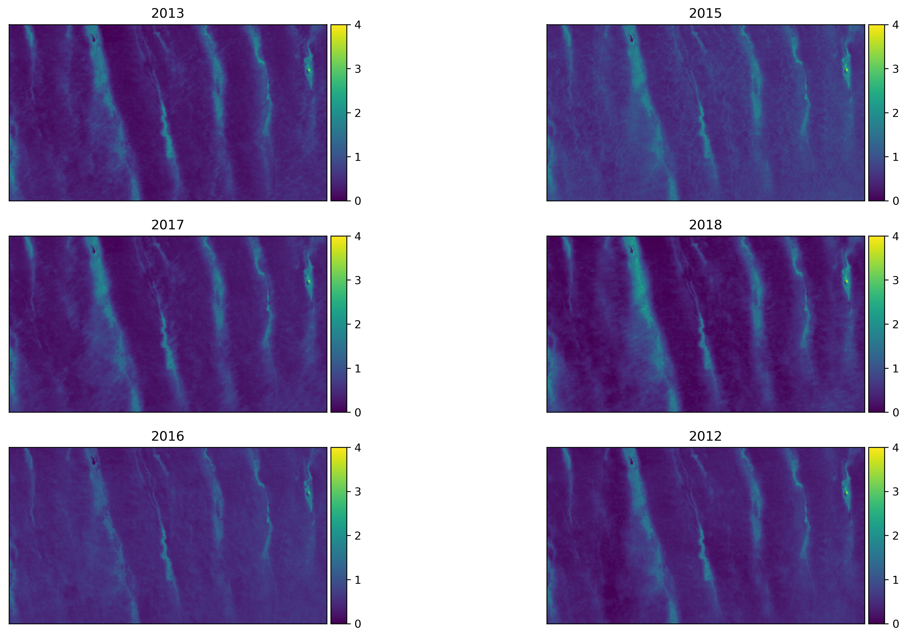

# Snow Depth Pattern Similarity

## Snow Patterns

Distinct patterns of snow depth exist on tundra landscapes where the distribution and redisitribution of snow by wind is organized through the spatial distribution and arrangment of topography. Snow patterns in tundra (and prairie and alpine) snow regions often are distinguished by two snow classes: snowdrift and scour. Snowdrifts are the "sinks" for windblown snow and are pockets of deep, dense snowcover. Scour zones are the "sources" for snowdrifts - they are areas exposed to strong winds which erode the snowcover and distribute it downwind where it settles out (a snowdrift) or sublimates. The CLPX and Happy Valley (HV) snow depth patterns demonstrate snowdrift and scour year after year with a high degree of similarity (Figure 1).
Prior work on snow depth patterns links patterns to geographic variables or uses them to inform hydrological mmodels (e.g. Kirnbaur 1991, Konig and Sturm, 1888, Grayson et al 2002, Winstral et al 2002, Parajka et al 2012) yet few analyze landscape-scale patterns (Lauriol, 1986) or quanitfy the inter-annual similarity of the patterns (Sturm and Wagner 2010). Snow pattern knowledge is still immature and the record of patterns in Nature is short. As remote sensing and modeling capacities expand, the need for robust methods of comparing spatial patterns is growing (Jetten, 2003). Measuring the similarity of one pattern to another is not trivial. While comparing and interpreting two spatial patterns may be intuitive for human observers, it is a complex task for computers because they are senstive to small changes. Minor geometric distortions (e.g. translation, rotation, warping) of a pattern, amplitude changes, or additive noise can disproportionately impact standard statistcal measures such as mean square error (MSE). The key to better pattern spatial pattern comparison and snow pattern knowledge is to program the computer to observe patterns like a human.

###### Figure 1. A series of watertracks filled by snowdrifts on Alaska's North Slope repeat each year with remarkable consistency.

Fortunately recent advances in technology have accelerated the fields of computer vision, image processing, and image quality assessment (IQA) and the replication of the human visual system's pattern recogitnion abilities by computers is an active area of research. Although there is no single best measure of pattern similarity, IQA research has produced a multitude of metrics that use information about structure and organization over multiple scales to measure the similairty of two images. We combine several IQA metrics in a tool (Appendix __) that analyzes the inter-annual similarity of near peak tundra snow patterns. Using IQA metrics permits a more sophisticated pattern analysis and (as we show) illuminates snow-landscape relationships.
The toolbox is composed of four tools:
1.  MSE
2. Structural Similarity Index (SSIM)
3. Complex Wavelet Structural Similarity Index (CW-SSIM)
4. Gradient Magnitude Similiarty Deviation (GMSD)

Although MSE is not performant with respect to newer IQA metrics, it is included here as a reference due to a long history in signal processing and the ease with which it is computed and interpreted (Wang and Bovik, 2009). Values reported here are euclidean-normalzied (NRMSE) and ranges between 0 (no similiarty) and 1 (perfect similarity (e.g. image compared to itself)). SSIM is a relatively simple and efficient metric that accounts for the structural information in a pattern that is independent of local mean amplitude and contrast, but is still sensitive to minor geometric distortions. Such non-structural distortions are handled by implmenting SSIM in the complex wavelet domain that includes addiontal information about local phase. Both SSIM and CW-SSIM values range between -1 and 1, with -1 indicating no similarity and 1 indicating perfect similarity (Wang and Simoncelli, 2005). GMSD is similarly robust and is the modern IQA endmember metric that is similar to that is faster than most contemporary methods and pools gradient information by standard deviation to account for local variance (Xue et. al, 2014). The combination of our IQA tool and expansive snow depth records allow a novel analysis of snow depth pattern similarity.

We report on the interannual snow depth similarity across eight snowdrift zones that reprsent a variety of scales, snow depth distributions, and snowdrift features. All four metrics are computed for each zone, although only CW-SSIM and GMSD are used in ranking the comparisons.

So so so similar and the only thing changing is the wx: so either the wx has little influence upon the ultimate seasonal pattern, or the seasonal weather also repeats with great fidelity.

But just how similar are they?

Something must be dribing that similarity.
We know snowdrifts are a function of landscape and weather - but how much is landscape. We don't have good weather control (maybe reanalysis shows something) but we know it is more variable than landscape. Weather cant capture the complexity of blowing snow

So what is it about the landscape? We know a drift landscape needs these things: Obstacles, Slope Breaks, Just changing topography and elevation, influenced by both upwind and downwind (how far?) factors.

 Landscape is the
So can we search an array for these landscape factors?

In our field areas we observe patterns of snow depth which repeat themselves with strong fidelity each winter. Snow patterns exist on the spatial scales ranging from contiental (10 4 km) (e.g. Greenland) to an individual bedform upon the snow surface (10 -4 km) and are driven by processes that function over time scales ranging from decadal (climate) to hourly (the drifting of snow in a storm). The mixture of these multi-scale processes produces the snow patterns in Nature.

Pattern Questions:
Do snow patterns exist in all snow classes?
What causes a pattern to be more or less similar from year to year? What can patterns tell us about snow processes?
What practical information can come from patterns?
How do snow patterns interact with other geographic patterns?

Weather data is sparse for these Areas

1.  Kirnbauer, R., Blöschl, G., Waldhäusl, P. & Hochstöger, F. An analysis of snow cover patterns as derived from oblique aerial photographs. in Snow, Hydrology and Forests in High Alpine Areas (Proceedings of the Vienna Symposium) 91–100 (IAHS, 1991).
2.  Grayson, R. B., Western, A. W. & Mcmahon, T. A. Advances in the use of observed spatial patterns of catchment hydrological response. Adv. Water Resour. 25, 1313–1334 (2002).
3.  Wealands, S. R., Grayson, R. B. & Walker, J. P. Investigating Spatial Pattern Comparison Methods for Distributed Hydrological Model Assessment.
4.  Konig, M. & Sturm, M. Mapping snow distribution in the Alaskan Arctic using aerial photography and topographic relationships. Water Resour. Res. 34, 3471–3483 (1998).
5.  Parajka, J., Haas, P., Kirnbauer, R., Jansa, J. & Blöschl, G. Potential of time-lapse photography of snow for hydrological purposes at the small catchment scale. Hydrol. Process. 26, 3327–3337 (2012).
6.  Winstral, A., Elder, K. & Davis, R. E. Spatial Snow Modeling of Wind-Redistributed Snow Using Terrain-Based Parameters. Journal of Hydrometeorology (2002). doi:10.1175/1525-7541(2002)003<0524:SSMOWR>2.0.CO;2
7.  Sturm, M. & Wagner, A. M. Using repeated patterns in snow distribution modeling: An Arctic example. Water Resour. Res. (2010). doi:10.1029/2010WR009434
