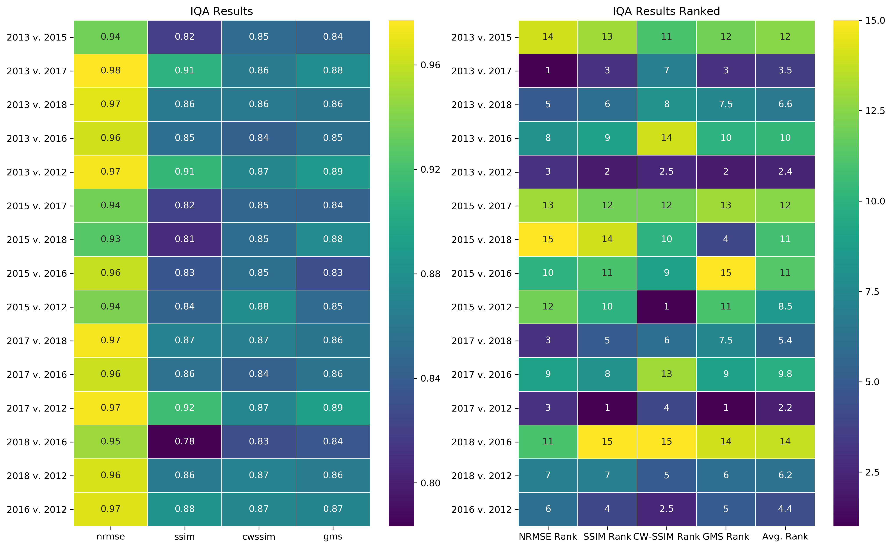

# Snow Depth Pattern Similarity
Spatial patterns of some snow property (e.g. depth, density, etc.) abound in nature and can inhabit spatial scales that range from contiental (10**4 km) to the organization of beforms upon the snow surface (10 -4 km). The processes that spawn these patterns function over similarly distant time scales ranging from decadal (climate) to wind transporting snow at __ g/m/s (REF) during a single storm. In our field areas we observe patterns of snow depth which repeat themselves with strong fidelity each winter. Distinct patterns of snow depth exist on tundra (and prairie and alpine) landscapes where the transport of snow by wind yields two primary snow classes: snowdrift "sinks" for windblown snow (relatively thick and dense snowcover), and scour "source" zones exposed to strong winds which erode the snowcover and distribute it downwind (or it sublimates). The spatial pattern of the snowdrift and scour is largely determined by how wind interacts with topography, and thus the spatial pattern of snow depth is dependednt on the spatial pattern of topography. Prior work on spatial snow patterns links the patterns to geographic variables or uses them to inform hydrological models (e.g. Kirnbaur 1991, Konig and Sturm, 1888, Grayson et al 2002, Winstral et al 2002, Parajka et al 2012) yet few analyze patterns at the landscape scale or greater (<i>cf.</i> Lauriol, 1986) or quanitfy the inter-annual consistency of the patterns (<i>cf.</i> Sturm and Wagner 2010). Snow pattern knowledge is still immature and the record of patterns in Nature is short. As remote sensing and modeling capacities expand, the need for robust methods of comparing spatial patterns is growing (Jetten, 2003). Measuring the similarity of one pattern to another is not trivial. While comparing and interpreting two spatial patterns may be intuitive for human observers, it is a complex task for computers because they are senstive to small changes. Minor geometric distortions (e.g. translation, rotation, warping) of a pattern, amplitude changes, or additive noise can disproportionately impact standard statistcal measures such as mean square error (MSE). The key to better pattern spatial pattern comparison and snow pattern knowledge is to program the computer to observe patterns like a human.

###### Figure 1. A series of watertracks filled by snowdrifts on Alaska's North Slope repeat each year with remarkable consistency.

Fortunately recent advances in technology have accelerated the fields of computer vision, image processing, and image quality assessment (IQA) and the replication of the human visual system's pattern recogitnion abilities by computers is an active area of research. Although there is no single best measure of pattern similarity, IQA research has produced a multitude of metrics that use information about structure and organization over multiple scales to measure the similairty of two images. We combine several IQA metrics in a tool (Appendix __) that analyzes the inter-annual similarity of near peak tundra snow patterns. Using IQA metrics permits a more sophisticated pattern analysis and (as we show later) illuminates snow-landscape relationships.
The toolbox is composed of four tools:
1.  Normalized Mean Square Error (NRMSE)
2. Structural Similarity Index Method (SSIM)
3. Complex Wavelet Structural Similarity Index Method (CW-SSIM)
4. Gradient Magnitude Similiarty Deviation (GMSD)

Although MSE is not performant with respect to newer IQA metrics, it is included here as a reference due to a long history in signal processing and the ease with which it is computed and interpreted (Wang and Bovik, 2009). Values reported here are euclidean-normalzied (NRMSE) and ranges between 0 (no similiarty) and 1 (perfect similarity (e.g. image compared to itself)). SSIM is a relatively simple and efficient metric that accounts for the structural information in a pattern that is independent of local mean amplitude and contrast, but is still sensitive to minor geometric distortions. Such non-structural distortions are handled by implmenting SSIM in the complex wavelet domain that includes addiontal information about local phase. Both SSIM and CW-SSIM values range between -1 and 1, with -1 indicating no similarity and 1 indicating perfect similarity (Wang and Simoncelli, 2005). GMSD is similarly robust and is the modern IQA endmember metric that is similar to that is faster than most contemporary methods and pools gradient information by standard deviation to account for local variance (Xue et. al, 2014). GMSD values range between 0 and 1 with 0 indicating perfect similarity. The combination of our IQA tool and expansive snow depth records allow a novel analysis of snow depth pattern similarity (Figure 2). Each IQA metric returns both a global index value and an array of local metric values with same dimensionality as the inpute images. The arrays are essentially similarity maps and demonstrate where the snow depth patterns are geographically cohesive and where they are not (Figure 2, top). The index values enable a comparison over time to identify snow pattern pairs that or more or less similar to one another. (Figure 2, Bottom). Only CW-SSIM (range -1 to +1) and GMSD are used in ranking similarity. Lower ranking pairs are more similar. (Figure 2, center and bottom). We quantify the interannual snow pattern similarity across eight snowdrift zones that reprsent a variety of scales, snow depth distributions, and snowdrift features for each pair of years (N=15) in our study.

###### Figure 2. IQA results for Happy Valley Watertracks

The results of the similarity analysis show that the patterns of snowdrift and scour at CLPX and Happy Valley (HV) repeat with great fidelity in much the same way in each of the six winters. Although each study zone contains patterns that repeat, the  and also demonstrate that that snow pattern similarity is subtley  high degree of pattern is consistent across each region. with a high degree of similarity (e.g. Figure 1).

# Figure of Subsets
2 panel
Hillshade (subplots) Snow depth subplots)
 While there is some variance similarity amongst pairs of winters and zones (Figure 3, top), on absolute scale we see that the similarity is overall remarkably consistent and quite good. There is also (as we dicsuss later) a difference in how each landscape filters variability in the winter weather (Figure 3, bottom).

###### Figure 3. All GMSD Results

 A few salient things emerge from the similarity analysis. First, the snow depth patterns are remarkably similar and consistent year after year

A few salient things emerge from the similarity analysis. First, the snow depth patterns are remarkably similar and consistent year after year.

The similarity of the tundra snow depth patterns year after year in different types of terrain enables us to confidently create a cumulative snow depth distribution pattern (CDSP) for the entire extent of the study areas by using the normalized mean snow depth from the dataset. We then define drifts and create a snowdrift inventory for each landscape.

Something must be dribing that similarity.
We know snowdrifts are a function of landscape and weather - but how much is landscape. We don't have good weather control (maybe reanalysis shows something) but we know it is more variable than landscape. Weather cant capture the complexity of blowing snow

So what is it about the landscape? We know a drift landscape needs these things: Obstacles, Slope Breaks, Just changing topography and elevation, influenced by both upwind and downwind (how far?) factors.

 Landscape is the
So can we search an array for these landscape factors?

Drifts with deeper, sharper breaks, are going to capture more variability because they do not fill.

Hv watertrack: all EQ Drifts
clpx-outcrops: all nonfilling
Interesting that these are the similairty endmembers.
Do we see a difference in their topographic variables?

With the knowledge that they are similar, plus that landscape is repsonsible,

we can make a snowdrif invventory: 

Now:
If the spatial pattern is 85% the same year after year - we  should be able to predict 85% of snow depth by landscape variables alone.

Weather data is sparse for these Areas

Plot: mean not-drift depth vs. mean drift depth

Snowdrifts are the "sinks" for windblown snow and are pockets of deep, dense snowcover. Scour zones are the "sources" for snowdrifts - they are areas exposed to strong winds which erode the snowcover and distribute it downwind where it settles out (a snowdrift) or sublimates.

1.  Kirnbauer, R., Blöschl, G., Waldhäusl, P. & Hochstöger, F. An analysis of snow cover patterns as derived from oblique aerial photographs. in Snow, Hydrology and Forests in High Alpine Areas (Proceedings of the Vienna Symposium) 91–100 (IAHS, 1991).
2.  Grayson, R. B., Western, A. W. & Mcmahon, T. A. Advances in the use of observed spatial patterns of catchment hydrological response. Adv. Water Resour. 25, 1313–1334 (2002).
3.  Wealands, S. R., Grayson, R. B. & Walker, J. P. Investigating Spatial Pattern Comparison Methods for Distributed Hydrological Model Assessment.
4.  Konig, M. & Sturm, M. Mapping snow distribution in the Alaskan Arctic using aerial photography and topographic relationships. Water Resour. Res. 34, 3471–3483 (1998).
5.  Parajka, J., Haas, P., Kirnbauer, R., Jansa, J. & Blöschl, G. Potential of time-lapse photography of snow for hydrological purposes at the small catchment scale. Hydrol. Process. 26, 3327–3337 (2012).
6.  Winstral, A., Elder, K. & Davis, R. E. Spatial Snow Modeling of Wind-Redistributed Snow Using Terrain-Based Parameters. Journal of Hydrometeorology (2002). doi:10.1175/1525-7541(2002)003<0524:SSMOWR>2.0.CO;2
7.  Sturm, M. & Wagner, A. M. Using repeated patterns in snow distribution modeling: An Arctic example. Water Resour. Res. (2010). doi:10.1029/2010WR009434
