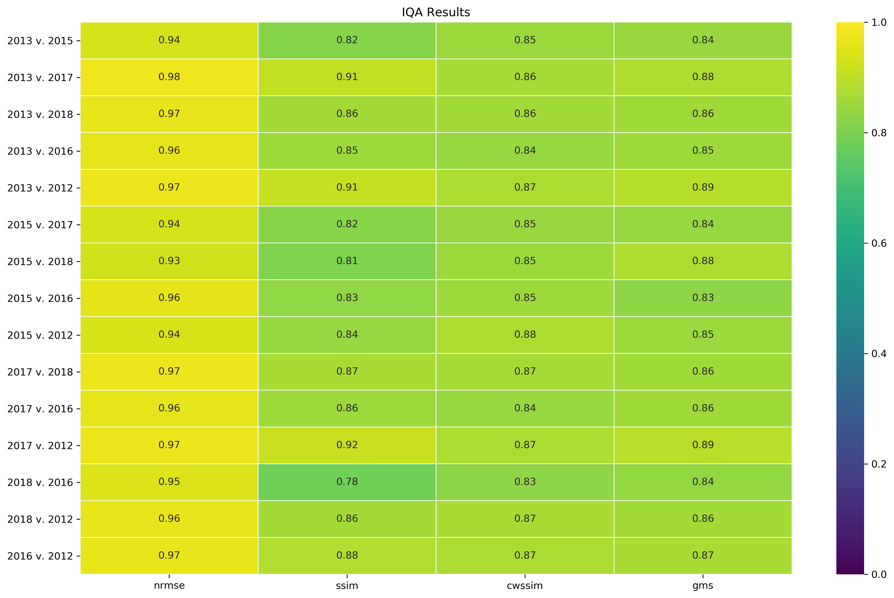
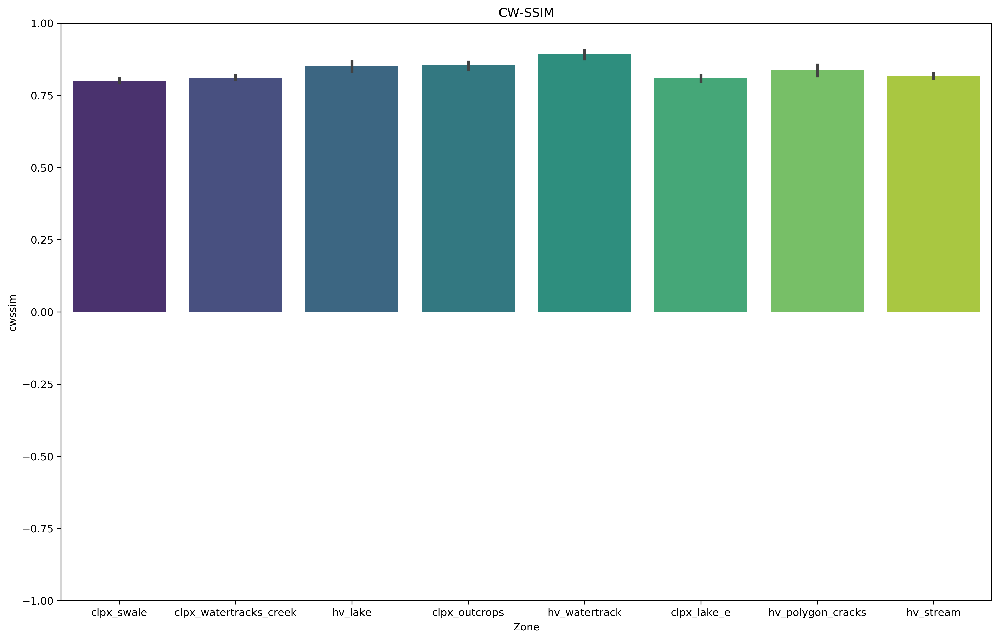

# Snow Depth Pattern Similarity

## Snow Pattern Introduction

Spatial patterns of snow properties (i.e. depth, density, SWE) abound in nature and inhabit spatial scales that range from continental (104 km, e.g. ice sheet gradients) to decimetric (e.g. snow surface bedforms). The processes that spawn these patterns function over similarly distant time scales ranging from decadal (climate) to wind rapidly moving snow over the course of a single storm where transport rates can range in the decigrams * m-2s-1. Observation of snow patterns is predicated by spatial scale and resolution and by the climate class of snow. In windy tundra (and some alpine and prairie) snow classes, distinct spatial patterns of snow depth are created by the scour, transport, and deposition of snow by the wind. Such snow patterns are distinguished by two primary snowcover units: snowdrifts and scour zones. Snowdrifts are "sinks" for windblown snow and possess a relatively thick and dense snowcover. Scoured zones are "sources" for the snowdrifts and are exposed to strong winds capable of eroding the snowcover and transporting it downwind where it is then deposited - unless it sublimates. Snow patterns with strong snowdrift and scour elements with little underlying vegetation (Figure 1) are a function of snow precipitation (P) and snow transport (T). The T component is determined by the interaction of wind and topography, and thus when the T signal is large, the spatial pattern of snow depth is very much dependent on the spatial pattern of topography. Tundra snow depth patterns at the landscape scale are tightly coupled with the snow transport process - which itself is coupled tightly to topographic patterns. Understanding the nature of tundra snow depth patterns, learning how to compare and contrast them, and observing their behavior over time, can reveal a novel heterogeneity within the snow and illuminiate new snow-landscape relationships.

###### Figure 1. A series of watertracks on Alaska's North Slope filled by snowdrifts and punctuated by scoured interfluves. The pattern repeats each year with remarkable consistency.

Although scientific interest is snow patterns is not new, our ability to repeatedly measure them in high resolution (1 m) at the landscape scale is. Prior work on spatial snow patterns links the patterns to geographic variables or uses them to inform hydrological models (e.g. Kirnbaur, 1991; Konig and Sturm, 1998; Grayson et al., 2002; Winstral et al., 2002; Parajka et al., 2012) yet few analyze patterns at the landscape or watershed scale (<i>cf.</i> Lauriol et al., 1986) or quanitfy the inter-annual consistency of the patterns (<i>cf.</i> Luce, 2004; Sturm and Wagner, 2010; Qualls and Arogundade, 2013). Snow pattern knowledge is still immature and the record of patterns in nature is short. As remote sensing and modeling capacities expand and resolutions sharpen, the need for robust and efficient methods of comparing spatial patterns is growing (Jetten, 2003). Measuring the similarity of one spatial pattern to another is not trivial. While comparing and interpreting two spatial patterns may be intuitive for human observers, it is a complex task for computers because they are senstive to small changes. For example, minor geometric distortions of a pattern (translation, rotation, warping, etc.), amplitude changes, or additive noise can disproportionately impact standard statistcal measures of pattern fidelity such as mean square error (MSE). The key to better quantitative spatial pattern comparison, and snow pattern knowledge, are computation tools that are robust enough to ignore insignficant changes and efficient enough to handle large datasets. Essentialy we need tools that mimic the power of human observation.

## Snow Pattern Methods

Fortunately recent advances in computer hardware have accelerated progress in the fields of computer vision, image processing, and image quality assessment (IQA) and the replication of the human visual system's exceptional pattern recogitnion capabilities is an active area of research. Although there is no consensus as to the single best algorithm for measuring pattern similarity, IQA research has produced a multitude of metrics that use information about pattern structure and organization over multiple scales to measure the similairty of two images. Each IQA metric has unique set of tradeoffs between complexity, efficiency, and interpretability. For our snow pattern use case we apply four IQA metrics that represent a range of complexities (Table 1).
###### Table 1. A pattern comparison toolbox composed of four IQA metrics.
| IQA Metric                                                      | Perfect Similarity | No Similarity |
|-----------------------------------------------------------------|--------------------|---------------|
| Euclidean-Normalized Mean Square Error (NRMSE)               | 0.0                | 1.0           |
| Structural Similarity Index Method (SSIM)                    | 1.0                | -1.0          |
| Complex Wavelet Structural Similarity Index Method (CW-SSIM) | 1.0                | -1.0          |
| Gradient Magnitude Similiarty Deviation (GMSD)               | 0.0                | 1.0           |
Each of the four IQA metrics are sensitive to different types of pattern (i.e. image) information. NRMSE is only sensitive to pixel-wise arthimetic differences and thus it is not robust with respect to more modern IQA metrics. However, it is included here as a reference point due to a long history of use in signal processing and because of the ease with which it is computed and interpreted (Wang and Bovik, 2009). NRMSE values reported here range between 0.0 and 1.0 where a score of 1.0 indicates perfect similarity - meaning the pattern is being compared to itself. NRMSE values are recorded here but are not ultimately used to analyze pattern fidelity. SSIM is more complex than MSE, but is still a relatively simple and efficient metric that considers the structural information in a pattern that is independent of local mean amplitude (brightness) and contrast. Although SSIM more closely mimics the human visual system because it focuses on where pattern gradients are high or are changing, it is still sensitive to minor geometric distortions. SSIM is also discounted from the ultimate pattern fidelity analysis. The non-structural distortions that hinder SSIM are countered by implementing the technique in the complex wavelet domain. CW-SSIM leverages information about local phase patterns and how the wavelet coeffcients compare across images (Wang and Simoncelli, 2005). GMSD is a similarly robust metric and is the modern endpoint in our IQA toolbox. More efficient than most contemporary methods, GMSD computes gradient information by convolving a Prewitt kernel over the images and then pooling the gradient magntiude differences by a windowed standard deviation to account for local variance (Xue et. al, 2014). Together, CW-SSIM and GMSD are used to quantify pattern similarity far more thoroughly than is possible with standard techniques, and do so in a way that is efficient and reproducible. Each IQA metric returns both a global index value and an array of local metric values with same dimensionality as the input images. The arrays are essentially similarity maps that depict where patterns are cohesive and where they are not with respect to the type of information the metric is sensitive to (e.g. Figure 2).

###### Figure 2. An example of the similarity analysis for a single zone and pair of years: IQA results for the Happy Valley Watertracks.

The index values enable intra-pattern comparison over time to identify pattern pairs that or more or less similar to one another. Index values can also be pooled to compare the overall pattern fidelity of different pattern types. Only CW-SSIM (range -1 to +1) and GMSD (range 0 to 1) are used in ranking similarity. Lower ranks indicate greater pattern fidelity (Figure 3).

Figure 3. IQA index values and rankings by comparison pairs for the Happy Valley Watertracks domain.

The combination of our IQA toolbox and expansive snow depth records enable a novel analysis of snow depth pattern similarity. We quantify the interannual similarity of near-peak snow depth patterns across eight snowdrift zones that reprsent a variety of scales, snow depth distributions, and snowdrift features (Figure 4). Similarity is computed for each unique pair of the six years included in our study (N=15), comprising a total of 120 "map-to-map" snow depth pattern comparisons. Using IQA metrics permits a more nuanced and sophisticated pattern analysis and illuminates (as we show later) snow-landscape relationships.

###### Figure 4. Eight snowdrift zones within CLPX and HV. Hillshade illumination from the NW at an altitude of 30 degrees.

## Snow Pattern Results

The results of the similarity analysis reveal that patterns of snowdrift and scour at CLPX and HV repeat each winter with great fidelity (e.g. CW-SSIM scores range from 0.52 to 0.86, Figure 5). While there is some variance in similarity amongst pairs of winters within each zone, on an absolute scale overall year-to-year similarity remarkably consistent. Such high fidelity patterns occur in each subset, although the finer spectrum of the IQA toolbox enables us to see that there are slight differences in relative similarity amongst the different landscapes (Figure 6).

###### Figure 5. CW-SSIM results for 120 snow depth pattern comparisons. Possible values range from -1 to 1.

###### Figure 6. CW-SSIM results grouped by zone. Possible values range from -1 to 1.

The two most prominent results of the similarity analysis are 1.) that the patterns are overall the same each year, with the caveat that 2.) there are subltle differences in the degree of the similarity between different landscapes. In light of the former we can now create high-confidence normalized cumulative snow distribution patterns (CDSPs, e.g. Sturm and Wagner, 2010) for the entire extents of both Happy Valley and CLPX using mean depths over time. These CSDP maps then serve as the basis for the identification and inventory of snowdrifts and their properties. As for the second result, it is interesting that the inter-annual similarity is not consistent within each study area. None of the four zones within each study area are far enough apart to experience different synoptic weather conditions - and centroids of CLPX and HV are separated by less than 60 km. Well controlled metreological data for our study region is sparse, but based sub-synoptic proximity of our eight zones and two study areas, we can assume that the weather events that determine snow accumulation (number and intensity of storms, wind events, etc.) are not much different between any of these areas. What is driving the inter-annual similarity, and what is driving the differences in inter-annual similarity over geographic space?

The answer to both of the questions likely lies in the landscape. Landscape is essentially a static factor on our time scale and we know that seasonal snow-forcing weather is not (show data from Franklin Bluffs and Imnav.?). Weather records also often lack the resolution to capture the potentially rapid and brief flux of windblown snow. With the knowledge that in the absence of some severe weather abnormality (a drought, a polar shift in snow-bearing winds, etc.) we should be able to predict a large portion of the CSDP through landscape variables. The landscape filters the variability of winter weather - but not all landscapes are equal is in this capacity. Some are more robust filters than others. For example, most and least stable snow patterns occur at the Happy Valley Watertracks and CLPX Lake repectively (Figure 6.) The Happy Valley Watertracks are a series of filling, equiblirum snowdrifts that are exposed to the typical westerly winds (AEA report), while the CLPX Lake zone is essentialy a single, nonfilling drift created by the cutbank of the lake (Figure 4). One hypothesis is that the Happy Valley Watertrack snow patterns are so consistent is because they fill to equilibrium relatively early in the season and any additional flux is passed downwind or sublimates. The landscape is not sensitive to varying amounts of flux. At CLPX though, the landscape is far more sensitive because deeper drift traps with sharper breaks in slope will not fill and thus record the amount of flux no matter the amount. They are also capable of capturing flux from a variety of directions (maybe) as they are circular rather than strictly linear features. It is interesting that these two landscapes are the similairty endmembers. Are there differences in their geomorphometry, and if so do such differences occur elsewhere? Could we find drifts within the inventory that are indicators of the winter conditions and discrimnate them from those are the same each year? If so, there is great potential to learn about winter conditions (precipitation, flux, wind azimuths, etc.) from measurements (field, airborne, spaceborne?) of a single drift.

1. Grayson, R. B., Western, A. W. & Mcmahon, T. A. Advances in the use of observed spatial patterns of catchment hydrological response. Adv. Water Resour. 25, 1313–1334 (2002).
2. Jetten, V., Govers, G. & Hessel, R. Erosion models: Quality of spatial predictions. Hydrol. Process. 17, 887–900 (2003).
3. Kirnbauer, R., Blöschl, G., Waldhäusl, P. & Hochstöger, F. An analysis of snow cover patterns as derived from oblique aerial photographs. in Snow, Hydrology and Forests in High Alpine Areas (Proceedings of the Vienna Symposium) 91–100 (IAHS, 1991).
4. Konig, M. & Sturm, M. Mapping snow distribution in the Alaskan Arctic using aerial photography and topographic relationships. Water Resour. Res. 34, 3471–3483 (1998).
5. Lauriol, B., Carrier, Y., Beaudet, H. & Binda, G. The Residual Snow Cover in the Canadian Arctic in July : A Means to Evaluate the Regional Maximum Snow Depth in Winter. Arctic 39, 309–315 (1986).
6. Luce, C. H. & Tarboton, D. G. The application of depletion curves for parameterization of subgrid variability of snow. Hydrol. Process. 18, 1409–1422 (2004).
7. Parajka, J., Haas, P., Kirnbauer, R., Jansa, J. & Blöschl, G. Potential of time-lapse photography of snow for hydrological purposes at the small catchment scale. Hydrol. Process. 26, 3327–3337 (2012).
8. Qualls;, R. J. & Arogundade, A. B. Synthetic Year-Independent Spatio-Temporal Patterns of Snow Depletion. in Western Snow Conference 131–137 (2013).
9. Sturm, M. & Wagner, A. M. Using repeated patterns in snow distribution modeling: An Arctic example. Water Resour. Res. (2010). doi:10.1029/2010WR009434
10. Wang, Z., Bovik, a C., Sheikh, H. R. & Simmoncelli, E. P. Image quality assessment: form error visibility to structural similarity. Image Process. IEEE Trans. 13, 600–612 (2004).
11. Wang, Z. & Bovik, A. C. Mean Square Error : Love It or Leave It ? IEEE Signal Processing Magazine 98, 98–117 (2009).
12. Wang, Z. & Simoncelli, E. P. Translation insensitive image similarity in complex wavelet domain. ICASSP, IEEE Int. Conf. Acoust. Speech Signal Process. - Proc. II, 573–576 (2005).
13. Wealands, S. R., Grayson, R. B. & Walker, J. P. Investigating Spatial Pattern Comparison Methods for Distributed Hydrological Model Assessment. in 2nd International Congress on Environmental Modelling and Software (2004).
14. Winstral, A., Elder, K. & Davis, R. E. Spatial Snow Modeling of Wind-Redistributed Snow Using Terrain-Based Parameters. Journal of Hydrometeorology (2002). doi:10.1175/1525-7541(2002)003<0524:SSMOWR>2.0.CO;2
15. Xue, W., Zhang, L., Mou, X. & Bovik, A. C. Gradient magnitude similarity deviation: A highly efficient perceptual image quality index. IEEE Trans. Image Process. 23, 668–695 (2014).
16. Weather Station Wind Resource Summary for Happy Valley, AK. (2005).
