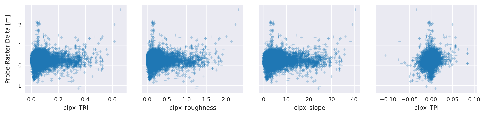

# Report on the accuracy and validation of airborne lidar and structure-from-motion photogrammetry (SfM) surface height measurements and computation of snow depths.

### Charlie Parr,  5/25/2018

###### TODO: Add 2018 results

* * *

## Introduction

##### Note: this is just an introduction for the validation component. A more general introduction to the topic and field areas will reside elsewhere.

The data used in this analysis comes from multiple airborne snow measurement campaigns conducted in two distinct Arctic tundra field areas, CLPX and Happy Valley, over the course of six years. The purpose of these campaigns was to acquire the surface elevations of landscapes blanketed by a peak winter snowcover as well as bare earth surface eleations with the intent to compute the difference between the winter and summer surfaces as a method of retreiving a continous landscape map of snow depth. Each annual campaign was supported by a groud validation effort consisting of thousands of manual snow depth measurements conincident with the acquisiton of the winter surface (Figure 1). The following report details the validation process and results, and discusses application of the error analysis results and error attribution.

###### Figure 1: CLPX 2012 Uncorrected Snow Depth Map (m) and MagnaProbe validation point locations ( N = 32571 )

## Methods

Each year the snow depth map produced by the seasonal surface differencing is validated by thousands of MagnaProbe measurements. A Python script compares the value of the snow depth raster against the value of the MagnaProbe depth measurement at the same location. The difference between the MagnaProbe measurement and the raster value is the error in meters. For those familiar with ArcGIS, this is similar to the 'Extract Values to Points' geoprocessing tool, or the Point Sampler Plugin for QGIS. A similar script then compares these error values against values against a set of terrain derivatives. Errors are analyzed by year, study area, location within each study area, and by topographic factors like hillshade and slope. Finally, a correction value is prescribed to adjust each snow depth map. Particular consideration is given to the case of Happy Valley in 2016 where no validation points were acquired because of logistical field work limits. All processing scripts and results are reproducible and hosted at
<https://github.com/charparr/parr-thesis/tree/master/validation>
and a 'live' version of this document is the markdown file inside the above repository at <https://github.com/charparr/parr-thesis/blob/master/validation/validation_report.md>

## Validation Results

A total of 135155 MagnaProbe points between both study areas were used in this validation process. The distributions of these snow depth measurements and their corresponding snow depth raster values are
found in Figure 2. The mean error for the entire set of data (all years and study areas) is 0.26 m.

###### Figure 2: MagnaProbe vs. lidar/SfM

###### Table 1: Validation Results

The above results indicate an overall negative bias (i.e. positive mean error values in Table 1) in the airborne retreivals of snow depth. The snow depth raster maps produced by substracting the summer surface from the winter surface are too shallow. The positive error values align reflect the visual interpretation of the frequency distributions (Figure 2) where the lidar or SfM half of the violin plot is negatively shifted with respect to its partner MagnaProbe distribution. The variability of the errors with respect to time (year) and space (study area) is examined with another violin plot (Figure 3) and by a more familiar boxplot (Figure 4). Errors are consistent between the two study areas except in 2017 (Figure 3), although in each year the median error at CLPX is greater than at Happey Valley. Note the missing validation data for Happy Valley in 2016. Errors are more variable over time than study area, but each boxplot's first and third quantiles overlap with at least one other year (Figure 4).

###### Figure 3: Violin Plots of Errors (MagnaProbe - Raster Delta) by Year and Study Area

###### Figure 4: Error Box Plots (i.e. MagnaProbe - Raster Delta) by Year and Study Area

To determine the presence of any geographic trend in the errors, geographic zone labels are presribed to different sets of MagnaProbe points for each study area. The CLPX points are divided into 4 zones: CLPX East, Imnavait, Imnavait North, and CLPX West. These four zones  capture different MagnaProbe sampling regimes and the generaltrend of wind and snow characteristics known to exist in this domain: deeper snow and milder winds in the West and shallower snow with strong katabatic winds in the East toward the Sag river (REFS). Happy Valley is split into five classes: Happy Valley North, Happy Valley South, Watertracks, Crescent Lake, and Happy Valley Stream. Total (Figures 5 and 6) and annual (Figure 7) errors are compared across these geographic zones to illuminate any potential geographic or sampling regime bias in the errors.

###### Figure 5: Violin Plots of Errors by Geographic Zone

###### Figure 6: Box Plots of Errors by Geographic Zone

###### Figure 7: Box Plots of Errors by Geographic Zone and Year

The relationship between topography and error, if any, is analyzed by
extracting the values from a variety of DEM derivative rasters and comparing these raster values with colocated error values. There are two sets of DEM derivatives: hillshade rasters and surface roughness rasters. Hillshade rasters from four different azimuths (45, 135, 225, and 315 degrees) are used. The surface roughness rasters are slope (degrees), the terrain prominence index (TPI), the terrain ruggedness index (TRI), and roughness. Both sets of map are produced via [GDAL commands](http://www.gdal.org/gdaldem.html) which are documented and executed locally in a bash script [(e.g. for CLPX)](../DEMs/clpx/bare_earth/topo_measures/make_topo_measures.sh). Scatterplots compare error values with raster values for the hillshade and surface roughness raster sets for each study area (Figure 8).

###### Figure 8: Topographic Error Analysis

## Discussion

The errors are quite similar overall across each year and study area. This in part due to the fact that the MagnaProbe snow depth measurements and the airborne snow depth retreivals have very similar looking distributions. The lidar or SfM is reflected and shifted down with respect to the corresponding MangaProbe distribution in the violin plot (Figure 2). The same plot indicates there is annual variation in these distributions, but this is likely to largely be a function of variation in MagnaProbe survey strategies and locations. The number and location of validation points varies from year to year. The annual magnitude of the negative bias (i.e. error) of the lidar or SfM snow depth retreivals with respect to MagnaProbe measurements varies by up to a factor of 4, but variance is constrained with annual standard deviation values ranging between 0.11 and 0.16 meters (Table 1). The consistent variance across years and study areas helps explain why the error distributions look so similar for each year and study area (Figure 3). Although at first glance the shape of the error distributions looks normal, they actually fail statistical tests for normality (i.e. the null-hypothesis that the values come from a normal population is rejected). At this time I am not sure what type of distribution is a good fit for the error population found here.

###### Possible TODO: Test errors for goodness of fit with some different distributions.

While the errors are generally consistent across time and between the two study areas, we also need to know whether or not the errors are consistent within each year study area. Does the airborne snow depth retreival perform better or worse with respect to the MagnaProbe snow depth measurements in certain localities? Or are the errors stationary across the entire domain? Assessing errors by geographic zone should reveal any geographic bias and inform how to use the error values to adjust the snow depth dDEMs. At Happy Valley three regions have very similar error distributions: Happy Valley South, Happy Valley North, and Happy Valley Stream (Figure 5). The consistency may be driven by similar, linear sampling regimes with high N values that generally parallel the North-South orientation of the swath. The Crescent Lake and Watertracks zones have lower median errors than the other Happy Valley zones (Figure 6), but have far smaller N values than Happy Valley North and South and sampling regimes were intentionally aligned with the prevailing winter winds (West to East) to capture snowdrifts - the Crescent Lake zone represents a single snowdrift overlaying the West bank of a tundra lake.

At CLPX the error distributions for every geographic distribution are all tightly clustered (Figure 5), although the CLPX West zone has a greatest median error (Figure 6), perhaps in part due to a low N value. The boxplots for CLPX East and Imnavait are nearly identical (Figure 6) despite their disparate wind regimes and snowpacks. The low variance of the Imnavait North zone errors can probably be explained by sparse coverage - these are points that lie North of the 1x1 and 2x3 kilometer Imnavait grids, but have similar longitudes.
The results of this analysis indicate there is no signigicant variance in error across geographic zones when results from all years are considered together. Splitting the results by geographic zone and by year (Figure 7) shows some interannual variation within geographic zones (e.g. Imnavait) but strong intra-annual consistency across geographic zones: the relative position on the y-axis of the annual boxplots is consistent for many zones. Based on the results here there are no discernible spatial biases in the errors. There is some variability, but this variability could be expected as a reflection int he variable sampling schemes employed at each year and zone. The topographic analysis yields similar results: hillshade values and surface roughness measures do not have signficant relationships with the error for either study area (Figure 8).

### Discussion: Application of Error Analysis

#### Correcting the Snow Depth Rasters

Given that there are no obvious geographic or topographic influences on the errors, we will apply a global correction to each snow depth raster that is equal to the value of the mean error presented in Table 1. Essentially this means adding a constant value to each value (i.e. pixel) in the snow depth raster (e.g. the entire 2012 Happy Valley snow depth raster will be made 0.12 m deeper). The result of the raster math is a 'corrected' snow depth raster which will be basis for all further analyses. The simple arithmetic, global adjustment of the data seems favorable at this time because it is simple and easily explained and based on hundreds of thousands of ground truth measuremnts. We can remain open to other adjustment schemes, but currently there is no clear justification for a more specific  or variable correction method based on geographic or topographic parameters.

#### Happy Valley 2016: No Validation Data

One gap in the error analysis so far is that there are no 2016 MagnaProbe validation points available for Happy Valley. One option is to use the mean of all the Happy Valley annual mean errors (0.19 m) to correct the raster. Another option is to use the mean error from the same time, CLPX 2016 (0.40 m), rather than the sample place (Table 1). An arguement for using 0.19 m is that in every year the mean error for CLPX is greater than the median error at Happy Valley for the same year (Figure 4). However, as discussed earlier, the errors are more consistent through time across different geographic zones. For example, for every geographic zone the 2016 median error is greater than the 2012 and 2013 median errors (Figure 7). We can combine this information by using the 2016 CLPX median error weighted by the tendency of the Happy Valley mean errors to be less than the CLPX mean errors. The Happy Valley mean error (all years) accounts for 63% of the CLPX mean error (all years exlcuding 2016). Using this percentage we can adjust the CLPX 2016 mean error of 0.40 m down to 0.25 m and add this value to the snow depth raster to produce the corrected 2016 Happy Valley snow depth raster.

#### Post Correction Check

###### TODO: Compare values of corrected snow depth rasters at known snow-free sites (rocks, roads). Are they about zero?

### Discussion: Error Attribution

-   What errors do we know from the literature?
    -   MagnaProbe
        -   Over probing likely
        -   Geolocation
    -   lidar
        -   Geolocation
        -   point density --> raster
        -   vertical limits
        -   sources (Deems, etc.)
    -   SfM
        -   Geolocation
        -   vertical limits
        -   lighting?
        -   sources (Nolan, Marti, Drone guys)

## Conclusion and Moving Forward

- We have adjusted every raster by some amount.
- Errors are attributable.
- Ground truth (BIG N) makes us confident to move forward.

