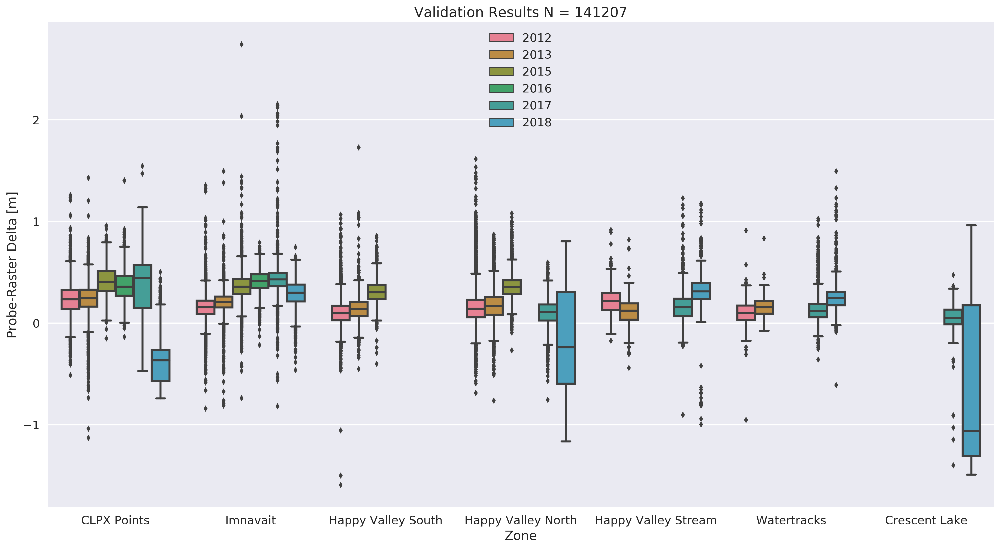

# Report on the accuracy and validation of airborn lidar and structure-from-motion photogrammetry (SfM) surface height measurements and computation of snow depths.

## Charlie Parr,  5/22/2018

* * *

### Data

The data used in this analysis comes from the airborne snow measurement campaigns conducted in two distinct Arctic tundra field areas over the course of six years. The basis of these campaigns was to acquire the elevation of peak winter snowcovers and bare earth surfaces and to interpret the difference between the two seasonal surfaces as snow depth. Each snow depth result is then validated by thousands of conincident manual measurements of snow depth. The report here describes the validation process, error analysis, and error attribution.

Each year the snow depth map produced by the seasonal surface differencing is validated by thousands of MagnaProbe measurements (e.g. Figure 1). A Python script checks the value of the snow depth raster against the value of the MagnaProbe depth measurement at the same location and then computes the difference between the two. The difference between the MagnaProbe snow depth measurement and the snow depth raster is considered the error. The errors are summarized for each year and study area in Table 1. A total of 135155 points were used in this validation process and the mean error for the entire dataset is 0.26 m. Note that in one instance (Happy Valley, 2016) no validation points were acquired because of logistical field work limits.

###### Figure 1: CLPX 2012 Uncorrected Depth Map and MagnaProbe validation points (N = 32571)

###### Table 1: Validation Results

The results in Table 1 indicate an overall negative bias in the airborne retreivals of snow depth. The snow depth maps produced by substracting the summer surface from the winter surface are too shallow. We can visualize this bias by comparing the frequency distributions of MagnaProbe depths and coincident raster depth values in a violin plot (Figure 2). The shape of the distributions mirror one another for any given year, and the interannual variation of the distributions is largely a function of variation in MagnaProbe survey strategies and locations. There is a consistent negative bias within the lidar or SfM depth retreivals, although the magnitude (but not the variance, (Table 1)) of that bias varies annually.

###### Figure 2: MagnaProbe vs. lidar/SfM

The errors within each year and study area can be checked for consistency and normailty with another violin plot, and by a more familiar boxplot (Figures 3 and 4). Figure 2 shows that errors are similar between the study areas, with the exception of 2017. The missing validation field campaign for Happy Valley in 2016 is also evident. The shape of the error frequency distributions looks normal, but actually fail statistical tests for normality (i.e. the null-hypothesis that the values come from a normal population is rejected). The boxplot (Figure 4) is a good representation of the data in Table 1 because we can see the consistent mean and variance of the errors.

###### Figure 3: Error Violin Plots (i.e. MagnaProbe - Raster Delta) by Year and Study Area

###### Figure 4: Error Box Plots (i.e. MagnaProbe - Raster Delta) by Year and Study Area

The errors are consistent across time and between the two study areas. However, we also want to know whether or not the errors are consistent within each year and study area. Does the airborne snow depth retreival perform better or worse with respect to the MagnaProbe ground truth snow depth measurements in certain types of terrain? In other words, is there any geographic trend in the errors, or are the errors stationary? To answere these questions we prescribe geographic zone labels to different sets of MagnaProbe points for each study area. At CLPX we split the points into 4 zones: CLPX East, Imnavait, Imnavait North, and CLPX West. These zones were chosen to capture different sampling regimes and the general trend of wind and snow known to exist in this domain: deeper snow and milder winds toward the West in the Kuparuk watershed, and shallower snow with strong katabatic winds toward the East in the Sag watershed. Happy Valley is split into four classes: Happy Valley North, Happy Valley South, Watertracks, Crescent Lake, and Happy Valley Stream. Assessing errors through these geographic labels should illuminate any potential spatial or snowcover related bias in the errors. The results of this analysis indicate no signigicant variance in error across geographic zones when results from all years are considered together (Figures 5 and 6). A more detailed look (Figure 7) shows some interannual variation within geographic zones (e.g. Imnavait) but strong intraannual consistency across geographic zones.

###### Figure 5: Violin Plots of Errors by Geographic Zone

###### Figure 6: Box Plots of Errors by Geographic Zone

###### Figure 7: Box Plots of Errors by Geographic Zone and Year

Now we are confident there is no spatial or geographic trend in the bias. but Topo?

